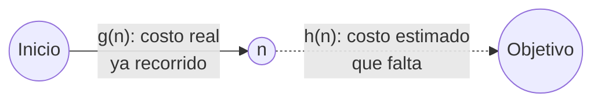
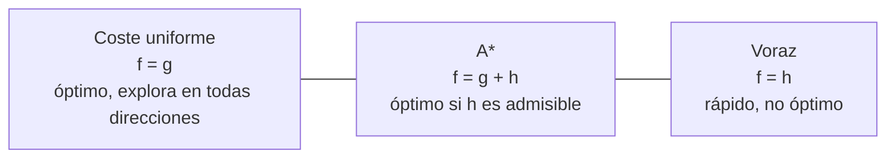
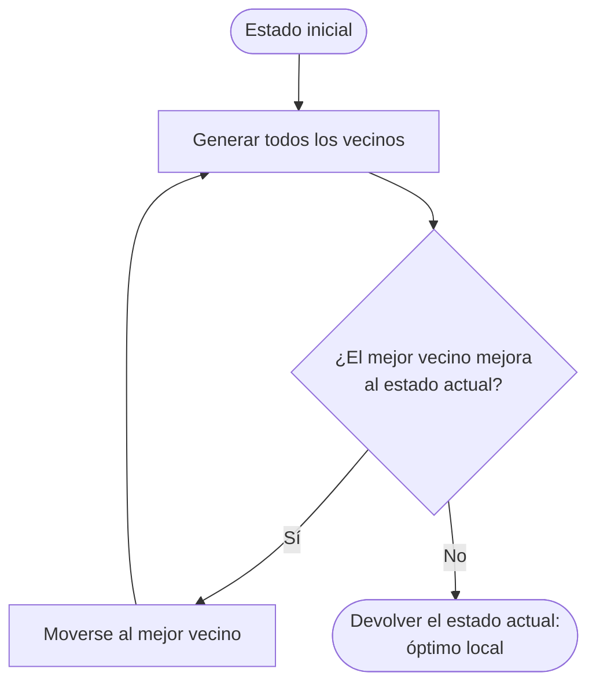
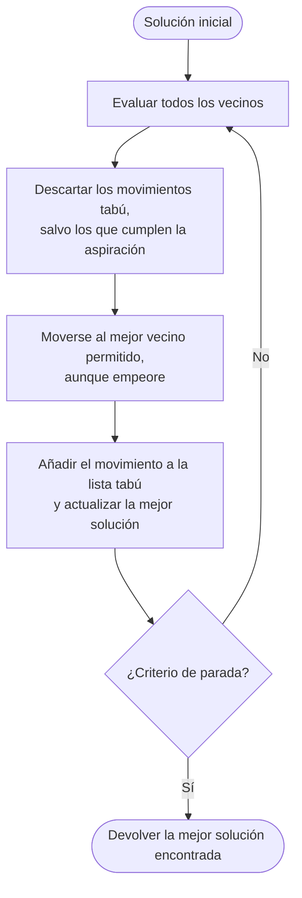

# Capítulo 3. Búsqueda informada, búsqueda local y metaheurísticas

**Curso:** Introducción a la Inteligencia Artificial (electiva) · Ingeniería de Software – modalidad virtual · UDES
**Semana:** 3 de 8
**Tiempo estimado de lectura:** 110 minutos
**Lecturas base:** García Serrano (2016), cap. 4 · Russell y Norvig (2004), caps. 4 y 5

---

## Objetivos de aprendizaje

Al terminar este capítulo podrás:

1. Explicar qué es una función heurística y comprobar si es admisible y consistente.
2. Aplicar la búsqueda con vuelta atrás a problemas con restricciones.
3. Aplicar a mano y en Python la búsqueda voraz primero el mejor y el algoritmo A\*, y explicar por qué A\* es óptimo con una heurística admisible.
4. Describir algoritmos constructivos voraces como el de Dijkstra y el de ahorros de Clarke y Wright.
5. Distinguir la búsqueda de caminos de la optimización, y aplicar *hill climbing*, temple simulado, búsqueda tabú y algoritmos genéticos.
6. Elegir una técnica según el tipo de problema, la calidad de solución requerida y los recursos disponibles.

## ¿Cómo usar este capítulo?

- Lee una sección a la vez y responde los recuadros **«Para pensar»** antes de continuar.
- Los ejemplos del capítulo son los mismos del [cuaderno de la práctica](../practicas/). Las trazas y las cifras se obtuvieron ejecutándolo, así que puedes reproducirlas.
- Cuando el capítulo cita un libro, lo hace con el formato *(Autor, año, capítulo)*. La lista completa está en la sección [Referencias](#referencias).

---

## Introducción

En la semana 2 buscaste las llaves del carro habitación por habitación porque no tenías ninguna pista. Ahora imagina que recuerdas haberlas tenido en la mano al entrar a la cocina. Esa pista no te dice dónde están, pero sí por dónde **conviene empezar**. García Serrano (2016, cap. 4) llama **búsqueda informada** a la que aprovecha este tipo de conocimiento sobre el problema para encontrar soluciones con menos esfuerzo.

La semana pasada terminó con una pregunta: si la búsqueda de coste uniforme es óptima y completa, ¿por qué no usarla siempre? La respuesta está en la tabla 2.9: en problemas grandes, la memoria y el tiempo crecen de forma exponencial. Este capítulo presenta dos familias de respuestas:

1. **Buscar caminos con información** (secciones 3.1 a 3.4): las heurísticas permiten guiar la búsqueda hacia el objetivo y dejar de explorar en todas direcciones. La estrella es el algoritmo **A\***.
2. **Optimizar sin construir caminos** (secciones 3.5 a 3.8): cuando el espacio es tan grande que ni siquiera A\* sirve, y lo que importa es la **configuración final** y no la secuencia de pasos, se parte de una solución completa y se mejora poco a poco. Aquí aparecen la **búsqueda local** y las **metaheurísticas**.

---

## 3.1 Funciones heurísticas

### 3.1.1 ¿Qué es una heurística?

La palabra *heurística* viene del griego *heuriskein*, «encontrar». En IA, una **función heurística** ***h*(*n*)** es una estimación del costo del camino más barato desde el nodo *n* hasta un nodo objetivo (Russell y Norvig, 2004, cap. 4). No es el costo real, que desconocemos, sino una **conjetura informada** que se calcula a partir del estado.

Recuerda que en el capítulo 2 definimos ***g*(*n*)** como el costo del camino desde la raíz hasta *n*. Ahora tenemos dos cantidades:



*Figura 3.1. Lo recorrido y lo que falta. Elaboración propia.*

Dos ejemplos que usaremos en todo el capítulo:

- **Rutas por carretera.** La **distancia en línea recta** desde una ciudad hasta el destino, *h*ₗᵣ(*n*). En la práctica se calcula a partir de las coordenadas geográficas de cada ciudad. Para ir a Santiago, por ejemplo, *h*ₗᵣ(Málaga) = 770 km, *h*ₗᵣ(Madrid) = 486 km y *h*ₗᵣ(Salamanca) = 319 km.
- **8-puzle.** Russell y Norvig (2004, cap. 4) proponen dos heurísticas: *h*₁, el número de **fichas mal colocadas**, y *h*₂, la suma de las **distancias de Manhattan** de cada ficha a su posición objetivo (el número de casillas en horizontal más el número en vertical).

García Serrano (2016, cap. 4) insiste en que una buena heurística es un compromiso: debe aportar información suficiente para guiar la búsqueda y, a la vez, ser **barata de calcular**, porque se evalúa en cada nodo.

### 3.1.2 Admisibilidad y consistencia

Una heurística es **admisible** si **nunca sobreestima** el costo real de alcanzar el objetivo: para todo nodo *n*, *h*(*n*) ≤ *h*\*(*n*), donde *h*\*(*n*) es el costo verdadero (Russell y Norvig, 2004, cap. 4). Una heurística admisible es, por naturaleza, **optimista**.

- *h*ₗᵣ es admisible porque la línea recta es el camino más corto entre dos puntos: ninguna carretera puede ser más corta. El cuaderno de la práctica lo comprueba en los 16 tramos del mapa: la carretera es entre un 14 % y un 40 % más larga que la línea recta.
- *h*₁ es admisible porque cada ficha mal colocada necesita al menos un movimiento.
- *h*₂ es admisible porque en cada movimiento una ficha avanza como máximo una casilla hacia su destino.

Una heurística es **consistente** (o **monótona**) si, para cada nodo *n* y cada sucesor *n′* generado por una acción *a*, se cumple la **desigualdad triangular** (Russell y Norvig, 2004, cap. 4):

> *h*(*n*) ≤ *c*(*n*, *a*, *n′*) + *h*(*n′*)

Es decir, la estimación desde *n* no puede ser mayor que el costo de dar un paso más la estimación desde donde se llega. Toda heurística consistente es admisible. *h*ₗᵣ, *h*₁ y *h*₂ son consistentes.

### 3.1.3 ¿Cuál heurística es mejor?

Si dos heurísticas son admisibles y *h*₂(*n*) ≥ *h*₁(*n*) para todo *n*, se dice que *h*₂ **domina** a *h*₁. Con una heurística dominante, A\* nunca expande más nodos (Russell y Norvig, 2004, cap. 4). La intuición: las dos subestiman, pero la mayor se acerca más al valor verdadero, así que descarta más nodos que no llevan a la solución.

La práctica lo muestra con un 8-puzle cuya solución óptima tiene 20 movimientos:

| Heurística | Nodos expandidos por A\* |
|---|--:|
| Ninguna (*h* = 0, equivale a coste uniforme) | 55.408 |
| *h*₁, fichas mal colocadas | 3.666 |
| *h*₂, distancias de Manhattan | 282 |

*Tabla 3.1. Efecto de la heurística en un 8-puzle de profundidad 20. Elaboración propia con el cuaderno de la práctica.*

Para comparar heurísticas con independencia del problema concreto se usa el **factor de ramificación efectivo** *b*\*: si A\* expande *N* nodos para una solución de profundidad *d*, *b*\* es el factor de ramificación que tendría un árbol uniforme de profundidad *d* con *N* + 1 nodos (Russell y Norvig, 2004, cap. 4). Una buena heurística tiene un *b*\* cercano a 1. En la práctica, con soluciones de profundidad 20, *b*\* es aproximadamente 1,42 con *h*₁ y 1,25 con *h*₂.

### 3.1.4 ¿Cómo se inventa una heurística?

Una técnica general es pensar en un **problema relajado**: una versión del problema con menos restricciones sobre las acciones. El costo de la solución óptima de un problema relajado es una heurística admisible para el problema original (Russell y Norvig, 2004, cap. 4). Por ejemplo, la regla del 8-puzle dice que «una ficha puede moverse a una casilla adyacente si está vacía». Si eliminamos condiciones:

- Si una ficha se puede mover a **cualquier casilla adyacente**, aunque esté ocupada, el costo es *h*₂.
- Si una ficha se puede mover a **cualquier casilla**, el costo es *h*₁.

> **Para pensar.** En una aplicación de navegación en la ciudad, ¿qué heurística usarías para estimar el **tiempo** que falta hasta el destino? Pista: divide una distancia por una velocidad. ¿Qué velocidad tendrías que usar para que la heurística sea admisible?

---

## 3.2 Búsqueda con vuelta atrás (*backtracking*)

### 3.2.1 La idea

La **vuelta atrás** es una búsqueda en profundidad que construye la solución **una decisión a la vez** y, en cuanto una decisión parcial viola alguna restricción, **deshace** la última decisión y prueba la siguiente opción (Golomb y Baumert, 1965; García Serrano, 2016, cap. 4). Su ventaja sobre generar soluciones completas y comprobarlas después es que **poda** ramas enteras del árbol: si las dos primeras decisiones ya son incompatibles, no se exploran las miles de soluciones que empiezan por ellas.

Se usa sobre todo en **problemas de satisfacción de restricciones** (PSR): problemas en los que hay que asignar valores a un conjunto de variables de modo que se cumplan ciertas restricciones, como armar un horario, colorear un mapa o resolver un sudoku. Russell y Norvig (2004, cap. 5) dedican un capítulo a estos problemas y presentan la vuelta atrás como el algoritmo básico para resolverlos.

### 3.2.2 Un ejemplo: las *N* reinas

Hay que colocar *N* reinas en un tablero de *N* × *N* de modo que ninguna ataque a otra, es decir, que no compartan fila, columna ni diagonal. La vuelta atrás coloca una reina por columna, de izquierda a derecha:

```text
función colocar(columna):
    si columna == N: devolver éxito
    para cada fila de 0 a N − 1:
        si la reina en (fila, columna) no ataca a las ya colocadas:
            colocarla
            si colocar(columna + 1) tiene éxito: devolver éxito
            quitarla                      ← vuelta atrás
    devolver fallo
```

Con *N* = 8, la vuelta atrás encuentra la primera solución después de generar **876 posiciones**. Una fuerza bruta que ya coloca una reina por fila y por columna (y solo comprueba las diagonales al final) revisa 2.843 permutaciones antes de dar con una válida; una fuerza bruta ingenua, que coloca las reinas en cualquier casilla, tendría que considerar del orden de 3 × 10¹⁴ secuencias (tabla 2.5).

### 3.2.3 Mejoras

La vuelta atrás básica mejora mucho con dos ideas (Russell y Norvig, 2004, cap. 5):

- **Ordenar las decisiones.** Elegir primero la variable con **menos valores posibles** (la más restringida): si va a fallar, mejor que falle pronto.
- **Propagar restricciones.** Al asignar un valor, eliminar de las demás variables los valores que ya no son compatibles (**comprobación hacia delante**). Si alguna variable se queda sin valores, se hace vuelta atrás de inmediato, sin esperar a llegar a ella.

> **Para pensar.** Un sudoku es un problema de satisfacción de restricciones con 81 variables. ¿Cuáles son sus variables, sus valores posibles y sus restricciones? ¿Por qué una persona experta empieza por las casillas que tienen menos opciones?

---

## 3.3 Búsqueda primero el mejor: voraz y A\*

### 3.3.1 La familia primero el mejor

En el capítulo 2 vimos que la estrategia de búsqueda se reduce a elegir qué nodo sale de la frontera. La **búsqueda primero el mejor** usa una **función de evaluación *f*(*n*)** y siempre expande el nodo de la frontera con el **menor valor de *f***. La frontera es, por tanto, una cola con prioridad (Russell y Norvig, 2004, cap. 4). Según cómo se defina *f*, se obtienen tres algoritmos:

| Algoritmo | *f*(*n*) | Qué tiene en cuenta |
|---|---|---|
| Coste uniforme (capítulo 2) | *g*(*n*) | Solo lo recorrido |
| Voraz primero el mejor | *h*(*n*) | Solo lo que falta, estimado |
| A\* | *g*(*n*) + *h*(*n*) | Las dos cosas |

*Tabla 3.2. La función de evaluación define el algoritmo. Elaboración propia a partir de Russell y Norvig (2004, cap. 4).*

En la práctica, los tres se implementan con **la misma función** de Python, a la que se le pasa *f* como parámetro.

### 3.3.2 Búsqueda voraz primero el mejor

La búsqueda **voraz** (*greedy*) expande siempre el nodo que **parece** más cercano al objetivo, sin importar cuánto costó llegar a él (Russell y Norvig, 2004, cap. 4). Para ir de Málaga a Santiago:

| Paso | Nodo expandido | *h*ₗᵣ |
|:-:|---|--:|
| 1 | Málaga | 770 |
| 2 | Madrid | 486 |
| 3 | Santiago | 0 |

*Tabla 3.3. Traza de la búsqueda voraz de Málaga a Santiago. Elaboración propia con el cuaderno de la práctica.*

Solo expande dos nodos antes de llegar, pero devuelve **Málaga → Madrid → Santiago, con 1.112 km**, que no es la ruta óptima (1.106 km, por Salamanca). La heurística la atrae hacia Santiago en línea recta y no le deja ver que dar un pequeño rodeo por Salamanca resulta más barato. En los 90 pares origen-destino del mapa, la búsqueda voraz devuelve una ruta no óptima en 21 casos; el peor es Málaga → Valencia, donde propone 869 km en lugar de 616.

La búsqueda voraz **no es óptima** y, en su versión de árbol, **tampoco es completa**: puede entrar en un ciclo si la heurística la empuja una y otra vez hacia un callejón sin salida. En el peor caso su complejidad es *O*(*b*ᵐ), aunque una buena heurística la reduce mucho (Russell y Norvig, 2004, cap. 4).

### 3.3.3 El algoritmo A\*

**A\*** (se lee «A estrella») fue propuesto por Hart, Nilsson y Raphael (1968). Combina lo mejor de la búsqueda de coste uniforme y de la voraz:

> ***f*(*n*) = *g*(*n*) + *h*(*n*)**

*f*(*n*) es el **costo estimado de la solución más barata que pasa por *n***. Repitamos el viaje de Málaga a Santiago:

| Paso | Nodo expandido | *g* | *h*ₗᵣ | *f* = *g* + *h* |
|:-:|---|--:|--:|--:|
| 1 | Málaga | 0 | 770 | 770 |
| 2 | Granada | 125 | 761 | 886 |
| 3 | Madrid | 513 | 486 | 999 |
| 4 | Salamanca | 716 | 319 | 1.035 |
| 5 | **Santiago** | **1.106** | 0 | **1.106** |

*Tabla 3.4. Traza de A\* de Málaga a Santiago. Elaboración propia con el cuaderno de la práctica.*

A\* encuentra la ruta óptima, **Málaga → Madrid → Salamanca → Santiago, con 1.106 km**, expandiendo 4 nodos. La búsqueda de coste uniforme, que encontró la misma ruta en el capítulo 2, expandió 9 (tabla 2.11). Observa dos detalles:

- En el paso 2, A\* expande Granada aunque esté más lejos de Santiago que Madrid, porque su *f* es menor: llegar a Granada fue muy barato. A\* **no se deja atraer** solo por la heurística.
- Cuando Madrid se expande (paso 3) se genera Santiago con *g* = 1.112 y *f* = 1.112. Pero Salamanca tiene *f* = 1.035, menor, así que se expande primero y descubre el camino de 1.106. Como en UCS, el test objetivo se aplica al **sacar** el nodo de la frontera.

### 3.3.4 Propiedades de A\*

**Optimalidad.** A\* es óptimo si la heurística es **admisible** (en la búsqueda en árboles) o **consistente** (en la búsqueda en grafos, que descarta estados repetidos) (Russell y Norvig, 2004, cap. 4). La idea de la demostración: si *h* nunca sobreestima, el *f* de cualquier nodo en el camino óptimo es como mucho el costo óptimo *C*\*; por eso, antes de sacar de la frontera un objetivo subóptimo (con *f* > *C*\*), A\* ya habrá sacado todos los nodos del camino óptimo. En la práctica, A\* con *h*ₗᵣ encuentra la ruta óptima en los 90 pares del mapa.

**Eficiencia óptima.** Entre los algoritmos que usan la misma heurística y garantizan la solución óptima, ninguno expande menos nodos que A\* (Russell y Norvig, 2004, cap. 4).

**Completitud.** A\* es completo si el factor de ramificación es finito y cada acción cuesta al menos una constante positiva ε, igual que UCS.

**El problema: la memoria.** A\* guarda todos los nodos generados, así que, como BFS y UCS, se queda sin memoria antes que sin tiempo en problemas grandes (Russell y Norvig, 2004, cap. 4). Por eso existen variantes con memoria acotada, como **IDA\*** (A\* con profundidad iterativa, que usa *f* como límite en lugar de la profundidad) y **SMA\*** (A\* con memoria acotada simplificada, que descarta los peores nodos cuando la memoria se llena).

**Heurísticas no admisibles.** Si se multiplica una heurística admisible por un factor mayor que 1, la búsqueda se vuelve más «voraz»: expande menos nodos, pero pierde la garantía de optimalidad. En el mapa de España, con un factor de 1,5 A\* expande en promedio 1,83 nodos en lugar de 2,23, pero se equivoca en 11 de los 90 pares. Esta idea, conocida como **A\* ponderado**, se usa cuando una solución «suficientemente buena» rápida vale más que la óptima lenta.



*Figura 3.2. A\* entre la prudencia del coste uniforme y la prisa de la búsqueda voraz. Elaboración propia.*

> **Para pensar.** A\* con *h*(*n*) = 0 para todo *n*, ¿a qué algoritmo equivale? ¿Es *h* = 0 una heurística admisible? ¿Es útil?

---

## 3.4 Algoritmos constructivos voraces

Un **algoritmo constructivo** fabrica una solución completa paso a paso. Si en cada paso toma la decisión que **parece mejor en ese momento** y nunca la reconsidera, es **voraz**. Los algoritmos voraces son rápidos y fáciles de programar; a veces garantizan la solución óptima y a veces solo una buena aproximación (García Serrano, 2016, cap. 4).

### 3.4.1 El algoritmo de Dijkstra

El algoritmo de **Dijkstra** (1959) calcula el camino más corto desde un origen hasta **todos** los demás nodos de un grafo con costos no negativos. En cada paso, de los nodos aún no definitivos, elige el de **menor distancia acumulada**, la marca como definitiva y actualiza las distancias de sus vecinos. Es exactamente lo que hace la búsqueda de coste uniforme del capítulo 2, salvo que Dijkstra no se detiene al encontrar un objetivo: sigue hasta haber fijado la distancia de todos los nodos (Russell y Norvig, 2004, cap. 3).

Es un algoritmo voraz que sí **garantiza** el óptimo: cuando un nodo se marca como definitivo, ningún camino posterior puede mejorarlo, porque todos los demás nodos de la frontera están más lejos y los costos no son negativos.

### 3.4.2 El vecino más cercano

Para el problema del viajante de comercio (TSP), la heurística constructiva más sencilla es el **vecino más cercano**: desde la ciudad actual, ir siempre a la ciudad no visitada más cercana. Es instantánea, pero no garantiza nada. En el TSP de las 24 capitales colombianas de la práctica produce un recorrido de 3.996 km, mientras que los métodos de búsqueda local llegan a 3.269 km: un 22 % más largo.

### 3.4.3 El algoritmo de ahorros de Clarke y Wright

En el capítulo 2 vimos que el TSP es la base del **problema de rutas de vehículos** (VRP): un depósito, varios clientes y una flota de vehículos con capacidad limitada. **Clarke y Wright (1964)** propusieron un algoritmo constructivo que sigue siendo muy usado por su sencillez:

1. Empezar con una ruta independiente por cliente: depósito → cliente → depósito.
2. Para cada par de clientes *i*, *j*, calcular el **ahorro** de atenderlos en la misma ruta en lugar de en dos rutas separadas:
   > *s*(*i*, *j*) = *d*(0, *i*) + *d*(0, *j*) − *d*(*i*, *j*)
3. Recorrer los pares de mayor a menor ahorro. Unir las rutas de *i* y de *j* si están en rutas distintas, si *i* y *j* están en un extremo de su ruta y si la ruta unida no supera la capacidad del vehículo.

Apliquémoslo a la matriz de cinco ciudades de la tabla 2.1, con A como depósito:

| Par | Cálculo | Ahorro |
|---|---|--:|
| C, D | 52 + 65 − 15 | **102** |
| B, D | 25 + 65 − 15 | 75 |
| B, C | 25 + 52 − 13 | 64 |
| D, E | 65 + 23 − 32 | 56 |
| C, E | 52 + 23 − 27 | 48 |
| B, E | 25 + 23 − 45 | 3 |

*Tabla 3.5. Ahorros de Clarke y Wright con depósito en A. Elaboración propia a partir de la tabla 2.1.*

- **Un solo vehículo sin límite de capacidad:** se unen C-D (102), luego B al extremo D (75) y luego E al extremo C (48). Los demás pares ya están en la misma ruta o no están en un extremo. El resultado es **A-E-C-D-B-A con 105 km**, mejor que la mejor ruta de la tabla 2.2 (108 km). En esta instancia pequeña, 105 km es además el óptimo.
- **Vehículos que atienden como máximo dos clientes:** se unen C-D (102); los pares siguientes harían una ruta de tres clientes y se descartan, hasta llegar a B-E (3). El resultado son dos rutas, A-C-D-A y A-B-E-A, con **225 km** en total.

> **Para pensar.** ¿Por qué el ahorro *s*(*B*, *E*) es tan pequeño? Mira dónde están B y E respecto al depósito A. ¿Qué te dice eso sobre los clientes que conviene agrupar en una misma ruta?

---

## 3.5 Búsqueda local y *hill climbing*

### 3.5.1 Del camino a la configuración

En los problemas de las secciones anteriores la solución era un **camino**: la secuencia de acciones importa. Pero en muchos problemas solo importa el **estado final**: en las *N* reinas interesa la posición final del tablero, no el orden en que se pusieron las reinas, y en el TSP interesa el recorrido, no cómo se construyó. Russell y Norvig (2004, cap. 4) llaman **algoritmos de búsqueda local** a los que trabajan con un único estado actual, completo, y se mueven solo a sus **vecinos**. Tienen dos ventajas:

- Usan **muy poca memoria**: normalmente, una cantidad constante.
- Encuentran soluciones razonables en espacios **enormes o continuos**, donde los algoritmos sistemáticos no son viables.

Además, sirven para problemas de **optimización**, en los que el objetivo es encontrar el mejor estado según una **función objetivo**. Los elementos de un problema de búsqueda local son:

| Elemento | En el TSP de la práctica |
|---|---|
| **Estado** (o solución candidata) | Un recorrido completo: una permutación de las ciudades. |
| **Función objetivo** | La longitud total del recorrido, que se quiere minimizar. |
| **Vecindario** | Los recorridos que se obtienen con un **movimiento 2-opt**: quitar dos aristas y reconectar invirtiendo el tramo intermedio. |

*Tabla 3.6. Elementos de la búsqueda local. Elaboración propia.*

Russell y Norvig (2004, cap. 4) proponen imaginar el **paisaje del espacio de estados**: cada estado es un punto del terreno y su altura es el valor de la función objetivo. Maximizar es buscar el pico más alto; minimizar, el valle más profundo. El pico más alto de todo el paisaje es el **máximo global**; un pico más alto que sus vecinos, pero no el más alto de todos, es un **máximo local**.

### 3.5.2 El algoritmo

El ***hill climbing*** (ascensión de colinas o escalada) es el algoritmo de búsqueda local más simple: en cada paso se mueve al **mejor vecino**, y se detiene cuando ningún vecino mejora el estado actual (Russell y Norvig, 2004, cap. 4).



*Figura 3.3. El algoritmo de *hill climbing*. Elaboración propia a partir de Russell y Norvig (2004, cap. 4).*

Russell y Norvig (2004, cap. 4) lo comparan con «intentar encontrar la cumbre del Everest en medio de una niebla espesa mientras se sufre de amnesia»: solo ves lo que tienes al lado y no recuerdas por dónde pasaste. En la práctica, desde un recorrido aleatorio de 11.240 km, el *hill climbing* con 2-opt llega a 3.269 km en solo 17 pasos.

### 3.5.3 Sus problemas

El *hill climbing* se atasca por tres razones (Russell y Norvig, 2004, cap. 4):

- **Máximos (o mínimos) locales:** ningún vecino es mejor, pero existe un estado mejor en otra parte del paisaje.
- **Mesetas:** zonas planas donde todos los vecinos tienen el mismo valor, así que no hay una dirección que seguir.
- **Crestas:** secuencias de máximos locales muy difíciles de recorrer con movimientos simples.

Las cifras de Russell y Norvig (2004, cap. 4) para el problema de las 8 reinas son elocuentes: partiendo de un estado aleatorio, el *hill climbing* se atasca el 86 % de las veces y resuelve solo el 14 % de los casos, aunque lo hace muy rápido. En la práctica verás algo parecido con el TSP: de 30 ejecuciones desde recorridos aleatorios distintos, solo 15 llegan al mejor recorrido encontrado (3.269 km) y la peor se queda en 3.978 km.

### 3.5.4 Variantes

- ***Hill climbing* estocástico:** elige al azar entre los vecinos que mejoran, no necesariamente el mejor.
- **Primera opción:** genera vecinos al azar y se mueve al primero que mejore. Es útil cuando el vecindario es muy grande.
- **Reinicio aleatorio:** ejecuta el *hill climbing* muchas veces desde estados iniciales aleatorios y se queda con el mejor resultado. Si cada intento tiene una probabilidad *p* de éxito, se necesitan en promedio 1/*p* reinicios (Russell y Norvig, 2004, cap. 4).

Las tres secciones siguientes presentan **metaheurísticas**: estrategias generales que dirigen una búsqueda local para que **escape de los óptimos locales**. Cada una lo hace con una idea distinta: el azar controlado (temple simulado), la memoria (búsqueda tabú) y la evolución de una población (algoritmos genéticos).

> **Para pensar.** En la práctica, el *hill climbing* que parte del recorrido del vecino más cercano termina en 3.333 km, peor que el mejor obtenido desde recorridos aleatorios. ¿Cómo es posible, si empieza desde un recorrido mucho mejor?

---

## 3.6 Temple simulado (*simulated annealing*)

### 3.6.1 La metáfora

En metalurgia, el **temple** (o recocido) consiste en calentar un metal a alta temperatura y enfriarlo lentamente. A alta temperatura los átomos se mueven con libertad; al enfriarse despacio, se acomodan en una estructura cristalina de baja energía, más resistente que si se enfría de golpe. Kirkpatrick, Gelatt y Vecchi (1983) trasladaron esta idea a la optimización.

### 3.6.2 El algoritmo

En lugar del mejor vecino, el temple simulado elige un vecino **al azar** (Russell y Norvig, 2004, cap. 4):

- Si el vecino **mejora**, siempre se acepta.
- Si **empeora** en Δ, se acepta con probabilidad ***e*^(−Δ/*T*)**, donde *T* es la **temperatura**.

La temperatura empieza alta y se reduce según un **programa de enfriamiento**; el más común es el geométrico, *T* ← α · *T*, con α cercano a 1 (por ejemplo, 0,995).

| Situación | *e*^(−Δ/*T*) | Comportamiento |
|---|---|---|
| *T* alta | Cercano a 1 | Acepta casi cualquier movimiento: **explora** el paisaje. |
| *T* baja | Cercano a 0 | Casi solo acepta mejoras: **explota** la zona actual, como el *hill climbing*. |
| Δ pequeño | Más alto | Un empeoramiento leve se acepta con más facilidad que uno grande. |

*Tabla 3.7. El papel de la temperatura en el temple simulado. Elaboración propia.*

Por ejemplo, un movimiento que alarga el recorrido 50 km se acepta con probabilidad *e*^(−50/1000) ≈ 0,95 cuando *T* = 1.000, y con probabilidad *e*^(−50/10) ≈ 0,007 cuando *T* = 10.

Si la temperatura baja con suficiente lentitud, el temple simulado encuentra el óptimo global con una probabilidad que tiende a 1 (Russell y Norvig, 2004, cap. 4). El problema es que «suficiente lentitud» puede ser muchísimo tiempo: en la práctica, el programa de enfriamiento se ajusta por experimentación.

### 3.6.3 Lo que muestra la práctica

En la instancia de 100 puntos aleatorios de la práctica, el temple simulado obtiene en promedio recorridos de 7.902 km, frente a 8.254 km del *hill climbing* con el mismo vecindario 2-opt. La gráfica de su evolución muestra la idea central: al principio la longitud **sube y baja** (exploración) y al final se estabiliza (explotación). Con una temperatura inicial de 1, el temple simulado casi no acepta empeoramientos y se comporta como un *hill climbing*.

> **Para pensar.** ¿Qué pasaría si la temperatura nunca bajara? ¿Y si empezara en 0?

---

## 3.7 Búsqueda tabú

### 3.7.1 La idea

La **búsqueda tabú** fue propuesta por **Glover (1986)**, quien introdujo el término, y desarrollada después en una serie de artículos (Glover, 1989). Su idea central es usar **memoria** para guiar la búsqueda local:

- En cada paso se mueve al **mejor vecino permitido**, **aunque sea peor** que el estado actual. Así puede salir de un óptimo local.
- Para no volver inmediatamente al óptimo local del que acaba de salir, mantiene una **lista tabú** con atributos de los movimientos recientes (por ejemplo, las aristas recién creadas), que quedan **prohibidos** durante un número de iteraciones llamado **permanencia** (*tenure*).
- El **criterio de aspiración** permite un movimiento tabú si lleva a una solución mejor que la mejor encontrada hasta el momento: la prohibición sirve para evitar ciclos, no para perder buenas soluciones.



*Figura 3.4. El esquema de la búsqueda tabú. Elaboración propia a partir de Glover (1989).*

### 3.7.2 Parámetros

La **permanencia** es el parámetro clave. Si es muy corta, la búsqueda vuelve a caer en los mismos ciclos; si es muy larga, prohíbe demasiados movimientos y puede quedarse sin opciones. En el TSP de 24 ciudades de la práctica, cada recorrido tiene solo 24 aristas: con una permanencia de 15 iteraciones y dos aristas tabú por movimiento, en poco tiempo **todos** los movimientos quedan prohibidos. Por eso el cuaderno usa una permanencia de 6.

A diferencia del temple simulado, la búsqueda tabú es **determinista**: con el mismo estado inicial, hace siempre los mismos movimientos. Su costo está en evaluar todo el vecindario en cada iteración.

> **Para pensar.** En la gráfica de la búsqueda tabú de la práctica, la longitud del recorrido actual sube varias veces. ¿Es eso un defecto del algoritmo o es lo que se busca?

---

## 3.8 Algoritmos genéticos

### 3.8.1 La metáfora de la evolución

Los **algoritmos genéticos** fueron formalizados por **John Holland (1975)** a partir de una analogía con la selección natural: en una población, los individuos mejor adaptados tienen más probabilidad de reproducirse y transmitir sus características. Russell y Norvig (2004, cap. 4) los describen como una variante de la búsqueda local en la que, en lugar de un estado, se mantiene una **población** de estados, y los sucesores se generan **combinando dos padres**.

| Término biológico | Significado en el algoritmo |
|---|---|
| **Individuo** o **cromosoma** | Una solución candidata, codificada como una cadena (de bits, de números o una permutación). |
| **Gen** | Una posición de la cadena. |
| **Población** | El conjunto de soluciones de una generación. |
| **Aptitud** (*fitness*) | El valor de la función objetivo: qué tan buena es la solución. |
| **Selección** | La elección de los padres, favoreciendo a los más aptos. |
| **Cruce** | La combinación de dos padres para crear un hijo. |
| **Mutación** | Un cambio aleatorio y pequeño en un hijo, que mantiene la diversidad. |

*Tabla 3.8. Vocabulario de los algoritmos genéticos. Elaboración propia a partir de Holland (1975) y Russell y Norvig (2004, cap. 4).*

### 3.8.2 El ciclo de una generación


*Figura 3.5. Ciclo de un algoritmo genético. Elaboración propia a partir de Holland (1975).*

Las decisiones de diseño más importantes son:

- **Codificación.** Para el TSP, un individuo es una permutación de las ciudades.
- **Selección.** En la **selección por torneo**, se eligen *k* individuos al azar y el mejor de ellos es un padre. Con *k* = 3 la presión hacia los mejores es moderada.
- **Cruce.** El cruce clásico de un punto corta los dos padres en una posición e intercambia los extremos. En una permutación eso produciría ciudades repetidas, así que para el TSP se usan cruces especiales, como el **cruce de orden (OX)**: el hijo copia un segmento del primer padre y completa las posiciones restantes con las ciudades que faltan, en el orden en que aparecen en el segundo padre.
- **Mutación.** Por ejemplo, invertir un segmento al azar (el mismo movimiento 2-opt).
- **Elitismo.** Copiar los mejores individuos directamente a la siguiente generación para no perderlos.

### 3.8.3 Fortalezas y debilidades

Los algoritmos genéticos son muy flexibles: solo necesitan una codificación, una función de aptitud y unos operadores. Por eso se han aplicado a problemas muy variados, como horarios, diseño de piezas o ajuste de parámetros de otros algoritmos. Su punto débil es que tienen **muchos parámetros** (tamaño de la población, probabilidades de cruce y mutación, número de generaciones) y que, sin una buena configuración, pueden rendir peor que métodos más simples.

La práctica lo muestra con claridad. En el TSP de 24 ciudades, el algoritmo genético alcanza el mismo recorrido de 3.269 km que los demás métodos. En la instancia de 100 puntos, con 400 generaciones, se queda en 10.896 km de promedio, **peor incluso que el vecino más cercano** (8.955 km). En el ejercicio 7 de la práctica comprobarás cuánto mejora al ajustar sus parámetros y cuánto tiempo cuesta.

> **Para pensar.** ¿Por qué el cruce de un punto funciona bien cuando un individuo es una cadena de bits independientes (por ejemplo, las variables de un problema SAT) y no cuando es un recorrido del TSP?

---

## 3.9 ¿Qué técnica elegir?

No hay una técnica mejor para todo. La elección depende del tipo de problema y de lo que se necesita:

| Técnica | Tipo de problema | ¿Garantiza el óptimo? | Memoria | Cuándo usarla |
|---|---|:-:|:-:|---|
| Voraz primero el mejor | Camino | No | Alta | Cuando basta una solución rápida y la heurística es buena. |
| A\* | Camino | Sí, con *h* admisible | Alta | Rutas, planificación y puzles de tamaño moderado. |
| IDA\* | Camino | Sí, con *h* admisible | Baja | Como A\*, cuando la memoria no alcanza. |
| Vuelta atrás | Restricciones | Encuentra una solución si existe | Baja | Horarios, sudokus, asignaciones con restricciones duras. |
| Constructivos voraces | Optimización | Solo en casos como Dijkstra | Baja | Solución inicial rápida para mejorarla después. |
| *Hill climbing* | Optimización | No | Mínima | Paisajes suaves o como componente de otros métodos. |
| Temple simulado | Optimización | Solo con enfriamiento infinitamente lento | Mínima | Paisajes con muchos óptimos locales. |
| Búsqueda tabú | Optimización | No | Baja | Problemas combinatorios con vecindarios evaluables. |
| Algoritmo genético | Optimización | No | Media | Problemas donde es natural combinar soluciones parciales. |

*Tabla 3.9. Resumen de las técnicas del capítulo. Elaboración propia.*

En la industria es común **combinar** técnicas: un constructivo voraz (como el vecino más cercano o Clarke y Wright) da una solución inicial, y una metaheurística la mejora. Por eso las metaheurísticas se describen a menudo como **marcos generales** que se adaptan a cada problema eligiendo la codificación, el vecindario y los parámetros.

> **Para pensar.** Una aplicación de domicilios debe asignar pedidos a repartidores y calcular sus rutas cada pocos segundos, con pedidos que llegan en todo momento. ¿Qué técnicas de este capítulo combinarías y por qué?

---

## Resumen

- Una **heurística** *h*(*n*) estima el costo de llegar al objetivo desde *n*. Es **admisible** si nunca sobreestima y **consistente** si cumple la desigualdad triangular. Las heurísticas admisibles se obtienen a menudo resolviendo un **problema relajado**, y una heurística que **domina** a otra expande menos nodos.
- La **vuelta atrás** construye soluciones paso a paso y deshace el último paso en cuanto se viola una restricción, lo que poda ramas enteras del árbol.
- La **búsqueda primero el mejor** expande el nodo de menor *f*(*n*). Con *f* = *h* se obtiene la búsqueda **voraz**, rápida pero no óptima. Con *f* = *g* + *h* se obtiene **A\***, que es **óptimo** con una heurística admisible (o consistente, en grafos) y óptimamente eficiente, pero consume mucha memoria.
- Los **algoritmos constructivos voraces**, como Dijkstra, el vecino más cercano o los ahorros de **Clarke y Wright**, construyen una solución tomando la mejor decisión local en cada paso.
- La **búsqueda local** trabaja con un estado completo y sus vecinos, usa poca memoria y sirve para problemas de **optimización**. El ***hill climbing*** se atasca en óptimos locales, mesetas y crestas.
- Las **metaheurísticas** escapan de los óptimos locales: el **temple simulado** acepta empeoramientos con una probabilidad que disminuye con la temperatura; la **búsqueda tabú** se mueve al mejor vecino permitido y prohíbe temporalmente los movimientos recientes; los **algoritmos genéticos** evolucionan una población mediante selección, cruce y mutación.
- Ninguna metaheurística garantiza el óptimo, y todas dependen de sus parámetros. Su valor está en encontrar soluciones muy buenas en espacios donde los métodos exactos no son viables.

---

## Glosario

| Término | Definición |
|---|---|
| **A\*** | Búsqueda primero el mejor con *f*(*n*) = *g*(*n*) + *h*(*n*). |
| **Admisible** | Heurística que nunca sobreestima el costo real de alcanzar el objetivo. |
| **Consistente (monótona)** | Heurística que cumple *h*(*n*) ≤ *c*(*n*, *a*, *n′*) + *h*(*n′*) para todo sucesor *n′*. |
| **Criterio de aspiración** | En la búsqueda tabú, condición que permite un movimiento tabú, normalmente si mejora la mejor solución conocida. |
| **Cruce** | Operador genético que combina dos padres para producir un hijo. |
| **Dominancia** | *h*₂ domina a *h*₁ si ambas son admisibles y *h*₂(*n*) ≥ *h*₁(*n*) para todo *n*. |
| **Factor de ramificación efectivo (*b*\*)** | Factor de ramificación de un árbol uniforme que tendría tantos nodos como los expandidos por la búsqueda. |
| **Función heurística *h*(*n*)** | Estimación del costo del camino más barato desde *n* hasta un objetivo. |
| **Metaheurística** | Estrategia general que dirige una búsqueda local para escapar de los óptimos locales. |
| **Movimiento 2-opt** | En el TSP, quitar dos aristas de un recorrido y reconectarlo invirtiendo el tramo intermedio. |
| **Óptimo local** | Estado mejor que todos sus vecinos, pero no necesariamente el mejor de todo el espacio. |
| **Permanencia (*tenure*)** | Número de iteraciones durante las que un movimiento permanece en la lista tabú. |
| **Problema relajado** | Versión de un problema con menos restricciones en sus acciones. |
| **Temperatura** | En el temple simulado, parámetro que controla la probabilidad de aceptar empeoramientos. |
| **Vecindario** | Conjunto de estados que se obtienen del actual con un movimiento elemental. |
| **Vuelta atrás (*backtracking*)** | Búsqueda en profundidad que deshace la última decisión en cuanto se viola una restricción. |

---

## Preguntas de repaso

1. Explica con tus palabras la diferencia entre *g*(*n*) y *h*(*n*). ¿Cuál de las dos se conoce con certeza?
2. Demuestra que la heurística *h*₁ del 8-puzle es admisible. ¿Sería admisible «el número de fichas mal colocadas multiplicado por 2»?
3. Aplica A\* a mano sobre el mapa de carreteras (figura 2.8) para ir de Sevilla a Barcelona. Usa estas distancias en línea recta hasta Barcelona: Sevilla 829, Madrid 505, Granada 682, Málaga 770, Valencia 303, Zaragoza 256, Salamanca 657, Santander 542 y Santiago 898. Escribe el orden en que se expanden los nodos con sus valores de *g*, *h* y *f*.
4. Repite la pregunta 3 con la búsqueda voraz. ¿Encuentra la misma ruta?
5. ¿Por qué A\* necesita aplicar el test objetivo al **sacar** un nodo de la frontera y no al generarlo? Usa la traza de la tabla 3.4 para justificarlo.
6. Aplica la vuelta atrás al problema de las 4 reinas. Dibuja el árbol hasta encontrar la primera solución y señala dónde se produce cada vuelta atrás.
7. Calcula los ahorros de Clarke y Wright para la tabla 2.1 tomando **E** como depósito, y construye la ruta de un solo vehículo.
8. Describe con un ejemplo de tu vida diaria qué es un óptimo local. ¿Cómo escaparías de él?
9. En el temple simulado, calcula la probabilidad de aceptar un movimiento que empeora 100 km cuando *T* = 500 y cuando *T* = 50.
10. ¿Qué tienen en común el temple simulado, la búsqueda tabú y los algoritmos genéticos? ¿Qué mecanismo usa cada uno para escapar de los óptimos locales?

---

## Referencias

Clarke, G., y Wright, J. W. (1964). Scheduling of vehicles from a central depot to a number of delivery points. *Operations Research, 12*(4), 568-581. https://doi.org/10.1287/opre.12.4.568

Dijkstra, E. W. (1959). A note on two problems in connexion with graphs. *Numerische Mathematik, 1*, 269-271. https://doi.org/10.1007/BF01386390

García Serrano, A. (2016). *Inteligencia artificial: Fundamentos, práctica y aplicaciones* (2.ª ed.). RC Libros.

Glover, F. (1986). Future paths for integer programming and links to artificial intelligence. *Computers & Operations Research, 13*(5), 533-549. https://doi.org/10.1016/0305-0548(86)90048-1

Glover, F. (1989). Tabu search—Part I. *ORSA Journal on Computing, 1*(3), 190-206. https://doi.org/10.1287/ijoc.1.3.190

Golomb, S. W., y Baumert, L. D. (1965). Backtrack programming. *Journal of the ACM, 12*(4), 516-524. https://doi.org/10.1145/321296.321300

Hart, P. E., Nilsson, N. J., y Raphael, B. (1968). A formal basis for the heuristic determination of minimum cost paths. *IEEE Transactions on Systems Science and Cybernetics, 4*(2), 100-107. https://doi.org/10.1109/TSSC.1968.300136

Holland, J. H. (1975). *Adaptation in natural and artificial systems*. University of Michigan Press.

Kirkpatrick, S., Gelatt, C. D., y Vecchi, M. P. (1983). Optimization by simulated annealing. *Science, 220*(4598), 671-680. https://doi.org/10.1126/science.220.4598.671

Russell, S. J., y Norvig, P. (2004). *Inteligencia artificial: Un enfoque moderno* (2.ª ed.; J. M. Corchado Rodríguez et al., Trads.). Pearson Educación.
