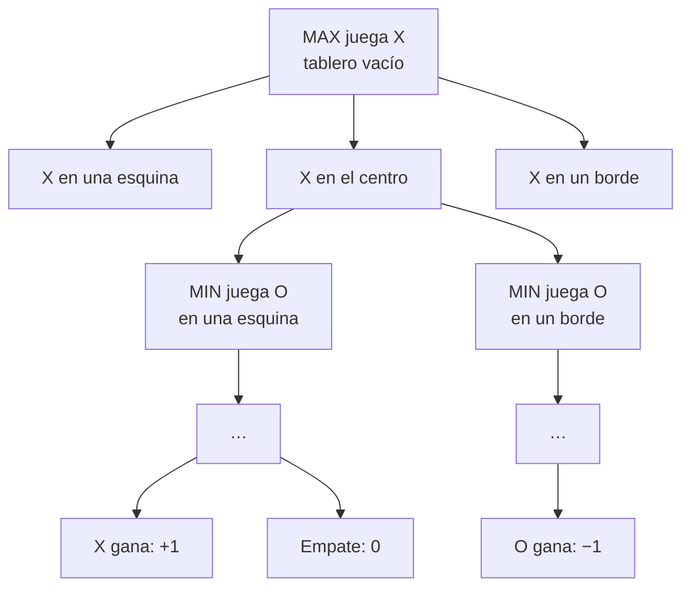
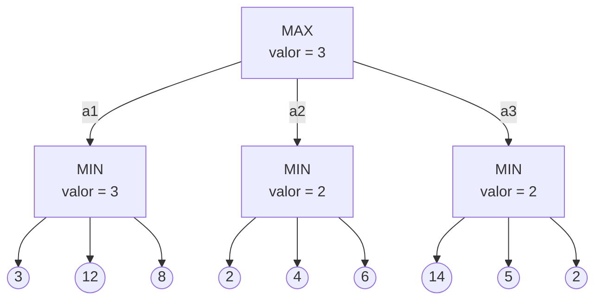

# Capítulo 4. Juegos y decisiones con adversario

**Curso:** Introducción a la Inteligencia Artificial (electiva) · Ingeniería de Software – modalidad virtual · UDES
**Semana:** 4 de 8
**Tiempo estimado de lectura:** 90 minutos
**Lecturas base:** García Serrano (2016), cap. 5 · Russell y Norvig (2004), cap. 6

---

## Objetivos de aprendizaje

Al terminar este capítulo podrás:

1. Clasificar un juego según el número de jugadores, la información disponible, el azar y la suma de sus resultados.
2. Representar un juego como un árbol de juego con estado inicial, movimientos, test terminal y función de utilidad.
3. Calcular a mano y en Python el valor minimax de un árbol, y escribir el algoritmo en su forma negamax.
4. Aplicar la poda alfa-beta, explicar por qué no cambia el resultado y cómo influye el orden de los movimientos.
5. Diseñar una función de evaluación para cortar la búsqueda en juegos grandes, y reconocer el efecto horizonte.
6. Extender minimax a juegos con más de dos jugadores y a juegos con azar (expectiminimax).

## ¿Cómo usar este capítulo?

- Lee una sección a la vez y responde los recuadros **«Para pensar»** antes de continuar.
- Ten papel y lápiz a mano: las secciones 4.3 y 4.5 se entienden mucho mejor si calculas los árboles tú mismo.
- Los ejemplos del capítulo son los mismos del [cuaderno de la práctica](../practicas/). Las cifras se obtuvieron ejecutándolo.
- Cuando el capítulo cita un libro, lo hace con el formato *(Autor, año, capítulo)*. La lista completa está en la sección [Referencias](#referencias).

---

## Introducción

En los capítulos 2 y 3 el agente estaba solo: el mundo cambiaba únicamente cuando él actuaba. En un juego eso deja de ser cierto. Hay **otro agente** que también actúa, que tiene sus propios objetivos y que, en muchos casos, quiere exactamente lo contrario que nosotros. Russell y Norvig (2004, cap. 6) llaman a esta situación **búsqueda con adversario**.

Los juegos han acompañado a la IA desde su origen. Claude Shannon (1950) escribió cómo programar un computador para jugar ajedrez antes de que existiera el nombre «inteligencia artificial», y Arthur Samuel (1959) construyó un programa de damas que aprendía de sus propias partidas. Los juegos atraen a los investigadores por tres razones: tienen reglas precisas, es fácil medir el éxito y son **difíciles**. El ajedrez tiene un factor de ramificación promedio de unos 35 y las partidas suelen durar 50 movimientos por jugador, así que su árbol de búsqueda tiene del orden de 35¹⁰⁰, unos 10¹⁵⁴ nodos (Russell y Norvig, 2004, cap. 6). Ningún computador puede explorarlo: hay que **decidir sin haberlo visto todo**.

En la semana 1 viste una lista de máquinas que vencieron a campeones humanos (tabla 1.2). En este capítulo verás los algoritmos que hay detrás.

---

## 4.1 IA y juegos

### 4.1.1 Tipos de juegos

Los juegos se clasifican según varias dimensiones (García Serrano, 2016, cap. 5; Russell y Norvig, 2004, cap. 6):

| Dimensión | Opciones | Ejemplos |
|---|---|---|
| **Número de jugadores** | Dos o más | Ajedrez (2), parqués (2 a 4) |
| **Información** | **Perfecta**: cada jugador ve todo el estado del juego. **Imperfecta**: parte del estado está oculta. | Ajedrez, damas, Go (perfecta); póquer, dominó, *Stratego* (imperfecta) |
| **Azar** | **Determinista** o **con azar** (dados, cartas barajadas) | Ajedrez (determinista); parqués, *backgammon* (con azar) |
| **Suma de los resultados** | **Suma cero**: lo que gana un jugador lo pierde el otro. **Suma no cero**: ambos pueden ganar o perder a la vez. | Ajedrez (suma cero); negociaciones, juegos cooperativos (suma no cero) |

*Tabla 4.1. Clasificación de los juegos. Elaboración propia a partir de García Serrano (2016, cap. 5) y Russell y Norvig (2004, cap. 6).*

La mayor parte de este capítulo trata el caso más estudiado: **juegos de dos jugadores, deterministas, de información perfecta y de suma cero**, como el tres en raya, Conecta 4, las damas o el ajedrez. La sección 4.6 levanta algunas de estas restricciones.

### 4.1.2 Los juegos como problemas de búsqueda

Un juego de dos jugadores, a los que llamaremos **MAX** y **MIN**, se define con cuatro componentes, parecidos a los del capítulo 2 (Russell y Norvig, 2004, cap. 6):

| Componente | Significado | Tres en raya |
|---|---|---|
| **Estado inicial** | La posición inicial y quién juega primero. | Tablero vacío; empieza MAX con `X`. |
| **Función sucesor** | Los movimientos legales y el estado al que llevan. | Poner la propia ficha en una casilla vacía. |
| **Test terminal** | ¿Terminó el juego? | Tres en línea o tablero lleno. |
| **Función de utilidad** | Valor numérico de cada estado terminal **para MAX**. | +1 si gana `X`, −1 si gana `O`, 0 si empatan. |

*Tabla 4.2. Componentes de un juego. Elaboración propia a partir de Russell y Norvig (2004, cap. 6).*

La diferencia con la búsqueda del capítulo 2 es de fondo: MAX ya no busca una **secuencia de acciones** que lleve a la meta, porque no controla las jugadas de MIN. Busca una **estrategia**: qué hacer en cada situación posible, tras cada respuesta del rival.

> **Para pensar.** Clasifica el parqués, el dominó y el ajedrez con las cuatro dimensiones de la tabla 4.1. ¿Cuál de ellos crees que es más difícil para un programa? ¿Por qué?

---

## 4.2 Árboles de juego

El estado inicial y la función sucesor definen el **árbol de juego**: la raíz es la posición inicial, cada nivel corresponde a la jugada de uno de los jugadores, y las hojas son los estados terminales con su utilidad. A cada nivel se le llama una **capa** (*ply*); dos capas forman un movimiento completo (García Serrano, 2016, cap. 5; Russell y Norvig, 2004, cap. 6).



*Figura 4.1. Primeras capas del árbol del tres en raya, agrupando posiciones simétricas. Elaboración propia.*

¿Qué tan grande es? En la práctica, un recorrido completo del árbol del tres en raya desde el tablero vacío visita **549.946 nodos**, aunque solo hay **5.478 posiciones legales distintas**: la misma posición se alcanza por muchos órdenes de jugadas, igual que los estados repetidos del capítulo 2. Para juegos mayores las cifras se disparan:

| Juego | Tamaño aproximado |
|---|---|
| Tres en raya | 5.478 posiciones legales |
| Conecta 4 | 4,5 × 10¹² posiciones legales |
| Damas | 5 × 10²⁰ posiciones |
| Ajedrez | Árbol de unos 10¹⁵⁴ nodos (Russell y Norvig, 2004, cap. 6) |

*Tabla 4.3. Tamaño de algunos juegos. Elaboración propia; las cifras de damas proceden de Schaeffer et al. (2007).*

---

## 4.3 El algoritmo minimax y negamax

### 4.3.1 La idea

Supón que MIN juega de forma **perfecta**, es decir, que en cada turno elige la jugada que más perjudica a MAX. Entonces el mejor movimiento de MAX es el que lleva al estado con el mayor **valor minimax**, definido así (von Neumann, 1928; Russell y Norvig, 2004, cap. 6):

- Si el estado es terminal, su valor es su **utilidad**.
- Si juega MAX, su valor es el **máximo** de los valores de sus sucesores.
- Si juega MIN, su valor es el **mínimo** de los valores de sus sucesores.

### 4.3.2 Un ejemplo de dos capas

Russell y Norvig (2004, cap. 6) usan un árbol de dos capas que se ha vuelto clásico. MAX elige entre tres jugadas, *a*₁, *a*₂ y *a*₃; después MIN responde con tres jugadas cada vez:



*Figura 4.2. Un árbol de juego de dos capas con sus valores minimax. Elaboración propia a partir de Russell y Norvig (2004, cap. 6).*

Los valores se calculan **de abajo hacia arriba**:

1. Cada nodo MIN toma el mínimo de sus hojas: mín(3, 12, 8) = 3; mín(2, 4, 6) = 2; mín(14, 5, 2) = 2.
2. La raíz, que es MAX, toma el máximo: máx(3, 2, 2) = 3.

La **decisión minimax** es *a*₁. Observa que *a*₃ tiene la hoja más alta (14), pero MIN nunca la permitiría: respondería con la hoja de valor 2.

### 4.3.3 El algoritmo y sus propiedades

En pseudocódigo (adaptado de Russell y Norvig, 2004, cap. 6):

```text
función valor_max(estado):
    si es_terminal(estado): devolver utilidad(estado)
    v = −∞
    para cada movimiento m:
        v = máx(v, valor_min(resultado(estado, m)))
    devolver v

función valor_min(estado):
    si es_terminal(estado): devolver utilidad(estado)
    v = +∞
    para cada movimiento m:
        v = mín(v, valor_max(resultado(estado, m)))
    devolver v
```

Minimax hace un **recorrido en profundidad** completo del árbol de juego. Por eso, si la profundidad máxima es *m* y hay *b* movimientos legales en cada punto, su complejidad en tiempo es *O*(*b*ᵐ) y en espacio *O*(*bm*), como la búsqueda en profundidad del capítulo 2 (Russell y Norvig, 2004, cap. 6). Es **completo** si el árbol es finito y **óptimo** contra un rival que también juega de forma óptima.

En la práctica, minimax determina que el tres en raya termina en **empate** si ambos juegan bien: el valor del tablero vacío es 0. Para saberlo visita los 549.946 nodos del árbol.

### 4.3.4 Negamax

En un juego de suma cero, el valor de una posición para MIN es el **negativo** de su valor para MAX. **Negamax** aprovecha esa simetría para escribir minimax con una sola función: cada jugador **maximiza su propio valor**, que es el negativo del valor de su adversario en la posición siguiente (García Serrano, 2016, cap. 5):

```text
función negamax(estado):
    si es_terminal(estado): devolver utilidad(estado) desde el punto de vista del jugador en turno
    devolver máx sobre los movimientos m de  −negamax(resultado(estado, m))
```

Negamax calcula exactamente lo mismo que minimax y visita los mismos nodos, pero el código es más corto y menos propenso a errores. Por eso lo usan la mayoría de los programas de juegos reales.

> **Para pensar.** Minimax supone que el rival juega de forma perfecta. ¿Qué pasa si el rival comete errores? ¿Puede MAX obtener un resultado peor del que predice minimax? ¿Y uno mejor?

---

## 4.4 Funciones de evaluación

### 4.4.1 Cortar la búsqueda

Minimax necesita llegar hasta las hojas, y en el ajedrez eso es imposible. Shannon (1950) propuso la solución que siguen todos los programas desde entonces: **cortar la búsqueda** a cierta profundidad y aplicar en los nodos de corte una **función de evaluación** que **estime** la utilidad esperada de la posición (Russell y Norvig, 2004, cap. 6). El algoritmo cambia en dos puntos:

- El test terminal se reemplaza por un **test de corte**: ¿el estado es terminal **o** se alcanzó la profundidad límite?
- La utilidad se reemplaza por la **función de evaluación** EVAL.

Es la misma idea de la heurística del capítulo 3: una estimación barata de lo que no podemos calcular con exactitud.

### 4.4.2 ¿Cómo es una buena función de evaluación?

Russell y Norvig (2004, cap. 6) piden tres condiciones:

1. Debe ordenar los **estados terminales** igual que la verdadera utilidad.
2. Debe ser **rápida** de calcular, porque se evalúa en miles o millones de hojas.
3. En los estados no terminales, debe estar **fuertemente correlacionada** con las posibilidades reales de ganar.

La forma más común es una **función lineal ponderada** de **rasgos** de la posición:

> EVAL(*s*) = *w*₁ *f*₁(*s*) + *w*₂ *f*₂(*s*) + … + *wₙ fₙ*(*s*)

En ajedrez, el rasgo más conocido es el **material**: los libros de ajedrez asignan aproximadamente 1 punto al peón, 3 al caballo y al alfil, 5 a la torre y 9 a la dama (Shannon, 1950; Russell y Norvig, 2004, cap. 6). A ese rasgo se suman otros, como la seguridad del rey, la movilidad de las piezas o la estructura de peones.

En el **Conecta 4** de la práctica, la función de evaluación revisa todas las ventanas de cuatro celdas del tablero:

| Rasgo | Peso |
|---|--:|
| Ventana con 2 fichas propias y ninguna del rival | +2 |
| Ventana con 3 fichas propias y ninguna del rival | +10 |
| Lo mismo para el rival | −2 y −10 |
| Cada ficha propia en la columna central, menos las del rival | ±3 |

*Tabla 4.4. Función de evaluación del Conecta 4 de la práctica. Elaboración propia.*

Los pesos se pueden ajustar a mano, como en la práctica, o **aprender** de partidas, como hizo Samuel (1959) con las damas: un precursor directo del aprendizaje automático de la semana 6.

### 4.4.3 El efecto horizonte y la búsqueda de quietud

Cortar la búsqueda a una profundidad fija tiene un riesgo: la posición en el corte puede parecer buena justo antes de un desastre que queda **un paso más allá**. Por ejemplo, el programa evalúa una posición tras capturar una torre sin ver que, en la jugada siguiente, el rival le captura la dama. Hay dos problemas relacionados (Russell y Norvig, 2004, cap. 6):

- Una posición **no estable** (por ejemplo, en medio de un intercambio de piezas) no debe evaluarse. La **búsqueda de quietud** extiende la búsqueda en esas posiciones hasta llegar a una posición **quieta**, sin capturas pendientes.
- El **efecto horizonte**: el programa usa jugadas que solo **retrasan** una pérdida inevitable, empujándola más allá de su profundidad de búsqueda, como si así desapareciera.

> **Para pensar.** Propón tres rasgos para una función de evaluación de las damas. ¿Cuál debería tener más peso? ¿Cómo podrías averiguarlo sin ser experto en damas?

---

## 4.5 Poda alfa-beta

### 4.5.1 La idea

Volvamos al árbol de la figura 4.2. Después de calcular el primer nodo MIN, MAX ya sabe que puede conseguir **al menos 3**. En el segundo nodo MIN, la primera hoja vale 2, así que ese nodo valdrá **como mucho 2**: MIN siempre podrá elegirla. Como 2 < 3, MAX nunca escogerá *a*₂, y **no hace falta mirar** las otras dos hojas (4 y 6). Se pueden **podar** (Russell y Norvig, 2004, cap. 6).

La **poda alfa-beta** formaliza esta idea con dos valores que se pasan hacia abajo durante la búsqueda:

- **α** (alfa): el valor de la **mejor opción para MAX** encontrada hasta ahora en el camino actual. Es una cota inferior.
- **β** (beta): el valor de la **mejor opción para MIN** encontrada hasta ahora en el camino actual. Es una cota superior.

En cuanto α ≥ β en un nodo, se dejan de examinar sus hijos restantes: el jugador que está más arriba nunca permitirá que el juego llegue a él.

### 4.5.2 El ejemplo paso a paso

| Paso | Nodo | Qué ocurre | α | β |
|:-:|---|---|:-:|:-:|
| 1 | MIN *a*₁ | Examina 3, 12 y 8. Su valor es 3. | −∞ | 3 |
| 2 | Raíz | MAX ya tiene asegurado 3. | 3 | +∞ |
| 3 | MIN *a*₂ | La primera hoja vale 2, así que el nodo vale ≤ 2 < α = 3. **Se podan las hojas 4 y 6.** | 3 | 2 |
| 4 | MIN *a*₃ | 14: el nodo vale ≤ 14. Sigue. | 3 | 14 |
| 5 | MIN *a*₃ | 5: el nodo vale ≤ 5. Sigue. | 3 | 5 |
| 6 | MIN *a*₃ | 2: el nodo vale 2. | 3 | 2 |
| 7 | Raíz | máx(3, 2, 2) = **3**. Decisión: *a*₁. | | |

*Tabla 4.5. Poda alfa-beta sobre el árbol de la figura 4.2. Elaboración propia a partir de Russell y Norvig (2004, cap. 6).*

El resultado es el mismo que con minimax, pero se evaluaron 7 hojas en lugar de 9. La poda alfa-beta **nunca cambia el valor ni la decisión**: solo evita trabajo inútil.

### 4.5.3 El orden importa

La eficacia de la poda depende del **orden** en que se examinan los hijos. En el nodo *a*₃ no se podó nada porque la mejor respuesta de MIN (el 2) estaba al final. Si hubiera estado primero, se habrían podado las otras dos hojas.

Knuth y Moore (1975) analizaron el caso ideal: si los sucesores se examinan siempre en el mejor orden, alfa-beta solo necesita examinar *O*(*b*^(*m*/2)) nodos en lugar de *O*(*b*ᵐ). En otras palabras, el factor de ramificación efectivo pasa de *b* a √*b*: en el mismo tiempo, alfa-beta puede mirar **aproximadamente el doble de profundo** que minimax. Con un orden aleatorio, el ahorro es menor, del orden de *O*(*b*^(3*m*/4)) (Russell y Norvig, 2004, cap. 6).

La práctica lo confirma en el tres en raya:

| Algoritmo | Nodos visitados | Porcentaje de minimax |
|---|--:|--:|
| Minimax | 549.946 | 100 % |
| Alfa-beta, orden natural (casillas 0 a 8) | 18.297 | 3,3 % |
| Alfa-beta, orden aleatorio | 15.795 | 2,9 % |
| Alfa-beta, centro y esquinas primero | 7.275 | 1,3 % |

*Tabla 4.6. Nodos visitados en el tres en raya completo. Elaboración propia con el cuaderno de la práctica.*

Y en Conecta 4, con búsqueda limitada en profundidad desde el tablero vacío y las columnas ordenadas del centro hacia los bordes:

| Profundidad | Minimax | Alfa-beta | Ahorro |
|:-:|--:|--:|--:|
| 3 | 400 | 76 | 81,0 % |
| 4 | 2.801 | 175 | 93,8 % |
| 5 | 19.608 | 682 | 96,5 % |

*Tabla 4.7. Nodos visitados en Conecta 4 con profundidad limitada. Elaboración propia con el cuaderno de la práctica.*

Los programas reales ordenan los movimientos con heurísticas propias del juego (primero las capturas, por ejemplo) o con lo aprendido en búsquedas anteriores. Además guardan las posiciones ya evaluadas en una **tabla de transposiciones**, que cumple la misma función que la lista de visitados del capítulo 2: no repetir el trabajo cuando una posición se alcanza por distintos órdenes de jugadas (Russell y Norvig, 2004, cap. 6).

> **Para pensar.** Si alfa-beta con un orden perfecto examina *O*(*b*^(*m*/2)) nodos, ¿cuál es su factor de ramificación efectivo en el ajedrez, con *b* ≈ 35? ¿Cuántas capas más profundo puede buscar que minimax en el mismo tiempo?

---

## 4.6 Juegos con más jugadores y juegos con azar

### 4.6.1 Más de dos jugadores

Con tres o más jugadores, un solo número ya no basta para describir una posición. La solución es que cada nodo tenga un **vector de utilidades**, una por jugador: en una partida de tres jugadores, (1, 2, 6) significa que el jugador A obtiene 1, B obtiene 2 y C obtiene 6. En cada nodo, el jugador en turno elige el hijo cuyo vector es **mejor para él**, y ese vector sube por el árbol (Russell y Norvig, 2004, cap. 6).

Los juegos de varios jugadores introducen además las **alianzas**: dos jugadores débiles pueden coordinarse contra el más fuerte y romper la alianza cuando deje de convenirles. Y si el juego no es de suma cero, los jugadores pueden tener incentivos para **cooperar** (García Serrano, 2016, cap. 5).

### 4.6.2 Juegos con azar: expectiminimax

En el parqués o en el *backgammon*, antes de cada jugada se lanzan los dados: MAX sabe qué movimientos puede hacer, pero no sabe qué podrá hacer MIN después, porque depende de su tirada. El árbol de juego incluye entonces **nodos de azar** entre las capas de MAX y MIN, con una rama por cada resultado posible y su probabilidad (Russell y Norvig, 2004, cap. 6).

El valor de un nodo de azar es el **valor esperado**, es decir, el promedio de los valores de sus hijos ponderado por la probabilidad de cada uno. El algoritmo resultante se llama **expectiminimax**:

| Tipo de nodo | Valor |
|---|---|
| Terminal | Utilidad |
| MAX | Máximo de los valores de los hijos |
| MIN | Mínimo de los valores de los hijos |
| Azar | Σ P(resultado) × valor del hijo |

*Tabla 4.8. Expectiminimax. Elaboración propia a partir de Russell y Norvig (2004, cap. 6).*

El azar tiene dos consecuencias importantes:

- **El árbol crece mucho más.** Con *n* resultados posibles del dado, la complejidad pasa de *O*(*b*ᵐ) a *O*(*b*ᵐ*n*ᵐ). En el *backgammon*, con 21 resultados distintos de dos dados y unos 20 movimientos legales por tirada, apenas se puede buscar a pocas capas (Russell y Norvig, 2004, cap. 6).
- **La escala de la evaluación importa.** En un juego sin azar, cualquier transformación que conserve el orden de los valores de las hojas deja la decisión intacta. Con azar, no. En el ejemplo de la práctica, MAX elige entre dos jugadas seguidas de una moneda trucada (90 % cara):

| Jugada | Cara (0,9) | Sello (0,1) | Valor esperado | Con valores transformados (1→1, 2→20, 3→30, 4→400) |
|---|:-:|:-:|:-:|:-:|
| A | 2 | 3 | **2,1** | 21,0 |
| B | 1 | 4 | 1,3 | **40,9** |

*Tabla 4.9. Una transformación que conserva el orden cambia la decisión de expectiminimax. Elaboración propia a partir de Russell y Norvig (2004, cap. 6).*

Por eso, en los juegos con azar la función de evaluación debe ser proporcional a la **probabilidad de ganar** (o a la utilidad esperada) de la posición, y no solo ordenar bien las posiciones (Russell y Norvig, 2004, cap. 6). Tesauro (1995) lo resolvió en el *backgammon* con **TD-Gammon**, una red neuronal que **aprendió** su función de evaluación jugando contra sí misma y alcanzó el nivel de los mejores jugadores humanos.

### 4.6.3 Información imperfecta

En el póquer o en el dominó, cada jugador desconoce parte del estado (las cartas o las fichas de los demás). Una primera aproximación es promediar sobre todas las situaciones posibles, pero no basta: en estos juegos importa también **qué información revela** cada jugada y cómo engañar al rival. El póquer es el ejemplo clásico, y por eso su dominio por Libratus en 2017 (tabla 1.2) fue un hito tan importante.

> **Para pensar.** En el parqués, ¿dónde irían los nodos de azar en el árbol de juego? ¿Cuántos resultados distintos tiene una tirada de dos dados si importa el orden de los dados? ¿Y si no importa?

---

## 4.7 El estado del arte

Las técnicas de este capítulo, combinadas con mucho cómputo e ingeniería, explican varios hitos de la tabla 1.2:

| Juego | Hito | Técnicas principales |
|---|---|---|
| **Conecta 4** | En 1988, Victor Allis y James D. Allen demostraron de forma independiente que el primer jugador gana si juega perfectamente. | Búsqueda exhaustiva con conocimiento del juego. |
| **Damas** | Chinook fue el primer programa en ganar un campeonato mundial contra humanos; en 2007 su equipo demostró que las damas, con juego perfecto, terminan en **empate** (Schaeffer et al., 2007). | Alfa-beta, bases de datos de finales y años de cómputo. |
| **Ajedrez** | Deep Blue venció a Kaspárov en 1997 buscando más de cien millones de posiciones por segundo con hardware especializado (Campbell et al., 2002). | Alfa-beta en paralelo, una función de evaluación con miles de rasgos y bases de aperturas y finales. |
| ***Backgammon*** | TD-Gammon alcanzó el nivel de los mejores jugadores humanos (Tesauro, 1995). | Expectiminimax poco profundo y una red neuronal entrenada por refuerzo. |
| **Go, ajedrez y shogi** | AlphaGo venció a Lee Sedol en 2016 (Silver et al., 2016); AlphaZero aprendió los tres juegos desde cero, jugando contra sí mismo (Silver et al., 2018). | **Búsqueda de árbol de Monte Carlo** guiada por redes neuronales profundas. |

*Tabla 4.10. Algunos hitos de la IA en juegos y sus técnicas. Elaboración propia a partir de las fuentes indicadas.*

El último caso marca un cambio de enfoque. En el Go, con un factor de ramificación de unos 250, las funciones de evaluación escritas a mano funcionaban mal. La **búsqueda de árbol de Monte Carlo** (MCTS) no evalúa las posiciones con una fórmula: simula muchas partidas desde la posición y usa la proporción de victorias como estimación. AlphaGo y AlphaZero sustituyen esas simulaciones al azar por **redes neuronales** que aprenden qué jugadas probar y cómo valorar una posición. Es la unión de la búsqueda (semanas 2 a 4) con el aprendizaje (semanas 6 y 7).

---

## Resumen

- Un juego se define con su **estado inicial**, su **función sucesor**, su **test terminal** y su **función de utilidad**. MAX no busca una secuencia de acciones, sino una **estrategia** frente a las respuestas de MIN.
- **Minimax** calcula el valor de cada posición suponiendo que ambos jugadores juegan de forma óptima: MAX maximiza y MIN minimiza. Recorre el árbol en profundidad, con tiempo *O*(*b*ᵐ). **Negamax** es la misma idea escrita con una sola función, gracias a la simetría de los juegos de suma cero.
- La **poda alfa-beta** obtiene el mismo resultado que minimax sin explorar las ramas que no pueden cambiar la decisión. Con un orden perfecto examina *O*(*b*^(*m*/2)) nodos, lo que permite buscar al doble de profundidad. En el tres en raya, con un buen orden, visita el 1,3 % de los nodos de minimax.
- En juegos grandes se **corta** la búsqueda a una profundidad fija y se aplica una **función de evaluación**, normalmente una combinación lineal ponderada de rasgos. Hay que vigilar las posiciones no estables y el **efecto horizonte**.
- Con **más de dos jugadores** se usan vectores de utilidades. Con **azar** se añaden nodos de azar y se usa **expectiminimax**; en ese caso la escala de la función de evaluación sí importa.
- Los programas que vencieron a los campeones humanos combinan estas técnicas con mucho cómputo; los más recientes las combinan con **aprendizaje**.

---

## Glosario

| Término | Definición |
|---|---|
| **Árbol de juego** | Árbol cuyos nodos son posiciones del juego y cuyas ramas son jugadas; las hojas son estados terminales. |
| **Búsqueda de quietud** | Extensión de la búsqueda en posiciones no estables hasta alcanzar posiciones sin cambios bruscos pendientes. |
| **Capa (*ply*)** | Un nivel del árbol de juego: la jugada de un solo jugador. |
| **Efecto horizonte** | Error de un programa que retrasa una pérdida inevitable más allá de su profundidad de búsqueda. |
| **Expectiminimax** | Extensión de minimax para juegos con azar, en la que los nodos de azar toman el valor esperado de sus hijos. |
| **Función de evaluación** | Estimación de la utilidad esperada de una posición no terminal. |
| **Información perfecta** | Propiedad de un juego en el que todos los jugadores conocen el estado completo. |
| **Minimax** | Algoritmo que calcula el valor de una posición suponiendo un juego óptimo de ambos jugadores. |
| **Negamax** | Formulación de minimax en la que cada jugador maximiza el negativo del valor de su rival. |
| **Poda alfa-beta** | Técnica que elimina ramas del árbol de juego que no pueden influir en la decisión final. |
| **Suma cero** | Propiedad de un juego en el que lo que gana un jugador lo pierde el otro. |
| **Tabla de transposiciones** | Memoria con posiciones ya evaluadas, para no repetir el cálculo cuando se alcanzan por otro orden de jugadas. |
| **Test de corte** | Condición que detiene la búsqueda en un nodo, por ser terminal o por haber alcanzado la profundidad límite. |
| **Utilidad** | Valor numérico de un estado terminal para un jugador. |

---

## Preguntas de repaso

1. Clasifica según la tabla 4.1 tres juegos de mesa o videojuegos que conozcas.
2. Formula el juego del **Nim** (dos jugadores retiran por turnos 1, 2 o 3 fichas de un montón; pierde quien retira la última) con los cuatro componentes de la tabla 4.2.
3. Dibuja el árbol completo del Nim con un montón de 5 fichas y calcula el valor minimax de la raíz. ¿Quién gana si ambos juegan bien?
4. Aplica la poda alfa-beta al árbol de la figura 4.2 examinando los hijos de cada nodo de **derecha a izquierda**. ¿Cuántas hojas se evalúan ahora?
5. Explica por qué la poda alfa-beta nunca cambia la decisión de minimax.
6. Escribe el pseudocódigo de negamax con poda alfa-beta. Pista: al llamar al hijo, intercambia y cambia de signo α y β.
7. Propón una función de evaluación para el tres en raya que no recorra el árbol completo, y aplícala a la posición del ejercicio 1 de la práctica.
8. Describe con un ejemplo el efecto horizonte en un juego que conozcas.
9. Calcula el valor expectiminimax de un nodo MAX con dos jugadas: la jugada A lleva a un dado de tres caras con valores 6, 0 y 3; la jugada B lleva con seguridad a un valor de 2,5. ¿Cuál elige MAX?
10. ¿Por qué AlphaZero se considera la unión de la búsqueda y del aprendizaje automático?

---

## Referencias

Allis, L. V. (1988). *A knowledge-based approach of Connect-Four: The game is solved: White wins* [Tesis de maestría]. Vrije Universiteit Amsterdam.

Campbell, M., Hoane, A. J., y Hsu, F. (2002). Deep Blue. *Artificial Intelligence, 134*(1-2), 57-83. https://doi.org/10.1016/S0004-3702(01)00129-1

García Serrano, A. (2016). *Inteligencia artificial: Fundamentos, práctica y aplicaciones* (2.ª ed.). RC Libros.

Knuth, D. E., y Moore, R. W. (1975). An analysis of alpha-beta pruning. *Artificial Intelligence, 6*(4), 293-326. https://doi.org/10.1016/0004-3702(75)90019-3

Russell, S. J., y Norvig, P. (2004). *Inteligencia artificial: Un enfoque moderno* (2.ª ed.; J. M. Corchado Rodríguez et al., Trads.). Pearson Educación.

Samuel, A. L. (1959). Some studies in machine learning using the game of checkers. *IBM Journal of Research and Development, 3*(3), 210-229. https://doi.org/10.1147/rd.33.0210

Schaeffer, J., Burch, N., Björnsson, Y., Kishimoto, A., Müller, M., Lake, R., Lu, P., y Sutphen, S. (2007). Checkers is solved. *Science, 317*(5844), 1518-1522. https://doi.org/10.1126/science.1144079

Shannon, C. E. (1950). Programming a computer for playing chess. *Philosophical Magazine, 41*(314), 256-275. https://doi.org/10.1080/14786445008521796

Silver, D., Huang, A., Maddison, C. J., Guez, A., Sifre, L., van den Driessche, G., Schrittwieser, J., Antonoglou, I., Panneershelvam, V., Lanctot, M., Dieleman, S., Grewe, D., Nham, J., Kalchbrenner, N., Sutskever, I., Lillicrap, T., Leach, M., Kavukcuoglu, K., Graepel, T., y Hassabis, D. (2016). Mastering the game of Go with deep neural networks and tree search. *Nature, 529*, 484-489. https://doi.org/10.1038/nature16961

Silver, D., Hubert, T., Schrittwieser, J., Antonoglou, I., Lai, M., Guez, A., Lanctot, M., Sifre, L., Kumaran, D., Graepel, T., Lillicrap, T., Simonyan, K., y Hassabis, D. (2018). A general reinforcement learning algorithm that masters chess, shogi, and Go through self-play. *Science, 362*(6419), 1140-1144. https://doi.org/10.1126/science.aar6404

Tesauro, G. (1995). Temporal difference learning and TD-Gammon. *Communications of the ACM, 38*(3), 58-68. https://doi.org/10.1145/203330.203343

von Neumann, J. (1928). Zur Theorie der Gesellschaftsspiele. *Mathematische Annalen, 100*, 295-320. https://doi.org/10.1007/BF01448847
