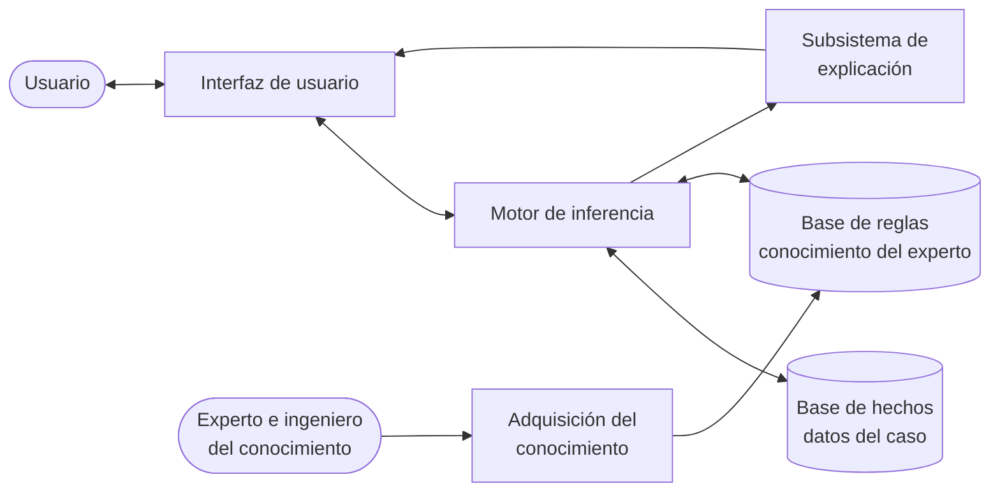
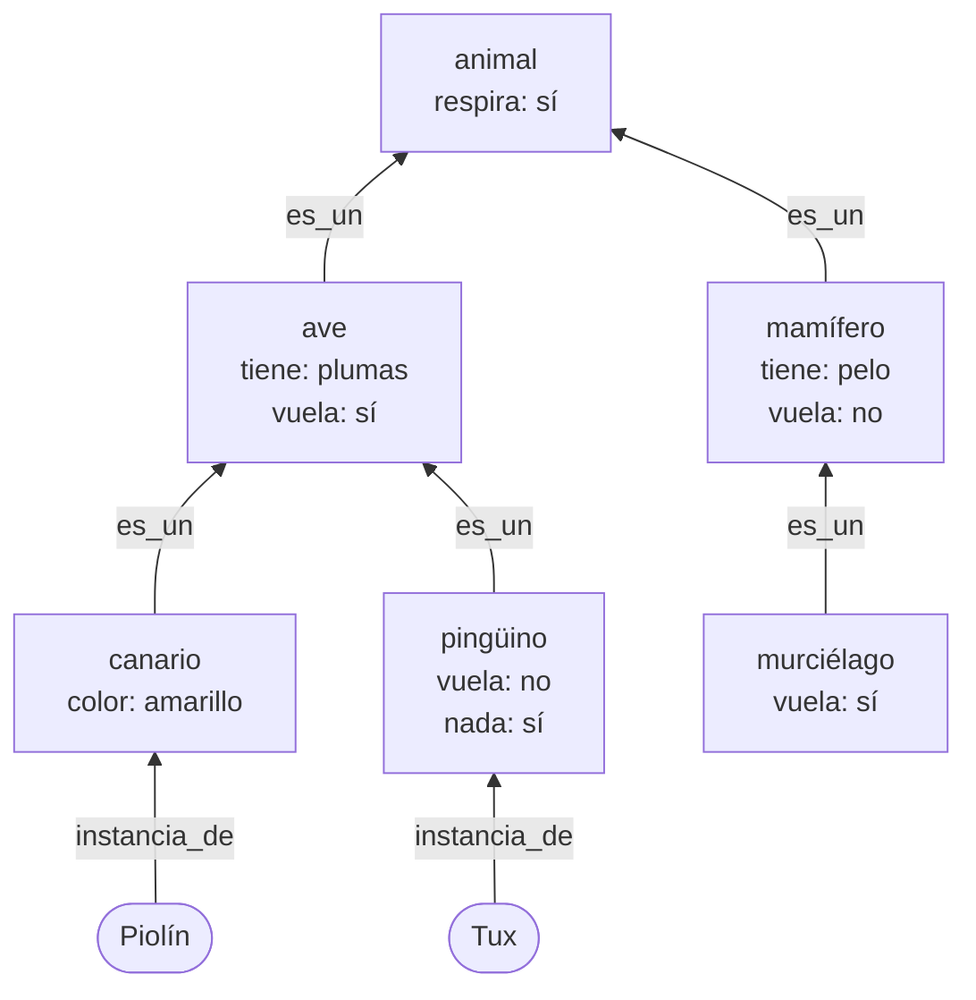
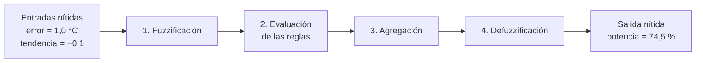

# Capítulo 5. Representación del conocimiento y razonamiento

**Curso:** Introducción a la Inteligencia Artificial (electiva) · Ingeniería de Software – modalidad virtual · UDES
**Semana:** 5 de 8
**Tiempo estimado de lectura:** 100 minutos
**Lecturas base:** García Serrano (2016), cap. 6 · Russell y Norvig (2004), caps. 7, 9, 10 y 14 (sección sobre lógica difusa)

---

## Objetivos de aprendizaje

Al terminar este capítulo podrás:

1. Explicar qué es la IA simbólica y usar la lógica proposicional para representar hechos y reglas, y para decidir si una conclusión se deduce de ellos.
2. Describir la arquitectura de un sistema experto y el papel de su base de hechos, su base de reglas y su motor de inferencia.
3. Aplicar el encadenamiento hacia adelante y hacia atrás, y elegir el más adecuado para un problema.
4. Representar conocimiento con redes semánticas y ontologías, y razonar con herencia y excepciones.
5. Definir conjuntos difusos y variables lingüísticas, y operar con ellos.
6. Construir un sistema de inferencia difusa de Mamdani y compararlo con un controlador nítido.

## ¿Cómo usar este capítulo?

- Lee una sección a la vez y responde los recuadros **«Para pensar»** antes de continuar.
- Los ejemplos del capítulo son los mismos del [cuaderno de la práctica](../practicas/): un sistema experto que diagnostica fallas de conexión a internet, una red semántica de animales y un termostato difuso. Las trazas y cifras se obtuvieron ejecutándolo.
- Cuando el capítulo cita un libro, lo hace con el formato *(Autor, año, capítulo)*. La lista completa está en la sección [Referencias](#referencias).

---

## Introducción

En las semanas 2 a 4, el conocimiento sobre el problema estaba **escondido en el código**: en la función sucesor, en la heurística o en la función de evaluación. Si un experto en ajedrez quería mejorar el programa de la semana 4, tenía que saber programar y entender el algoritmo. Este capítulo da un paso distinto: escribir el conocimiento de forma **explícita**, como hechos y reglas que un programa puede leer, combinar y **explicar**.

Ese es el núcleo de la **IA simbólica**, el enfoque dominante desde los años 50 hasta finales de los 80, y la base de los **sistemas expertos** que llevaron la IA a la industria (sección 1.3.5). Sus ideas siguen muy vivas: los motores de reglas de negocio, los grafos de conocimiento de los buscadores y los controladores difusos de muchos electrodomésticos las usan a diario.

El capítulo tiene dos mitades. Las secciones 5.1 a 5.4 tratan el razonamiento con conocimiento **preciso**: lógica, reglas, redes semánticas y ontologías. Las secciones 5.5 y 5.6 tratan el conocimiento **vago**, el que expresamos con palabras como «un poco de frío» o «bastante rápido», mediante la **lógica difusa**. La semana 6 abordará la otra gran fuente de imprecisión, la **incertidumbre**, con la probabilidad.

---

## 5.1 Lógica e IA simbólica

### 5.1.1 La hipótesis del sistema de símbolos físicos

Newell y Simon (1976) formularon la idea que sostiene a la IA simbólica: un **sistema de símbolos físicos** (un sistema que crea, combina y transforma símbolos, como un computador) tiene los medios necesarios y suficientes para la acción inteligente general. Según esta hipótesis, pensar es **manipular símbolos** según reglas.

Russell y Norvig (2004, cap. 7) lo concretan en el **agente basado en conocimiento**, que tiene dos partes:

- Una **base de conocimiento** (BC): un conjunto de **sentencias** escritas en un **lenguaje de representación**.
- Un mecanismo de **inferencia**, que deduce sentencias nuevas a partir de las que ya están en la BC.

La gran ventaja de esta separación es el enfoque **declarativo**: para cambiar lo que el agente sabe, basta con añadir o quitar sentencias, sin tocar el código del razonamiento.

### 5.1.2 Lógica proposicional

La **lógica proposicional** es el lenguaje de representación más sencillo (Russell y Norvig, 2004, cap. 7). Sus elementos son:

- **Símbolos proposicionales**, como *Llueve* o *CalleMojada*, que pueden ser verdaderos o falsos.
- **Conectivas**: ¬ (no), ∧ (y), ∨ (o), ⇒ (implica) y ⇔ (si y solo si).

Un **modelo** es una asignación de valores de verdad a todos los símbolos. La **semántica** dice cuándo una sentencia es verdadera en un modelo. La más delicada es la implicación: *A* ⇒ *B* solo es falsa cuando *A* es verdadera y *B* falsa.

| *A* | *B* | ¬*A* | *A* ∧ *B* | *A* ∨ *B* | *A* ⇒ *B* |
|:-:|:-:|:-:|:-:|:-:|:-:|
| V | V | F | V | V | V |
| V | F | F | F | V | F |
| F | V | V | F | V | V |
| F | F | V | F | F | V |

*Tabla 5.1. Tabla de verdad de las conectivas. Elaboración propia a partir de Russell y Norvig (2004, cap. 7).*

### 5.1.3 Consecuencia lógica e inferencia

Una base de conocimiento **implica** una sentencia α (se escribe BC ⊨ α) si α es verdadera en **todos** los modelos en los que la BC es verdadera (Russell y Norvig, 2004, cap. 7). Con pocas variables se puede comprobar enumerando la tabla de verdad. En la práctica, con la BC

> *Llueve* ⇒ *CalleMojada*, *CalleMojada* ⇒ *Resbaladiza*, *Llueve*

el programa comprueba que BC ⊨ *Resbaladiza*. Pero con *n* símbolos hay 2ⁿ modelos: con 30 símbolos, más de mil millones. Por eso se usan **reglas de inferencia**, que derivan sentencias nuevas directamente de las existentes. La más importante es el ***modus ponens***:

> De *A* ⇒ *B* y de *A*, se deduce *B*.

Un procedimiento de inferencia es **sólido** si solo deduce sentencias que realmente se siguen de la BC, y **completo** si puede deducir todas las que se siguen (Russell y Norvig, 2004, cap. 7).

Una advertencia: el razonamiento «*A* ⇒ *B*; *B*; por lo tanto *A*» **no** es válido. Se llama **afirmación del consecuente** y es un error frecuente. Que la calle esté mojada no implica que haya llovido: pudo pasar un carro de riego.

### 5.1.4 Reglas y cláusulas de Horn

Muchos sistemas reales restringen las sentencias a la forma

> *P*₁ ∧ *P*₂ ∧ … ∧ *Pₙ* ⇒ *Q*

es decir, «**SI** se cumplen todas las condiciones **ENTONCES** se cumple la conclusión». Russell y Norvig (2004, cap. 7) llaman a estas sentencias **cláusulas de Horn**. Su gran ventaja es que con ellas la inferencia por encadenamiento hacia adelante o hacia atrás, que veremos en la sección 5.3, es sólida, completa y muy eficiente: su costo crece de forma lineal con el tamaño de la base de conocimiento.

### 5.1.5 Más allá de la lógica proposicional

La lógica proposicional no puede decir «**todos** los routers tienen una luz de internet»: tendría que escribir una sentencia por cada router. La **lógica de primer orden** añade **objetos**, **predicados** y **cuantificadores** (Russell y Norvig, 2004, caps. 8 y 9):

> ∀*x* Router(*x*) ⇒ TieneLuzInternet(*x*)

Es mucho más expresiva, pero también más costosa de razonar. Los sistemas expertos de las secciones siguientes usan, en la práctica, reglas con variables que se encuentran a medio camino entre ambas lógicas.

> **Para pensar.** Escribe en lógica proposicional dos reglas que uses al decidir si llevas paraguas. ¿Qué conocimiento tuyo no logras expresar con verdadero y falso?

---

## 5.2 Sistemas expertos

### 5.2.1 ¿Qué es un sistema experto?

Un **sistema experto** es un programa que resuelve problemas de un dominio especializado usando el conocimiento de expertos humanos, representado normalmente como reglas (García Serrano, 2016, cap. 6). Su característica principal es que **separa el conocimiento del mecanismo de razonamiento**:



*Figura 5.1. Arquitectura de un sistema experto. Elaboración propia a partir de García Serrano (2016, cap. 6).*

- La **base de hechos** (o memoria de trabajo) contiene lo que se sabe del **caso concreto**: las observaciones del usuario y las conclusiones intermedias. Cambia en cada consulta.
- La **base de reglas** contiene el **conocimiento del dominio**, en forma de reglas SI-ENTONCES. Es la misma para todas las consultas.
- El **motor de inferencia** decide qué reglas aplicar y en qué orden. Es independiente del dominio: el mismo motor sirve para diagnosticar redes o enfermedades.
- El **subsistema de explicación** responde preguntas como «¿cómo llegaste a esa conclusión?» y «¿por qué me preguntas eso?».

En la práctica construyes un sistema experto con 15 reglas que diagnostica por qué un equipo no se conecta a internet en casa. Dos de sus reglas son:

```text
R3: SI router_con_luces Y ningun_dispositivo_conecta ENTONCES falla_de_red
R4: SI falla_de_red Y luz_internet_roja ENTONCES falla_del_proveedor
```

### 5.2.2 Los sistemas expertos en la historia

| Sistema | Dominio | Aporte |
|---|---|---|
| **DENDRAL** (Stanford, desde 1965) | Química: deducir la estructura de una molécula a partir de su espectro de masas. | Considerado el primer sistema experto; mostró que el conocimiento específico del dominio es la clave del rendimiento (Lindsay et al., 1993). |
| **MYCIN** (Stanford, años 70) | Medicina: diagnóstico de infecciones de la sangre y recomendación de antibióticos. | Unas 450 reglas con **factores de certeza** para manejar la incertidumbre, y un subsistema de explicación (Shortliffe y Buchanan, 1975). |
| **R1 / XCON** (Digital Equipment Corporation, 1980) | Configuración de pedidos de computadores VAX. | El primer sistema experto con éxito comercial; ahorraba a la empresa unos 40 millones de dólares al año (McDermott, 1982; sección 1.3.5). |

*Tabla 5.2. Tres sistemas expertos históricos. Elaboración propia a partir de las fuentes indicadas.*

### 5.2.3 Fortalezas y limitaciones

**Fortalezas.** Los sistemas expertos **explican** sus conclusiones paso a paso, algo que, como verás en las semanas 7 y 8, a muchas técnicas basadas en datos les cuesta. Además, el conocimiento se puede revisar y modificar regla por regla, y no necesitan datos de entrenamiento.

**Limitaciones.** La más conocida es el **cuello de botella de la adquisición del conocimiento**: extraer las reglas de un experto es lento y costoso, porque los expertos a menudo no saben explicar cómo deciden. Además, las bases de reglas grandes se vuelven difíciles de mantener, y los sistemas son **frágiles**: fuera de su dominio estrecho, o ante un caso que ninguna regla prevé, fallan sin aviso. Esta fragilidad contribuyó al «invierno de la IA» de finales de los 80 (sección 1.3.5).

**Hoy.** Las reglas siguen presentes en el software empresarial como **motores de reglas de negocio** (por ejemplo, Drools), que separan las políticas de una organización (descuentos, aprobación de créditos, validaciones) del código de la aplicación, exactamente como un sistema experto separa su base de reglas de su motor.

> **Para pensar.** Si tuvieras que construir un sistema experto que recomiende en qué electiva inscribirse, ¿a quién entrevistarías para obtener las reglas? ¿Qué dificultades crees que encontrarías?

---

## 5.3 Encadenamiento hacia adelante y hacia atrás

El motor de inferencia puede recorrer las reglas en dos direcciones (García Serrano, 2016, cap. 6; Russell y Norvig, 2004, caps. 7 y 9).

### 5.3.1 Encadenamiento hacia adelante

El **encadenamiento hacia adelante** parte de los **hechos conocidos** y aplica toda regla cuyas condiciones se cumplan, añadiendo su conclusión a la base de hechos, hasta que no se pueda deducir nada nuevo. Está **dirigido por los datos**.

```text
repetir:
    conjunto_conflicto = reglas no disparadas cuyas condiciones están todas en la base de hechos
    si conjunto_conflicto está vacío: terminar
    elegir una regla del conjunto conflicto (resolución de conflictos)
    dispararla: añadir su conclusión a la base de hechos
```

En la práctica, un usuario informa que el router tiene luces, que ningún dispositivo se conecta y que la luz de internet está roja. El motor razona así:

| Ciclo | Conjunto conflicto | Regla disparada | Hecho nuevo |
|:-:|---|---|---|
| 1 | R3 | R3 | `falla_de_red` |
| 2 | R4 | R4 | `falla_del_proveedor` |
| 3 | R5 | R5 | RECOMENDAR: llamar al proveedor de internet |

*Tabla 5.3. Traza del encadenamiento hacia adelante. Elaboración propia con el cuaderno de la práctica.*

Como el motor guarda qué regla produjo cada hecho, puede **explicar** la recomendación recorriendo la cadena hacia atrás: «llamar al proveedor, por R5, porque hay una falla del proveedor; que se dedujo por R4, porque hay una falla de red (R3) y la luz de internet está roja».

**Resolución de conflictos.** Cuando varias reglas son aplicables a la vez, el motor debe elegir una. Las estrategias más comunes son (García Serrano, 2016, cap. 6):

- **Orden:** la primera regla de la lista (la que usa la práctica).
- **Especificidad:** la regla con más condiciones, que es la más específica.
- **Recencia:** la regla que usa los hechos más recientes.
- **Refracción:** una regla no se dispara dos veces con los mismos hechos.

Si las reglas solo **añaden** hechos, el orden no cambia las conclusiones finales, solo el camino. Pero si las reglas pueden **borrar** hechos o ejecutar acciones, el orden sí importa.

Cuando hay miles de reglas, comprobar todas en cada ciclo es lento. El **algoritmo Rete** (Forgy, 1982) evita repetir comparaciones guardando en una red qué condiciones ya se cumplen; lo usan muchos motores de reglas actuales.

### 5.3.2 Encadenamiento hacia atrás

El **encadenamiento hacia atrás** parte de una **hipótesis** (una meta) y busca reglas que la concluyan. Para cada una, intenta demostrar sus condiciones como **submetas**, y así sucesivamente, hasta llegar a hechos que están en la base o que se pueden **preguntar** al usuario. Está **dirigido por los objetivos** (Russell y Norvig, 2004, cap. 7).

En la práctica, el sistema intenta demostrar la hipótesis «reiniciar el router»:

```text
Para demostrar «reiniciar el router» pruebo R7: SI falla_del_router
    Para demostrar «falla_del_router» pruebo R6: SI falla_de_red Y luz_internet_verde
        Para demostrar «falla_de_red» pruebo R3: SI router_con_luces Y ningun_dispositivo_conecta
            ? router_con_luces -> sí
            ? ningun_dispositivo_conecta -> sí
        => «falla_de_red» demostrado por R3
        ? luz_internet_verde -> sí
    => «falla_del_router» demostrado por R6
=> «reiniciar el router» demostrado por R7
```

Solo hizo **3 preguntas** de los 14 datos que el sistema podría pedir. Esa es la gran ventaja del encadenamiento hacia atrás: **no pregunta lo que no necesita**. Además, puede explicar **por qué** pregunta algo: «te pregunto por la luz de internet porque estoy intentando demostrar que hay una falla del router».

### 5.3.3 ¿Cuál usar?

| | Encadenamiento hacia adelante | Encadenamiento hacia atrás |
|---|---|---|
| **Punto de partida** | Los datos | Una hipótesis |
| **Pregunta típica** | ¿Qué se deduce de lo que sé? | ¿Es cierta esta hipótesis? |
| **Ventaja** | Descubre todas las conclusiones; reacciona a datos nuevos. | Solo explora lo relevante para la meta; hace pocas preguntas. |
| **Desventaja** | Puede deducir muchos hechos irrelevantes. | Necesita hipótesis concretas para empezar. |
| **Usos típicos** | Monitoreo, alarmas, configuración (como R1/XCON). | Diagnóstico y consulta (como MYCIN). |

*Tabla 5.4. Comparación de las dos formas de encadenamiento. Elaboración propia a partir de García Serrano (2016, cap. 6) y Russell y Norvig (2004, cap. 7).*

> **Para pensar.** Un sistema que vigila los sensores de temperatura de un centro de datos y dispara alarmas, ¿debería razonar hacia adelante o hacia atrás? ¿Y un asistente que ayuda a un estudiante a saber si cumple los requisitos para graduarse?

---

## 5.4 Redes semánticas y ontologías

### 5.4.1 Redes semánticas

Una **red semántica** representa el conocimiento como un **grafo**: los nodos son conceptos o individuos, y los arcos etiquetados son relaciones entre ellos. Quillian (1968) la propuso como modelo de la memoria humana, y desde entonces se ha usado como una forma intuitiva de organizar el conocimiento (Russell y Norvig, 2004, cap. 10).

La relación más importante es **es_un**, que organiza los conceptos en una **jerarquía** (una **taxonomía**) y permite la **herencia**: un concepto tiene todas las propiedades de sus antepasados. Así no hay que repetir que el canario, la paloma y el colibrí tienen plumas: basta con decirlo una vez del concepto *ave*.



*Figura 5.2. La red semántica de la práctica. Elaboración propia.*

### 5.4.2 Herencia, excepciones y herencia múltiple

Para responder «¿Tux vuela?», el sistema busca la propiedad en el nodo *Tux*; si no la encuentra, sube por los arcos es_un hasta hallarla. En la práctica:

| Consulta | Respuesta | Camino recorrido |
|---|---|---|
| ¿Tux vuela? | No | Tux → pingüino |
| ¿Tux tiene…? | Plumas | Tux → pingüino → ave |
| ¿Tux respira? | Sí | Tux → pingüino → ave → animal |
| ¿Piolín vuela? | Sí | Piolín → canario → ave |

*Tabla 5.5. Consultas por herencia en la red semántica de la práctica. Elaboración propia con el cuaderno de la práctica.*

La primera consulta muestra una **excepción**: las aves vuelan, pero el pingüino no. La regla es que **el valor más específico gana**: como el sistema busca primero en el nodo más cercano, encuentra «vuela: no» en *pingüino* antes de llegar a *ave*. Esto se llama **herencia por defecto**: las propiedades heredadas son supuestos razonables que se pueden anular (Russell y Norvig, 2004, cap. 10).

El problema aparece con la **herencia múltiple**: si un concepto tiene dos padres con valores contradictorios, ¿cuál hereda? El ejemplo clásico es Richard Nixon, que era cuáquero (los cuáqueros son pacifistas) y republicano (los republicanos, en el ejemplo, no lo son). No hay una respuesta lógicamente correcta, y cada sistema debe definir una política (Russell y Norvig, 2004, cap. 10).

Una idea cercana son los **marcos** (*frames*) de Minsky (1974): estructuras con **ranuras** que agrupan las propiedades de un concepto, con valores por defecto que se heredan. Los marcos son un antecedente directo de las **clases** y la **herencia** de la programación orientada a objetos que usas en ingeniería de software.

### 5.4.3 Ontologías y grafos de conocimiento

Gruber (1993) definió una **ontología** como «una especificación explícita de una conceptualización»: un vocabulario compartido y formal de los conceptos de un dominio, sus propiedades y sus relaciones, pensado para que distintos sistemas lo usen y lo entiendan igual.

En la web, las ontologías se escriben como **tripletas** (sujeto, predicado, objeto), el formato del estándar **RDF** del W3C. La red de la práctica se guarda exactamente así:

```text
("pinguino", "es_un", "ave")
("ave", "tiene", "plumas")
("Tux", "instancia_de", "pinguino")
```

Sobre RDF, el lenguaje **OWL** permite definir clases, propiedades y restricciones con una semántica lógica precisa, lo que permite a un razonador deducir hechos nuevos. Berners-Lee, Hendler y Lassila (2001) propusieron con estas tecnologías la **web semántica**: una web cuyos datos pudieran entender las máquinas, y no solo las personas.

Hoy la idea vive en los **grafos de conocimiento**. En 2012 Google presentó el suyo con el lema «cosas, no cadenas» (Singhal, 2012): el buscador ya no solo compara palabras, sino que sabe que «Bucaramanga» es una ciudad, que está en Santander y que Santander es un departamento de Colombia. **Wikidata**, la base de conocimiento libre de la Fundación Wikimedia, contiene millones de elementos enlazados de esta forma y cualquiera puede consultarla.

> **Para pensar.** Diseña una pequeña ontología del plan de estudios de tu carrera: ¿qué conceptos (curso, prerrequisito, docente, semestre…) y qué relaciones necesitas? ¿Qué preguntas podría responder un programa con esa ontología?

---

## 5.5 Conjuntos difusos

### 5.5.1 El problema de las fronteras nítidas

Piensa en el conjunto de las «personas altas». ¿Una persona de 1,79 m es alta? ¿Y una de 1,80 m? En la lógica clásica, un elemento **pertenece o no** a un conjunto: habría que fijar un umbral, digamos 1,80 m, y aceptar que 1 cm convierte a alguien de «no alto» en «alto». Las personas no razonamos así.

Zadeh (1965) propuso los **conjuntos difusos**: conjuntos en los que cada elemento tiene un **grado de pertenencia** entre 0 y 1. Una persona de 1,79 m puede pertenecer al conjunto «alto» con grado 0,7, y una de 1,95 m con grado 1.

| Estatura | Conjunto nítido «alto» (umbral 1,80 m) | Conjunto difuso «alto» |
|---|:-:|:-:|
| 1,60 m | 0 | 0,0 |
| 1,75 m | 0 | 0,5 |
| 1,79 m | 0 | 0,7 |
| 1,80 m | 1 | 0,75 |
| 1,95 m | 1 | 1,0 |

*Tabla 5.6. Pertenencia nítida y difusa al conjunto «alto». Elaboración propia; los grados difusos son ilustrativos.*

### 5.5.2 Funciones de pertenencia y variables lingüísticas

La **función de pertenencia** μ_A(*x*) asigna a cada elemento *x* su grado de pertenencia al conjunto *A*. Las formas más usadas son la **triangular** y la **trapezoidal**, porque son sencillas de definir y de calcular (García Serrano, 2016, cap. 6).

Una **variable lingüística** es una variable cuyos valores son palabras, cada una asociada a un conjunto difuso. En el termostato de la práctica, la variable *error* (la diferencia entre la temperatura deseada y la actual, en °C) toma tres valores lingüísticos:

- **caliente** (sobra calor): trapecio que vale 1 hasta −2 °C y baja a 0 en 0 °C.
- **bien**: triángulo con vértice en 0 °C y base de −1,5 a 1,5 °C.
- **frío** (falta calor): trapecio que sube de 0 en 0 °C a 1 en 2 °C.

Con un error de 1,0 °C, la temperatura es «bien» con grado 0,33 y «frío» con grado 0,5 **a la vez**. Esa es la diferencia fundamental con la lógica clásica: un valor puede pertenecer **parcialmente** a varios conjuntos.

### 5.5.3 Operaciones

Las operaciones de conjuntos se generalizan a grados de pertenencia. Las definiciones originales de Zadeh (1965), que son las más usadas, son:

| Operación | Lógica | Definición difusa |
|---|---|---|
| Intersección | Y | μ_{A∩B}(*x*) = mín(μ_A(*x*), μ_B(*x*)) |
| Unión | O | μ_{A∪B}(*x*) = máx(μ_A(*x*), μ_B(*x*)) |
| Complemento | NO | μ_{¬A}(*x*) = 1 − μ_A(*x*) |

*Tabla 5.7. Operaciones con conjuntos difusos. Elaboración propia a partir de Zadeh (1965).*

Si los grados solo pueden ser 0 o 1, estas operaciones coinciden con las de la lógica clásica (tabla 5.1).

### 5.5.4 Difuso no es probable

Un grado de pertenencia de 0,7 no es una probabilidad de 0,7. La probabilidad mide la **incertidumbre** sobre algo que es o no es: «hay un 70 % de probabilidad de que mañana llueva». La lógica difusa mide la **vaguedad** de un concepto que no tiene fronteras nítidas: «hoy está *bastante* nublado». Russell y Norvig (2004, cap. 14) subrayan esta diferencia: la lógica difusa es una forma de razonar sobre la **verdad parcial**, no sobre la incertidumbre. La probabilidad es el tema de la semana 6.

> **Para pensar.** Define con funciones de pertenencia la variable lingüística «tiempo de respuesta de una página web» con los valores rápido, aceptable y lento. ¿Dónde pondrías las fronteras? ¿Las pondría igual un usuario de un juego en línea?

---

## 5.6 Inferencia difusa: el método de Mamdani

### 5.6.1 Reglas difusas

Un **sistema de inferencia difusa** razona con reglas cuyas condiciones y conclusiones son valores lingüísticos:

> **SI** el error es *frío* **Y** la tendencia es *bajando* **ENTONCES** la potencia es *alta*

El primer controlador basado en estas reglas fue el de **Mamdani y Assilian (1975)**, que controlaron una máquina de vapor de laboratorio con reglas escritas a partir de la experiencia de un operador humano. Desde entonces, el control difuso se ha usado en lavadoras, cámaras, sistemas de frenado y aire acondicionado. Un ejemplo célebre es el metro de Sendai, en Japón, que desde 1987 usa control difuso para acelerar y frenar con suavidad.

### 5.6.2 El termostato de la práctica

El controlador de la práctica decide la **potencia** de un calefactor (0 a 100 %) a partir de dos entradas: el **error** (objetivo − temperatura actual) y la **tendencia** de la temperatura (°C por minuto). Sus nueve reglas se escriben como una tabla, llamada **matriz de memoria asociativa difusa** (FAM):

| Error \ Tendencia | bajando | estable | subiendo |
|---|---|---|---|
| **frío** | alta | alta | alta |
| **bien** | media | media | baja |
| **caliente** | baja | nula | nula |

*Tabla 5.8. Base de reglas del termostato difuso. Elaboración propia.*

### 5.6.3 Los cuatro pasos

El método de Mamdani tiene cuatro pasos (García Serrano, 2016, cap. 6). Veámoslos con un error de 1,0 °C (falta un poco de calor) y una tendencia de −0,1 °C/min (la temperatura baja):



*Figura 5.3. Los pasos de la inferencia de Mamdani. Elaboración propia.*

1. **Fuzzificación.** Se calcula el grado de pertenencia de cada entrada a cada etiqueta. El error es *frío* con 0,5 y *bien* con 0,33; la tendencia es *bajando* con 0,5 y *estable* con 0,33.
2. **Evaluación de las reglas.** El grado de activación de una regla con «Y» es el **mínimo** de los grados de sus condiciones. Se activan cuatro reglas:

   | Regla | Grado |
   |---|:-:|
   | frío Y bajando → alta | mín(0,5; 0,5) = 0,50 |
   | frío Y estable → alta | mín(0,5; 0,33) = 0,33 |
   | bien Y bajando → media | mín(0,33; 0,5) = 0,33 |
   | bien Y estable → media | mín(0,33; 0,33) = 0,33 |

   El conjunto de salida de cada regla se **recorta** a la altura de su grado de activación.
3. **Agregación.** Los conjuntos recortados se unen con el **máximo**, y se obtiene un único conjunto difuso de salida.
4. **Defuzzificación.** Se convierte ese conjunto en un número. El método más común es el **centroide**: el centro de gravedad del área bajo la curva. Aquí da una potencia de **74,5 %**.

### 5.6.4 ¿Vale la pena? La simulación

La práctica simula una habitación durante 3 horas con dos controladores: el difuso y un termostato **nítido** que enciende al 100 % por debajo de 21,5 °C y apaga por encima de 22,5 °C. A los 90 minutos se abre una ventana durante 10 minutos.

| Controlador | Llega a 21,5 °C en | Temperatura media (estable) | Oscilación | Cambios bruscos de potencia | Energía usada |
|---|:-:|:-:|:-:|:-:|:-:|
| Nítido | minuto 28 | 21,97 °C | ±0,65 °C | 19 | 134 min a plena potencia |
| Difuso | minuto 53 | 21,77 °C | ±0,13 °C | 7 | 129 min a plena potencia |

*Tabla 5.9. Termostato nítido frente a termostato difuso. Elaboración propia con el cuaderno de la práctica.*

El controlador difuso mantiene una temperatura mucho **más estable** y cambia la potencia con suavidad, lo que reduce el desgaste del aparato y el consumo. A cambio, tarda más en calentar la habitación y se queda **ligeramente por debajo** del objetivo, porque cerca de 22 °C su potencia apenas supera la necesaria para compensar las pérdidas. Corregirlo es el ejercicio 5 de la práctica.

La lección más importante, sin embargo, es de ingeniería de software: el comportamiento del controlador está escrito en **nueve reglas legibles**, que un experto en climatización puede revisar y ajustar sin entender ecuaciones diferenciales.

> **Para pensar.** ¿Qué reglas difusas usarías para controlar la velocidad de un ventilador según la temperatura y la humedad? Escribe la matriz FAM.

---

## 5.7 Del conocimiento experto a los datos

Todas las técnicas de este capítulo tienen algo en común: **alguien escribe el conocimiento**. Esa es su fuerza (son explicables y no necesitan datos) y su debilidad (hay que encontrar al experto y traducir lo que sabe en reglas).

| | Sistemas basados en conocimiento (semana 5) | Sistemas basados en datos (semana 6) |
|---|---|---|
| **Origen del conocimiento** | Expertos humanos | Ejemplos |
| **Explicación** | Natural: la cadena de reglas | Más difícil |
| **Costo principal** | Adquirir y mantener el conocimiento | Reunir y etiquetar datos |
| **Ante casos nuevos** | Falla si ninguna regla los prevé | Generaliza, a veces mal |

*Tabla 5.10. Dos formas de construir un sistema inteligente. Elaboración propia.*

La semana 6 explora la segunda columna. En la **Actividad Evaluativa 3** construirás los dos tipos de sistema sobre el mismo problema y los compararás.

---

## Resumen

- La **IA simbólica** representa el conocimiento con símbolos y razona manipulándolos. Un **agente basado en conocimiento** separa la **base de conocimiento** del mecanismo de **inferencia**.
- En **lógica proposicional**, una BC **implica** una sentencia si esta es verdadera en todos los modelos de la BC. El ***modus ponens*** permite inferir sin enumerar modelos. Las reglas SI-ENTONCES son **cláusulas de Horn**, con las que la inferencia es eficiente. La **lógica de primer orden** añade objetos y cuantificadores.
- Un **sistema experto** tiene una **base de hechos**, una **base de reglas**, un **motor de inferencia** y un **subsistema de explicación**. DENDRAL, MYCIN y R1/XCON marcaron su historia. Su principal limitación es el **cuello de botella de la adquisición del conocimiento**.
- El **encadenamiento hacia adelante** va de los datos a las conclusiones; el **encadenamiento hacia atrás** va de una hipótesis a los datos que la confirman y solo pregunta lo necesario.
- Las **redes semánticas** organizan conceptos en jerarquías con **herencia** y **excepciones**. Las **ontologías** formalizan un vocabulario compartido, se escriben como **tripletas** RDF y sostienen los **grafos de conocimiento** actuales.
- Los **conjuntos difusos** asignan **grados de pertenencia** entre 0 y 1 y modelan la **vaguedad**, no la incertidumbre. Las **variables lingüísticas** toman valores como «frío» o «alta».
- La **inferencia de Mamdani** fuzzifica las entradas, evalúa las reglas con el mínimo, agrega con el máximo y defuzzifica con el centroide. Produce controladores suaves y fáciles de entender.

---

## Glosario

| Término | Definición |
|---|---|
| **Base de hechos** | Conjunto de datos conocidos sobre el caso concreto que se está resolviendo. |
| **Base de reglas** | Conjunto de reglas SI-ENTONCES que representan el conocimiento del dominio. |
| **Centroide** | Método de defuzzificación que toma el centro de gravedad del conjunto difuso de salida. |
| **Cláusula de Horn** | Regla con una conjunción de condiciones y una sola conclusión. |
| **Conjunto conflicto** | Conjunto de reglas aplicables en un ciclo del motor de inferencia. |
| **Conjunto difuso** | Conjunto en el que cada elemento tiene un grado de pertenencia entre 0 y 1. |
| **Consecuencia lógica (⊨)** | Una BC implica α si α es verdadera en todos los modelos en que la BC es verdadera. |
| **Defuzzificación** | Conversión de un conjunto difuso de salida en un valor numérico. |
| **Encadenamiento hacia adelante** | Inferencia dirigida por los datos: aplica reglas hasta no poder deducir nada nuevo. |
| **Encadenamiento hacia atrás** | Inferencia dirigida por objetivos: busca reglas que demuestren una hipótesis. |
| **Función de pertenencia** | Función que asigna a cada elemento su grado de pertenencia a un conjunto difuso. |
| **Fuzzificación** | Cálculo de los grados de pertenencia de una entrada nítida a los conjuntos difusos. |
| **Herencia** | Mecanismo por el que un concepto adquiere las propiedades de sus antepasados en una jerarquía. |
| **Motor de inferencia** | Componente que decide qué reglas aplicar y en qué orden. |
| **Ontología** | Especificación explícita de una conceptualización: conceptos, propiedades y relaciones de un dominio. |
| **Red semántica** | Grafo cuyos nodos son conceptos o individuos y cuyos arcos son relaciones. |
| **Variable lingüística** | Variable cuyos valores son palabras asociadas a conjuntos difusos. |

---

## Preguntas de repaso

1. Usa una tabla de verdad para comprobar si {*A* ⇒ *B*, ¬*B*} implica ¬*A*. ¿Cómo se llama esta forma de razonamiento?
2. Explica con un ejemplo de tu vida cotidiana por qué la afirmación del consecuente no es un razonamiento válido.
3. Dibuja la arquitectura de un sistema experto y explica qué cambia y qué se mantiene igual entre una consulta y otra.
4. Con las reglas de la práctica, aplica a mano el encadenamiento hacia adelante con los hechos `otros_dispositivos_conectan`, `equipo_con_wifi` y `paginas_no_cargan`.
5. Con las mismas reglas, aplica el encadenamiento hacia atrás para la hipótesis «activar el wifi del equipo». ¿Qué preguntas haría el sistema y en qué orden?
6. ¿Por qué se dice que la adquisición del conocimiento es el cuello de botella de los sistemas expertos?
7. Añade a la red semántica de la figura 5.2 el concepto *avestruz* y la instancia *Rocky*. Escribe las tripletas necesarias y explica cómo se responde «¿Rocky vuela?».
8. Explica la diferencia entre un grado de pertenencia de 0,8 y una probabilidad de 0,8 con un ejemplo propio.
9. Repite a mano la inferencia de Mamdani del termostato con un error de −0,5 °C y una tendencia de 0,1 °C/min: calcula los grados de pertenencia y el grado de activación de cada regla.
10. Compara el termostato nítido y el difuso de la tabla 5.9. ¿Cuál instalarías en un hospital? ¿Y en un invernadero?

---

## Referencias

Berners-Lee, T., Hendler, J., y Lassila, O. (2001). The semantic web. *Scientific American, 284*(5), 34-43. https://doi.org/10.1038/scientificamerican0501-34

Forgy, C. L. (1982). Rete: A fast algorithm for the many pattern/many object pattern match problem. *Artificial Intelligence, 19*(1), 17-37. https://doi.org/10.1016/0004-3702(82)90020-0

García Serrano, A. (2016). *Inteligencia artificial: Fundamentos, práctica y aplicaciones* (2.ª ed.). RC Libros.

Gruber, T. R. (1993). A translation approach to portable ontology specifications. *Knowledge Acquisition, 5*(2), 199-220. https://doi.org/10.1006/knac.1993.1008

Lindsay, R. K., Buchanan, B. G., Feigenbaum, E. A., y Lederberg, J. (1993). DENDRAL: A case study of the first expert system for scientific hypothesis formation. *Artificial Intelligence, 61*(2), 209-261. https://doi.org/10.1016/0004-3702(93)90068-M

Mamdani, E. H., y Assilian, S. (1975). An experiment in linguistic synthesis with a fuzzy logic controller. *International Journal of Man-Machine Studies, 7*(1), 1-13. https://doi.org/10.1016/S0020-7373(75)80002-2

McDermott, J. (1982). R1: A rule-based configurer of computer systems. *Artificial Intelligence, 19*(1), 39-88. https://doi.org/10.1016/0004-3702(82)90021-2

Minsky, M. (1974). *A framework for representing knowledge* (AI Memo 306). Massachusetts Institute of Technology. https://dspace.mit.edu/handle/1721.1/6089

Newell, A., y Simon, H. A. (1976). Computer science as empirical inquiry: Symbols and search. *Communications of the ACM, 19*(3), 113-126. https://doi.org/10.1145/360018.360022

Quillian, M. R. (1968). Semantic memory. En M. Minsky (Ed.), *Semantic information processing* (pp. 227-270). MIT Press.

Russell, S. J., y Norvig, P. (2004). *Inteligencia artificial: Un enfoque moderno* (2.ª ed.; J. M. Corchado Rodríguez et al., Trads.). Pearson Educación.

Shortliffe, E. H., y Buchanan, B. G. (1975). A model of inexact reasoning in medicine. *Mathematical Biosciences, 23*(3-4), 351-379. https://doi.org/10.1016/0025-5564(75)90047-4

Singhal, A. (2012, 16 de mayo). *Introducing the Knowledge Graph: things, not strings*. Google. https://blog.google/products/search/introducing-knowledge-graph-things-not/

Zadeh, L. A. (1965). Fuzzy sets. *Information and Control, 8*(3), 338-353. https://doi.org/10.1016/S0019-9958(65)90241-X
