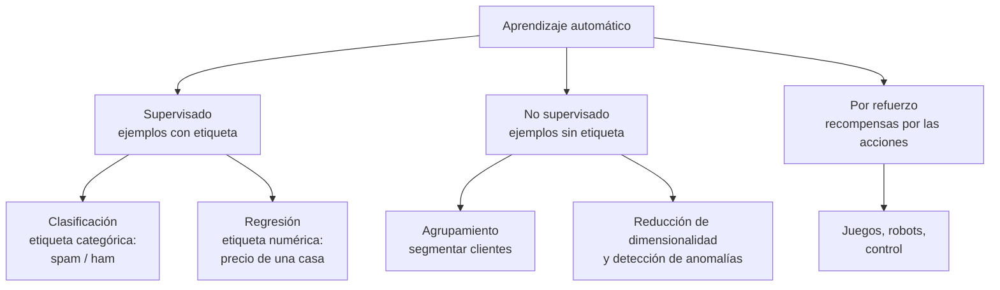

# Capítulo 6. Aprendizaje automático e IA basada en datos

**Curso:** Introducción a la Inteligencia Artificial (electiva) · Ingeniería de Software – modalidad virtual · UDES
**Semana:** 6 de 8
**Tiempo estimado de lectura:** 100 minutos
**Lecturas base:** García Serrano (2016), cap. 7 (primera parte) · Rouhiainen (2018), cap. 1 (preguntas sobre los datos) · Russell y Norvig (2004), caps. 13, 18 y 20

---

## Objetivos de aprendizaje

Al terminar este capítulo podrás:

1. Distinguir los datos estructurados de los no estructurados y describir un conjunto de datos con su vocabulario: ejemplos, atributos y etiquetas.
2. Diferenciar el aprendizaje supervisado, el no supervisado y el aprendizaje por refuerzo, y reconocer cada uno en aplicaciones reales.
3. Calcular probabilidades conjuntas, condicionales y totales a partir de una tabla de datos.
4. Aplicar el teorema de Bayes e interpretar sus términos: probabilidad a priori, verosimilitud y probabilidad a posteriori.
5. Construir a mano y en Python un clasificador bayesiano ingenuo, con suavizado de Laplace.
6. Evaluar un clasificador con datos de prueba, una matriz de confusión, precisión y exhaustividad.

## ¿Cómo usar este capítulo?

- Lee una sección a la vez y responde los recuadros **«Para pensar»** antes de continuar.
- Ten una calculadora a mano: las secciones 6.3 a 6.5 tienen cálculos sencillos que conviene repetir.
- Los ejemplos del capítulo son los mismos del [cuaderno de la práctica](../practicas/). Las cifras se obtuvieron ejecutándolo.
- Cuando el capítulo cita un libro, lo hace con el formato *(Autor, año, capítulo o pregunta)*. La lista completa está en la sección [Referencias](#referencias).

---

## Introducción

En la semana 5 construiste un sistema experto escribiendo sus reglas a mano. Funcionó, pero tuviste que **saber** de antemano cómo se diagnostica una falla de conexión. ¿Y si nadie sabe escribir las reglas? Nadie puede escribir una regla que distinga una foto de un gato de una de un perro, ni una lista completa de las palabras que delatan un correo fraudulento: los estafadores cambian sus mensajes cada semana.

El **aprendizaje automático** (*machine learning*) cambia el enfoque: en lugar de programar las reglas, se le dan al programa **ejemplos** y él descubre los patrones. Mitchell (1997) lo definió así: un programa **aprende** de la experiencia *E* con respecto a una tarea *T* y una medida de rendimiento *P*, si su rendimiento en *T*, medido por *P*, mejora con la experiencia *E*. Para un filtro de *spam*, *T* es clasificar mensajes, *P* es el porcentaje de mensajes bien clasificados y *E* es un conjunto de mensajes ya etiquetados.

En la semana 1 viste que el auge actual de la IA se explica en buena parte por la disponibilidad de **datos** y de **cómputo** (sección 1.4). Este capítulo explica qué hace la IA con esos datos. Empieza por los datos mismos (6.1), presenta los tipos de aprendizaje (6.2), repasa la probabilidad que hace falta (6.3 y 6.4) y termina con un primer algoritmo de aprendizaje completo, el **clasificador bayesiano ingenuo** (6.5 y 6.6). La semana 7 presentará las redes neuronales.

---

## 6.1 Los datos: estructurados y no estructurados

### 6.1.1 Dos tipos de datos

En la sección 1.4.1 viste la distinción que hace Rouhiainen (2018, pregunta 3):

- Los **datos estructurados** tienen un formato fijo y se organizan en tablas: valores numéricos, fechas, monedas o categorías. Son los datos de una base de datos relacional o de una hoja de cálculo.
- Los **datos no estructurados** no tienen ese formato: textos, imágenes, audios y videos. Según la estimación que cita Rouhiainen (2018, pregunta 3), entre el 80 % y el 90 % de los datos de negocios son de este tipo.

Para que un algoritmo pueda aprender de datos no estructurados, primero hay que **representarlos** como números. La forma de hacerlo es una de las decisiones más importantes de un proyecto de IA. En la práctica verás dos representaciones de un texto: la **bolsa de palabras**, que cuenta cuántas veces aparece cada palabra, y los **trigramas de caracteres**, que cuentan secuencias de tres letras.

### 6.1.2 El vocabulario de un conjunto de datos

| Término | Significado | En el ejemplo del partido (sección 6.5) |
|---|---|---|
| **Ejemplo** (instancia, registro) | Cada caso del conjunto de datos; una fila de la tabla. | Un día |
| **Atributo** (característica, variable) | Cada propiedad que describe un ejemplo; una columna. | Cielo, temperatura, humedad, viento |
| **Etiqueta** (clase, variable objetivo) | Lo que se quiere predecir. | ¿Se jugó el partido? |
| **Conjunto de entrenamiento** | Los ejemplos con los que aprende el algoritmo. | |
| **Conjunto de prueba** | Ejemplos que el algoritmo **no vio** al aprender, usados para medir su rendimiento. | |

*Tabla 6.1. Vocabulario básico de un conjunto de datos. Elaboración propia.*

Los atributos pueden ser **numéricos** (la temperatura en grados) o **categóricos** (el cielo: soleado, nublado o lluvioso). Muchas técnicas, como la versión del clasificador bayesiano de este capítulo, trabajan con atributos categóricos; los numéricos se pueden **discretizar** en rangos.

### 6.1.3 La calidad de los datos

Un modelo aprendido no puede ser mejor que los datos de los que aprende. Rouhiainen (2018, pregunta 3) recuerda que las grandes empresas tecnológicas construyen su ventaja sobre un ciclo virtuoso: más usuarios generan más datos, que mejoran los productos, que atraen más usuarios (figura 1.1). Pero la cantidad no basta. Los datos deben ser:

- **Representativos:** deben parecerse a los casos en los que se usará el modelo. Un filtro entrenado con SMS en inglés no sirve para mensajes en español.
- **Correctos:** las etiquetas equivocadas enseñan patrones equivocados.
- **Suficientes:** con pocos ejemplos, el modelo puede confundir casualidades con patrones.
- **Justos:** si los datos reflejan prejuicios del pasado, el modelo los aprenderá y los repetirá. Este problema, el **sesgo**, es uno de los temas centrales de la semana 8.

> **Para pensar.** Elige una aplicación que uses a diario. ¿Qué datos estructurados y qué datos no estructurados crees que recoge sobre ti? ¿Para qué podría usarlos?

---

## 6.2 Aprendizaje supervisado, no supervisado y por refuerzo

Russell y Norvig (2004, cap. 18) distinguen tres tipos de aprendizaje según el tipo de **retroalimentación** que recibe el agente.

*Figura 6.1. Tipos de aprendizaje automático. Elaboración propia a partir de Russell y Norvig (2004, cap. 18).*

### 6.2.1 Aprendizaje supervisado

En el **aprendizaje supervisado**, cada ejemplo de entrenamiento viene con la **respuesta correcta** (la etiqueta), como si un profesor la hubiera dado. El algoritmo aprende una función que relaciona los atributos con la etiqueta, para aplicarla a casos nuevos (Russell y Norvig, 2004, cap. 18). Hay dos tipos de tareas:

- **Clasificación**, si la etiqueta es una categoría: *spam* o legítimo, enfermo o sano, el idioma de un texto.
- **Regresión**, si la etiqueta es un número: el precio de un apartamento, la demanda de energía de mañana.

Es el tipo de aprendizaje más usado en la industria, y el que verás en la práctica y en la Actividad Evaluativa 3. Su principal costo es conseguir **datos etiquetados**: alguien tuvo que marcar miles de mensajes como *spam*. Por eso Quick, Draw!, que usaste en la semana 1, necesita saber qué objeto **se pidió** dibujar: esa es la etiqueta.

### 6.2.2 Aprendizaje no supervisado

En el **aprendizaje no supervisado** los ejemplos **no tienen etiqueta**. El algoritmo busca por sí mismo estructura en los datos (Russell y Norvig, 2004, cap. 18). La tarea más común es el **agrupamiento** (*clustering*): formar grupos de ejemplos parecidos entre sí.

En la práctica, el algoritmo ***k*-medias** recibe el gasto mensual y las visitas de 300 clientes de una tienda en línea, sin ninguna etiqueta, y encuentra tres grupos con centros en (51 mil pesos, 2 visitas), (151 mil pesos, 15 visitas) y (300 mil pesos, 6 visitas). El algoritmo no sabe qué significa cada grupo: ponerles nombre («clientes ocasionales», «clientes frecuentes», «grandes compradores») es trabajo de las personas.

### 6.2.3 Aprendizaje por refuerzo

En el **aprendizaje por refuerzo**, el agente no recibe ejemplos, sino **recompensas** o castigos por sus acciones, a menudo mucho tiempo después de haberlas tomado (Russell y Norvig, 2004, cap. 21). Un agente que aprende a jugar Conecta 4 solo sabe al final de la partida si ganó o perdió, y debe averiguar qué jugadas fueron responsables del resultado.

Ya conoces varios ejemplos: TD-Gammon aprendió *backgammon* jugando contra sí mismo (sección 4.6.2), AlphaGo Zero aprendió Go sin datos humanos (tabla 1.2), y Mnih et al. (2015) entrenaron un mismo agente para jugar decenas de videojuegos de Atari a partir de los píxeles de la pantalla y la puntuación. El aprendizaje por refuerzo también es una de las etapas del entrenamiento de los asistentes conversacionales actuales, a partir de las valoraciones de personas (sección 1.3.8).

| | Supervisado | No supervisado | Por refuerzo |
|---|---|---|---|
| **Qué recibe** | Ejemplos con etiqueta | Ejemplos sin etiqueta | Recompensas por sus acciones |
| **Qué aprende** | Una función de los atributos a la etiqueta | Estructura: grupos, patrones, anomalías | Una política: qué hacer en cada estado |
| **Ejemplo** | Filtro de *spam* | Segmentación de clientes | Agente que juega |

*Tabla 6.2. Comparación de los tres tipos de aprendizaje. Elaboración propia a partir de Russell y Norvig (2004, caps. 18 y 21).*

### 6.2.4 ¿Aprendió o memorizó? La evaluación

Un modelo que acierta en todos los ejemplos con los que se entrenó puede haber **memorizado** sin aprender. Lo que importa es su capacidad de **generalizar**: acertar en casos nuevos. Por eso, antes de entrenar, se separa una parte de los datos como **conjunto de prueba**, que el algoritmo no verá hasta el final (Russell y Norvig, 2004, cap. 18). Un modelo que funciona muy bien con los datos de entrenamiento y mal con los de prueba sufre de **sobreajuste**.

Para un clasificador con una clase **positiva** (por ejemplo, *spam*), los aciertos y errores se resumen en una **matriz de confusión**:

| | Predicho positivo | Predicho negativo |
|---|:-:|:-:|
| **Realmente positivo** | Verdadero positivo (VP) | Falso negativo (FN) |
| **Realmente negativo** | Falso positivo (FP) | Verdadero negativo (VN) |

*Tabla 6.3. Matriz de confusión. Elaboración propia.*

A partir de ella se calculan tres métricas:

- **Exactitud** (*accuracy*): (VP + VN) / total. La proporción de aciertos.
- **Precisión**: VP / (VP + FP). De lo que el modelo marcó como positivo, ¿cuánto lo era?
- **Exhaustividad** o **sensibilidad** (*recall*): VP / (VP + FN). De los positivos reales, ¿cuántos detectó?

¿Por qué no basta la exactitud? En el corpus de SMS de la práctica, solo el 13 % de los mensajes son *spam*: un «filtro» que diga siempre «legítimo» tendría una exactitud del 87 % sin detectar un solo *spam*. Cuando las clases están **desbalanceadas**, la precisión y la exhaustividad dicen mucho más. Además, los dos errores no cuestan lo mismo: en un filtro de *spam*, un falso positivo (un mensaje importante que se pierde) suele ser más grave que un falso negativo; en una prueba médica de tamizaje, ocurre lo contrario.

> **Para pensar.** Un banco usa un modelo para detectar transacciones fraudulentas. ¿Qué es más grave para el banco y para sus clientes, un falso positivo o un falso negativo? ¿Preferirías un modelo con más precisión o con más exhaustividad?

---

## 6.3 Nociones de probabilidad

El clasificador de este capítulo razona con **probabilidades**. Esta sección repasa lo mínimo necesario (Russell y Norvig, 2004, cap. 13).

### 6.3.1 Probabilidad y frecuencia

La **probabilidad** de un suceso *A*, *P*(*A*), es un número entre 0 y 1 que mide qué tan posible es. Cuando se estima a partir de datos, se usa la **frecuencia relativa**: el número de casos en que ocurre *A* dividido por el total de casos. Como la semana 5 aclaró, la probabilidad mide **incertidumbre** sobre algo que ocurre o no, no la vaguedad de un concepto (sección 5.5.4).

Tomemos los 14 días del ejemplo del partido (tabla 6.5, más adelante). Se jugó en 9 días y no se jugó en 5:

> *P*(juega = sí) = 9/14 ≈ 0,643 · *P*(juega = no) = 5/14 ≈ 0,357

### 6.3.2 Probabilidad conjunta y condicional

- La **probabilidad conjunta** *P*(*A*, *B*) es la probabilidad de que ocurran *A* y *B* a la vez. De los 14 días, en 2 hizo sol y se jugó: *P*(soleado, sí) = 2/14.
- La **probabilidad condicional** *P*(*A* | *B*) es la probabilidad de *A* **sabiendo** que ocurrió *B*. Se calcula restringiéndose a los casos en que ocurre *B*:

> *P*(*A* | *B*) = *P*(*A*, *B*) / *P*(*B*)

De los 9 días en que se jugó, en 2 hizo sol: *P*(soleado | sí) = 2/9 ≈ 0,222. De los 5 días en que no se jugó, en 3 hizo sol: *P*(soleado | no) = 3/5 = 0,6.

Despejando se obtiene la **regla del producto**: *P*(*A*, *B*) = *P*(*A* | *B*) *P*(*B*).

### 6.3.3 Independencia y probabilidad total

Dos sucesos son **independientes** si saber que ocurrió uno no cambia la probabilidad del otro: *P*(*A* | *B*) = *P*(*A*). En ese caso, *P*(*A*, *B*) = *P*(*A*) *P*(*B*). Lanzar dos veces una moneda produce resultados independientes; el clima de hoy y el de mañana, no.

Si *B* solo puede ser verdadero o falso, la **regla de la probabilidad total** permite calcular *P*(*A*) sumando los dos casos:

> *P*(*A*) = *P*(*A* | *B*) *P*(*B*) + *P*(*A* | ¬*B*) *P*(¬*B*)

> **Para pensar.** ¿Son independientes el cielo y la decisión de jugar en los 14 días del ejemplo? Compara *P*(soleado | sí) con *P*(soleado) = 5/14.

---

## 6.4 El teorema de Bayes

### 6.4.1 La fórmula

Como *P*(*A*, *B*) se puede escribir de dos formas con la regla del producto, *P*(*A* | *B*) *P*(*B*) = *P*(*B* | *A*) *P*(*A*), y despejando se obtiene el **teorema de Bayes**, publicado tras la muerte del reverendo Thomas Bayes (1763):

> ***P*(*H* | *E*) = *P*(*E* | *H*) *P*(*H*) / *P*(*E*)**

Aquí *H* es una **hipótesis** (la persona está enferma, el mensaje es *spam*) y *E* es la **evidencia** observada (la prueba dio positivo, el mensaje contiene la palabra «premio»). Cada término tiene un nombre (Russell y Norvig, 2004, cap. 13):

| Término | Nombre | Significado |
|---|---|---|
| *P*(*H*) | Probabilidad **a priori** | Lo que creíamos antes de ver la evidencia. |
| *P*(*E* \| *H*) | **Verosimilitud** | Qué tan probable es la evidencia si la hipótesis es cierta. |
| *P*(*E*) | **Evidencia** | Qué tan probable es la evidencia en general (probabilidad total). |
| *P*(*H* \| *E*) | Probabilidad **a posteriori** | Lo que debemos creer después de ver la evidencia. |

*Tabla 6.4. Los términos del teorema de Bayes. Elaboración propia a partir de Russell y Norvig (2004, cap. 13).*

El teorema dice **cómo actualizar una creencia** con nueva información. Su importancia práctica es que a menudo conocemos *P*(*E* | *H*), que se mide en dirección causal (de la enfermedad al síntoma), y necesitamos *P*(*H* | *E*), que es la dirección del diagnóstico (del síntoma a la enfermedad).

### 6.4.2 Un ejemplo que engaña a la intuición

Una enfermedad afecta al **1 %** de la población. Una prueba la detecta en el **90 %** de los enfermos, pero da positivo en el **9 %** de los sanos. Una persona da positivo. ¿Qué probabilidad hay de que esté enferma?

Mucha gente responde «90 %». Calculemos:

- *P*(*E*) = 0,01 (a priori), *P*(+ | *E*) = 0,90 (verosimilitud), *P*(+ | ¬*E*) = 0,09.
- Probabilidad total: *P*(+) = 0,90 × 0,01 + 0,09 × 0,99 = 0,0981.
- Bayes: *P*(*E* | +) = 0,90 × 0,01 / 0,0981 ≈ **0,092**.

Solo un **9,2 %**. Se entiende mejor con **frecuencias naturales**: de 1.000 personas, 10 están enfermas y 9 de ellas dan positivo; de las 990 sanas, unas 89 también dan positivo. De los 98 positivos, solo 9 están enfermos. La enfermedad es tan rara que los falsos positivos de los sanos superan a los verdaderos positivos. La práctica lo confirma simulando 100.000 personas: de 9.682 positivos, 900 están enfermos, un 9,3 %.

El error de confundir *P*(+ | *E*) con *P*(*E* | +) se conoce como **falacia de la tasa base**, porque ignora la probabilidad a priori. Es la versión probabilística de la afirmación del consecuente de la sección 5.1.3.

> **Para pensar.** Si la persona se repite la prueba y vuelve a dar positivo, ¿cuál es la nueva probabilidad? Usa 0,092 como probabilidad a priori.

---

## 6.5 El clasificador bayesiano ingenuo

### 6.5.1 De Bayes a un clasificador

Para clasificar un ejemplo con atributos *x*₁, …, *xₙ*, el teorema de Bayes da la probabilidad de cada clase *c*:

> *P*(*c* | *x*₁, …, *xₙ*) = *P*(*x*₁, …, *xₙ* | *c*) *P*(*c*) / *P*(*x*₁, …, *xₙ*)

El denominador es el mismo para todas las clases, así que para **elegir** la clase basta con comparar los numeradores. El problema es estimar *P*(*x*₁, …, *xₙ* | *c*): con muchos atributos, casi ninguna combinación concreta aparece en los datos.

El clasificador **bayesiano ingenuo** (*naive Bayes*) resuelve el problema con una suposición simplificadora: los atributos son **condicionalmente independientes** entre sí dada la clase (Russell y Norvig, 2004, caps. 13 y 20). Entonces la verosimilitud conjunta es el producto de las individuales, y la clase elegida es:

> ***c*\* = argmáx_c *P*(*c*) · *P*(*x*₁ | *c*) · *P*(*x*₂ | *c*) · … · *P*(*xₙ* | *c*)**

La suposición es «ingenua» porque casi nunca es verdad (en un correo, «gratis» y «premio» suelen aparecer juntas). Sin embargo, el clasificador funciona sorprendentemente bien en la práctica, porque para **elegir** la clase no hace falta estimar bien las probabilidades: basta con que la clase correcta quede por encima.

### 6.5.2 Un ejemplo paso a paso

Un club registró durante 14 días el clima y si se jugó un partido al aire libre. Es un conjunto de datos clásico de la enseñanza del aprendizaje automático (Mitchell, 1997):

| Día | Cielo | Temperatura | Humedad | Viento | ¿Juega? |
|:-:|---|---|---|---|:-:|
| 1 | soleado | calurosa | alta | débil | no |
| 2 | soleado | calurosa | alta | fuerte | no |
| 3 | nublado | calurosa | alta | débil | sí |
| 4 | lluvioso | templada | alta | débil | sí |
| 5 | lluvioso | fresca | normal | débil | sí |
| 6 | lluvioso | fresca | normal | fuerte | no |
| 7 | nublado | fresca | normal | fuerte | sí |
| 8 | soleado | templada | alta | débil | no |
| 9 | soleado | fresca | normal | débil | sí |
| 10 | lluvioso | templada | normal | débil | sí |
| 11 | soleado | templada | normal | fuerte | sí |
| 12 | nublado | templada | alta | fuerte | sí |
| 13 | nublado | calurosa | normal | débil | sí |
| 14 | lluvioso | templada | alta | fuerte | no |

*Tabla 6.5. Datos del partido. Traducido de Mitchell (1997, tabla 3.2).*

¿Se jugará un día **soleado, fresco, con humedad alta y viento fuerte**? Se estiman las probabilidades contando en la tabla:

| Clase | *P*(*c*) | *P*(soleado \| *c*) | *P*(fresca \| *c*) | *P*(alta \| *c*) | *P*(fuerte \| *c*) | Producto |
|:-:|:-:|:-:|:-:|:-:|:-:|:-:|
| sí | 9/14 = 0,643 | 2/9 = 0,222 | 3/9 = 0,333 | 3/9 = 0,333 | 3/9 = 0,333 | **0,0053** |
| no | 5/14 = 0,357 | 3/5 = 0,600 | 1/5 = 0,200 | 4/5 = 0,800 | 3/5 = 0,600 | **0,0206** |

*Tabla 6.6. Cálculo del clasificador bayesiano ingenuo. Elaboración propia a partir de Mitchell (1997), verificada con el cuaderno de la práctica.*

Como 0,0206 > 0,0053, el clasificador predice **no se juega**. Si se normalizan los dos productos para que sumen 1, la probabilidad de «no» es 0,0206 / (0,0206 + 0,0053) ≈ **0,795**.

### 6.5.3 El problema de la probabilidad cero y el suavizado de Laplace

Ahora clasifiquemos un día **nublado**, caluroso, con humedad alta y viento fuerte. En los datos, **nunca** se dejó de jugar con cielo nublado, así que *P*(nublado | no) = 0/5 = 0, y el producto completo de la clase «no» es **cero**, digan lo que digan los demás atributos. Un solo valor no observado anula toda la evidencia.

La solución habitual es el **suavizado de Laplace**: sumar 1 a todas las cuentas (Russell y Norvig, 2004, cap. 20). Si el atributo tiene *k* valores posibles:

> *P*(*xᵢ* = *v* | *c*) = (cuenta(*v*, *c*) + 1) / (cuenta(*c*) + *k*)

Con el suavizado, *P*(nublado | no) = (0 + 1) / (5 + 3) = 0,125: pequeña, pero no cero. En la práctica, la predicción sigue siendo «sí», pero ahora la clase «no» conserva un puntaje que refleja el resto de la evidencia.

### 6.5.4 Clasificar textos

Para clasificar textos se usa la variante **multinomial**: los «atributos» son las palabras del mensaje, representadas como una **bolsa de palabras**, y *P*(*w* | *c*) es la proporción de apariciones de la palabra *w* entre todas las palabras de los mensajes de la clase *c*. Hay dos detalles prácticos:

- **Suavizado de Laplace**, por el mismo motivo de antes: una palabra que nunca apareció en el *spam* de entrenamiento no debe hacer imposible que un mensaje sea *spam*.
- **Logaritmos.** Un mensaje largo multiplica cientos de probabilidades pequeñas, y el resultado se vuelve 0 en el computador por falta de precisión. Como el logaritmo conserva el orden, se **suman los logaritmos** de las probabilidades en lugar de multiplicarlas.

Este método tiene una historia notable en la lucha contra el *spam*. Sahami et al. (1998) propusieron filtrar el correo basura con un clasificador bayesiano, y el ensayo *A plan for spam* de Paul Graham (2002) popularizó la idea entre los programadores. Los filtros bayesianos se volvieron entonces un componente estándar de los programas de correo.

> **Para pensar.** ¿Qué información pierde la bolsa de palabras? Piensa en los mensajes «el banco no te pide tu clave» y «el banco te pide tu clave».

---

## 6.6 Lo que muestra la práctica

### 6.6.1 Un filtro de *spam* en español

La práctica entrena el clasificador con **80 mensajes** escritos para el curso (40 de *spam* y 40 legítimos, típicos de Colombia), usando 60 para entrenar y 20 para probar. En la primera división acierta los 20 mensajes de prueba. Pero un solo resultado con tan pocos datos dice poco: repitiendo la división al azar 20 veces, la exactitud varía entre 0,90 y 1,00, con una media de **0,957**. Con conjuntos de datos pequeños, hay que reportar varias divisiones (o usar **validación cruzada**) y no un único número.

El clasificador también se puede **inspeccionar**. Las palabras más indicativas de *spam* que aprendió son «gratis», «descuento», «cuenta», «dinero», «reclama», «gana» y «enlace»; las más indicativas de mensajes legítimos son «repositorio», «reunión» y «clase». Ante el mensaje «El banco confirmó tu transferencia ingresa tu clave para verla», el filtro asigna un 99,2 % de probabilidad de *spam*: reconoce el patrón de un intento de suplantación (*phishing*).

### 6.6.2 Con datos reales

Con el corpus *SMS Spam Collection* (Almeida y Hidalgo, 2011), de 5.574 SMS reales en inglés, el mismo código obtiene sobre 1.394 mensajes de prueba:

| VP | FP | FN | VN | Exactitud | Precisión | Exhaustividad |
|:-:|:-:|:-:|:-:|:-:|:-:|:-:|
| 173 | 4 | 15 | 1.202 | 0,986 | 0,977 | 0,920 |

*Tabla 6.7. Bayes ingenuo sobre el corpus SMS Spam Collection. Elaboración propia con el cuaderno de la práctica.*

Solo 4 mensajes legítimos se marcaron como *spam*, mientras que 15 de 188 mensajes de *spam* se colaron. La implementación de la librería **scikit-learn** obtiene la misma exactitud, 0,986, lo que confirma que el código de la práctica es correcto.

### 6.6.3 Identificar idiomas

Con trigramas de caracteres en lugar de palabras, el mismo algoritmo aprende a identificar el idioma de un texto. Entrenado con solo 8 frases por idioma, acierta en frases como «Where is the library?» y «Onde fica a biblioteca?», pero confunde con el español «Où se trouve la bibliothèque?» y «Obrigado pela ajuda». Con tan pocos datos, las frases cortas no tienen suficientes trigramas característicos: es un buen recordatorio de que **la calidad de un modelo depende de la cantidad y la representatividad de sus datos**.

### 6.6.4 Fortalezas y limitaciones del clasificador bayesiano ingenuo

| Fortalezas | Limitaciones |
|---|---|
| Muy rápido de entrenar: basta con contar. | La suposición de independencia casi nunca se cumple. |
| Funciona bien con pocos datos y con muchos atributos, como las palabras de un texto. | Las probabilidades que produce suelen ser exageradas (muy cerca de 0 o de 1), aunque la clase elegida sea correcta. |
| Fácil de interpretar: se puede ver qué atributos pesan más. | No captura interacciones entre atributos: el orden de las palabras, por ejemplo. |
| Se actualiza fácilmente con datos nuevos sumando cuentas. | Necesita suavizado para los valores no observados. |

*Tabla 6.8. Fortalezas y limitaciones del clasificador bayesiano ingenuo. Elaboración propia.*

Por todo esto, el clasificador bayesiano ingenuo es una **línea base** excelente: el primer modelo que conviene probar en un problema de clasificación, antes de pasar a técnicas más complejas como las redes neuronales de la semana 7.

---

## Resumen

- Los **datos estructurados** se organizan en tablas; los **no estructurados** (texto, imagen, audio) deben representarse como números antes de aprender de ellos. Un conjunto de datos tiene **ejemplos**, **atributos** y, en el aprendizaje supervisado, **etiquetas**. Los datos deben ser representativos, correctos, suficientes y justos.
- En el aprendizaje **supervisado** se aprende de ejemplos etiquetados (clasificación y regresión); en el **no supervisado**, se busca estructura en datos sin etiquetas (agrupamiento); en el aprendizaje **por refuerzo**, el agente aprende de recompensas.
- Un modelo se evalúa con datos de **prueba** que no vio al entrenar. La **matriz de confusión**, la **precisión** y la **exhaustividad** son más informativas que la exactitud, sobre todo con clases **desbalanceadas**.
- El **teorema de Bayes** actualiza una probabilidad **a priori** con la **verosimilitud** de la evidencia para obtener una probabilidad **a posteriori**. Ignorar la probabilidad a priori lleva a la **falacia de la tasa base**.
- El **clasificador bayesiano ingenuo** elige la clase que maximiza *P*(*c*) ∏ *P*(*xᵢ* | *c*), suponiendo que los atributos son independientes dada la clase. Necesita **suavizado de Laplace** para evitar probabilidades cero y **logaritmos** para evitar productos que se vuelven cero.
- Es rápido, interpretable y una excelente **línea base**, como muestran el filtro de *spam* y el identificador de idiomas de la práctica.

---

## Glosario

| Término | Definición |
|---|---|
| **Aprendizaje no supervisado** | Aprendizaje a partir de ejemplos sin etiqueta, para encontrar estructura en los datos. |
| **Aprendizaje por refuerzo** | Aprendizaje a partir de recompensas y castigos por las acciones del agente. |
| **Aprendizaje supervisado** | Aprendizaje a partir de ejemplos con la respuesta correcta (etiqueta). |
| **Bolsa de palabras** | Representación de un texto como el conjunto de sus palabras y sus frecuencias, sin orden. |
| **Clasificación** | Tarea supervisada en la que la etiqueta es una categoría. |
| **Conjunto de prueba** | Ejemplos reservados para evaluar un modelo, que no se usan al entrenarlo. |
| **Exactitud** | Proporción de predicciones correctas. |
| **Exhaustividad (sensibilidad, *recall*)** | Proporción de los positivos reales que el modelo detecta. |
| **Independencia condicional** | *A* y *B* son independientes dada *C* si, conociendo *C*, saber *B* no cambia la probabilidad de *A*. |
| **Matriz de confusión** | Tabla que cruza las clases reales con las predichas. |
| **Precisión** | Proporción de las predicciones positivas que son correctas. |
| **Probabilidad a posteriori** | Probabilidad de una hipótesis después de observar la evidencia. |
| **Probabilidad a priori** | Probabilidad de una hipótesis antes de observar la evidencia. |
| **Probabilidad condicional** | Probabilidad de un suceso sabiendo que ocurrió otro. |
| **Regresión** | Tarea supervisada en la que la etiqueta es un número. |
| **Sobreajuste** | Situación en la que un modelo funciona bien con los datos de entrenamiento y mal con datos nuevos. |
| **Suavizado de Laplace** | Técnica que suma 1 a todas las cuentas para evitar probabilidades cero. |
| **Verosimilitud** | Probabilidad de la evidencia suponiendo que la hipótesis es cierta. |

---

## Preguntas de repaso

1. Da un ejemplo de datos estructurados y uno de datos no estructurados en un sistema de información universitario.
2. Clasifica como aprendizaje supervisado, no supervisado o por refuerzo: (a) predecir la nota final de un estudiante a partir de sus notas parciales; (b) agrupar canciones parecidas; (c) un robot aspiradora que aprende a no chocar; (d) detectar transacciones bancarias inusuales sin ejemplos previos de fraude.
3. Con la tabla 6.5, calcula *P*(humedad = alta), *P*(humedad = alta | sí) y *P*(sí | humedad = alta).
4. Repite el cálculo de la prueba médica con una prevalencia del 10 %. ¿Cuánto vale ahora *P*(*E* | +)?
5. Explica con tus palabras qué significa que la suposición de Bayes ingenuo sea «ingenua». Da un ejemplo de dos atributos de la tabla 6.5 que probablemente no sean independientes.
6. Clasifica a mano, con la tabla 6.5 y sin suavizado, un día lluvioso, caluroso, con humedad normal y viento débil.
7. Repite la pregunta 6 con suavizado de Laplace. ¿Cambia la predicción?
8. Un filtro clasificó 200 mensajes de prueba: VP = 40, FP = 10, FN = 5, VN = 145. Calcula la exactitud, la precisión y la exhaustividad.
9. ¿Por qué los clasificadores de texto suman logaritmos de probabilidades en lugar de multiplicar las probabilidades?
10. En la práctica, la exactitud del filtro de *spam* varió entre 0,90 y 1,00 según la división de los datos. ¿Qué implica eso para la forma en que debes reportar los resultados de la Actividad Evaluativa 3?

---

## Referencias

Almeida, T. A., y Hidalgo, J. M. G. (2011). *SMS Spam Collection* [Conjunto de datos]. UCI Machine Learning Repository. https://doi.org/10.24432/C5CC84

Bayes, T. (1763). An essay towards solving a problem in the doctrine of chances. *Philosophical Transactions of the Royal Society of London, 53*, 370-418. https://doi.org/10.1098/rstl.1763.0053

García Serrano, A. (2016). *Inteligencia artificial: Fundamentos, práctica y aplicaciones* (2.ª ed.). RC Libros.

Graham, P. (2002). *A plan for spam*. http://www.paulgraham.com/spam.html

Mitchell, T. M. (1997). *Machine learning*. McGraw-Hill.

Mnih, V., Kavukcuoglu, K., Silver, D., Rusu, A. A., Veness, J., Bellemare, M. G., Graves, A., Riedmiller, M., Fidjeland, A. K., Ostrovski, G., Petersen, S., Beattie, C., Sadik, A., Antonoglou, I., King, H., Kumaran, D., Wierstra, D., Legg, S., y Hassabis, D. (2015). Human-level control through deep reinforcement learning. *Nature, 518*, 529-533. https://doi.org/10.1038/nature14236

Rouhiainen, L. (2018). *Inteligencia artificial: 101 cosas que debes saber hoy sobre nuestro futuro*. Alienta Editorial.

Russell, S. J., y Norvig, P. (2004). *Inteligencia artificial: Un enfoque moderno* (2.ª ed.; J. M. Corchado Rodríguez et al., Trads.). Pearson Educación.

Sahami, M., Dumais, S., Heckerman, D., y Horvitz, E. (1998). A Bayesian approach to filtering junk e-mail. En *Learning for Text Categorization: Papers from the 1998 Workshop* (Technical Report WS-98-05). AAAI Press.
