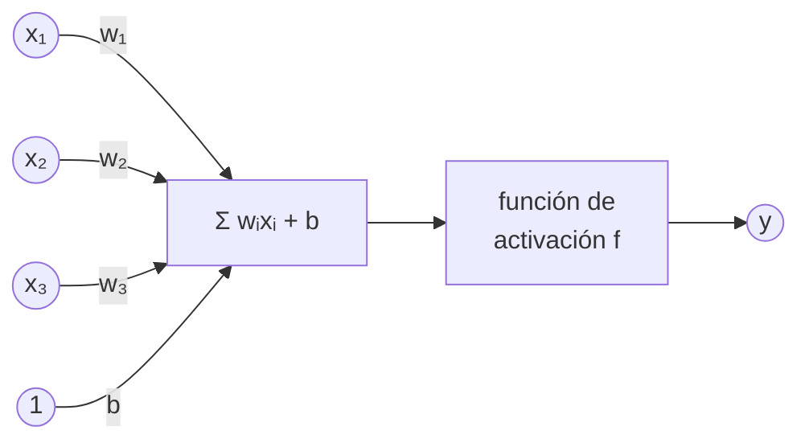
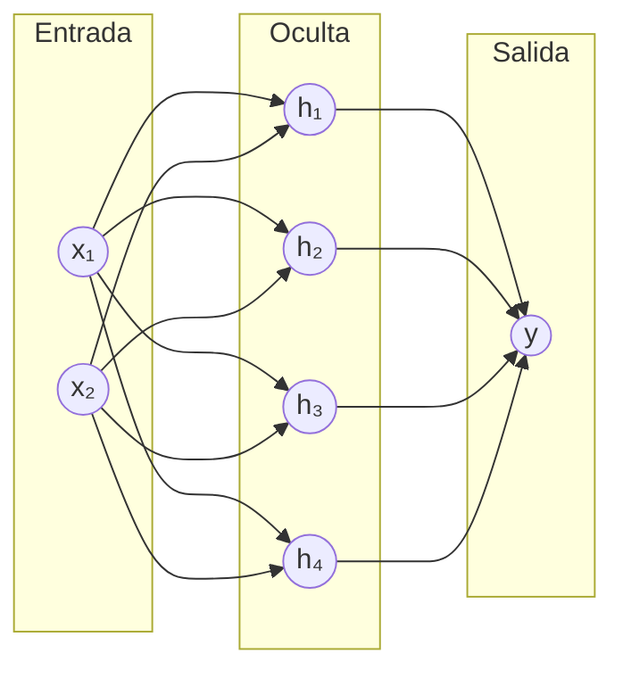

# Capítulo 7. Redes neuronales e IA centrada en el ser humano

**Curso:** Introducción a la Inteligencia Artificial (electiva) · Ingeniería de Software – modalidad virtual · UDES
**Semana:** 7 de 8
**Tiempo estimado de lectura:** 110 minutos
**Lecturas base:** García Serrano (2016), cap. 7 (segunda parte) · Rouhiainen (2018), cap. 4 · Russell y Norvig (2004), cap. 20 (sección sobre redes neuronales)

---

## Objetivos de aprendizaje

Al terminar este capítulo podrás:

1. Describir la neurona artificial como modelo simplificado de la neurona biológica y explicar el papel de los pesos, el sesgo y la función de activación.
2. Aplicar la regla de aprendizaje del perceptrón y explicar por qué un perceptrón simple no puede aprender la función XOR.
3. Explicar cómo una red multicapa aprende con retropropagación y descenso del gradiente.
4. Describir la red de Hopfield como memoria asociativa.
5. Explicar qué cambió con el aprendizaje profundo y reconocer sus aplicaciones en el procesamiento del lenguaje natural, la visión por computador y el reconocimiento de voz.
6. Aplicar principios de IA centrada en el ser humano al diseño de un sistema que usa redes neuronales.

## ¿Cómo usar este capítulo?

- Lee una sección a la vez y responde los recuadros **«Para pensar»** antes de continuar.
- Las secciones 7.1 a 7.5 se acompañan con el [cuaderno de la práctica](../practicas/), que construye cada red desde cero. Las secciones 7.6 a 7.8 se acompañan con TensorFlow Playground y Teachable Machine.
- Cuando el capítulo cita un libro, lo hace con el formato *(Autor, año, capítulo)*. La lista completa está en la sección [Referencias](#referencias).

---

## Introducción

En la semana 1 viste dos grandes enfoques de la IA: el **simbólico**, que razona con reglas escritas por personas (semana 5), y el **conexionista**, que se inspira en el cerebro y aprende ajustando las conexiones entre muchas unidades simples. La historia de este segundo enfoque es la de un péndulo: nació con el primer trabajo de IA (McCulloch y Pitts, 1943), cayó en desgracia a finales de los 60, resurgió en los 80 con la retropropagación y, desde 2012, con el nombre de **aprendizaje profundo**, domina casi todas las aplicaciones de IA que usas a diario: el reconocimiento de rostros de tu teléfono, la transcripción de tus notas de voz y los asistentes conversacionales.

Este capítulo recorre ese camino. Las secciones 7.1 a 7.4 presentan las redes clásicas que se pueden entender con papel y lápiz. La sección 7.5 explica qué las hizo «profundas». Las secciones 7.6 y 7.7 muestran tres grandes aplicaciones: el lenguaje, la visión y la voz. La sección 7.8 cierra con una pregunta de ingeniería: ¿cómo se diseña un sistema con IA que de verdad sirva a las personas?

---

## 7.1 La neurona biológica y la neurona artificial

### 7.1.1 La neurona biológica

El cerebro humano tiene unos 86.000 millones de neuronas (Azevedo et al., 2009). Cada una recibe señales de otras a través de sus **dendritas**, las integra en el **cuerpo celular** y, si la estimulación supera un umbral, emite un impulso eléctrico por su **axón**, que llega a otras neuronas a través de las **sinapsis**. La eficacia de cada sinapsis puede cambiar con la experiencia: según la idea de Donald Hebb (1949), las conexiones entre neuronas que se activan juntas se refuerzan. Esa plasticidad es la base biológica del aprendizaje (García Serrano, 2016, cap. 7).

### 7.1.2 La neurona artificial

McCulloch y Pitts (1943) propusieron un modelo matemático muy simplificado de esta neurona, que sigue siendo la base de todas las redes actuales:

*Figura 7.1. La neurona artificial. Elaboración propia a partir de García Serrano (2016, cap. 7).*

- Las **entradas** *xᵢ* hacen el papel de las señales que llegan por las dendritas.
- Cada entrada se multiplica por un **peso** *wᵢ*, que representa la eficacia de la sinapsis: un peso positivo excita, uno negativo inhibe.
- La neurona suma las entradas ponderadas y un **sesgo** *b*, que desplaza el umbral de activación.
- Una **función de activación** *f* decide la salida.

Con los pesos adecuados, una sola neurona calcula funciones lógicas. Por ejemplo, con *w*₁ = *w*₂ = 1 y *b* = −1,5, la neurona solo se activa cuando las dos entradas valen 1: calcula AND. Con *b* = −0,5 calcula OR.

### 7.1.3 Funciones de activación

| Función | Definición | Salida | Uso |
|---|---|---|---|
| **Escalón** | 1 si *z* > 0; 0 en otro caso | 0 o 1 | Neurona de McCulloch y Pitts; perceptrón |
| **Sigmoide** | 1 / (1 + *e*^(−*z*)) | Entre 0 y 1 | Redes clásicas; salida de un clasificador binario |
| **Tangente hiperbólica** | tanh(*z*) | Entre −1 y 1 | Redes clásicas |
| **ReLU** | máx(0, *z*) | 0 o positiva | La más usada en las redes profundas actuales |

*Tabla 7.1. Funciones de activación más comunes. Elaboración propia.*

La sigmoide y la ReLU tienen una ventaja clave sobre el escalón: son **derivables** (la ReLU, en casi todos sus puntos), lo que permite entrenar redes de varias capas con la retropropagación de la sección 7.3.

---

## 7.2 El perceptrón simple

### 7.2.1 Una neurona que aprende

Frank Rosenblatt (1958) propuso el **perceptrón**: una neurona con activación escalón que **aprende** sus pesos a partir de ejemplos. La regla es muy simple. Para cada ejemplo con entradas *x* y salida deseada *t*, se calcula la salida *y*; si hay error, se corrige cada peso en la dirección que lo reduce (García Serrano, 2016, cap. 7; Russell y Norvig, 2004, cap. 20):

> *wᵢ* ← *wᵢ* + η (*t* − *y*) *xᵢ*  ·  *b* ← *b* + η (*t* − *y*)

donde η es la **tasa de aprendizaje**. Si la salida es correcta, (*t* − *y*) = 0 y nada cambia. Si la neurona dijo 0 cuando debía decir 1, los pesos de las entradas activas aumentan; si dijo 1 cuando debía decir 0, disminuyen. Cada recorrido completo por los datos de entrenamiento se llama **época**.

### 7.2.2 Lo que muestra la práctica

En la práctica, el perceptrón aprende OR en 3 épocas y AND en 9. Con XOR, después de 50 épocas sigue cometiendo errores en los cuatro ejemplos.

### 7.2.3 El límite: la separabilidad lineal

El perceptrón calcula Σ *wᵢxᵢ* + *b* > 0. Con dos entradas, la frontera entre las dos clases es la recta *w*₁*x*₁ + *w*₂*x*₂ + *b* = 0. Por eso un perceptrón solo puede aprender problemas **linealmente separables**: aquellos en los que una recta (o, con más entradas, un hiperplano) separa las dos clases.

El **teorema de convergencia del perceptrón** garantiza que, si los datos son linealmente separables, la regla encuentra una solución en un número finito de pasos. Si no lo son, no hay garantía. XOR es el ejemplo clásico: los puntos (0, 1) y (1, 0) valen 1, y los puntos (0, 0) y (1, 1) valen 0. Ninguna recta separa unos de otros.

En su libro *Perceptrons*, Minsky y Papert (1969) analizaron estas limitaciones con rigor matemático. El libro contribuyó a que la financiación y el interés por las redes neuronales cayeran durante más de una década, aunque sus autores sabían que redes con varias capas podían superar el problema. Lo que faltaba era una forma eficiente de **entrenarlas**.

> **Para pensar.** Dibuja los cuatro puntos de AND y los cuatro de XOR en un plano. ¿Por qué con XOR no basta una recta, pero sí bastarían dos?

---

## 7.3 Redes multicapa y retropropagación

### 7.3.1 Añadir capas ocultas

Un **perceptrón multicapa** organiza las neuronas en capas: una **capa de entrada**, una o varias **capas ocultas** y una **capa de salida**. Cada neurona de una capa está conectada con todas las de la siguiente (García Serrano, 2016, cap. 7).

*Figura 7.2. La red 2-4-1 que resuelve XOR en la práctica. Elaboración propia.*

Las capas ocultas **transforman** las entradas en una nueva representación en la que el problema sí es separable. Para XOR, una neurona oculta puede aprender OR y otra NAND; la neurona de salida calcula el AND de ambas, que es exactamente XOR. Cybenko (1989) demostró que una red con **una sola capa oculta** y suficientes neuronas sigmoides puede aproximar cualquier función continua con la precisión que se quiera: es el **teorema de aproximación universal**. El teorema dice que la red *existe*; no dice cuántas neuronas hacen falta ni cómo encontrar sus pesos.

### 7.3.2 Retropropagación y descenso del gradiente

La regla del perceptrón no sirve para las capas ocultas: no hay una «salida deseada» para una neurona oculta. Rumelhart, Hinton y Williams (1986) popularizaron la solución, la **retropropagación del error** (*backpropagation*), que se convirtió en el método estándar de entrenamiento:

1. **Propagación hacia adelante.** Se calcula la salida de la red para un ejemplo, capa por capa.
2. **Cálculo del error.** Se compara la salida con la deseada mediante una **función de pérdida**; por ejemplo, el error cuadrático medio.
3. **Propagación hacia atrás.** Con la **regla de la cadena** del cálculo, se calcula cuánto contribuyó cada peso al error, empezando por la capa de salida y retrocediendo hasta la de entrada. Ese conjunto de derivadas es el **gradiente**.
4. **Descenso del gradiente.** Cada peso se mueve un poco en la dirección opuesta a su derivada, es decir, en la dirección en que el error baja: *w* ← *w* − η ∂pérdida/∂*w*.

El descenso del gradiente es una búsqueda local como el *hill climbing* de la semana 3 (sección 3.5), en un espacio continuo de millones de dimensiones: cada punto del espacio es una configuración de pesos y su «altura» es el error. Como el *hill climbing*, puede quedar atrapado en mínimos locales, aunque en las redes grandes eso resulta ser un problema menor de lo que se pensaba.

### 7.3.3 Lo que muestra la práctica

La red 2-4-1 de la práctica, entrenada durante 5.000 épocas, produce para XOR las salidas 0,019; 0,976; 0,978 y 0,030, que redondeadas son 0, 1, 1, 0: **aprendió XOR**. La curva de aprendizaje muestra cómo baja el error época tras época.

Con un problema más difícil, dos «lunas» entrelazadas de 400 puntos con ruido, la práctica compara redes con distinto número de neuronas ocultas:

| Neuronas ocultas | Exactitud en entrenamiento | Exactitud en prueba |
|:-:|:-:|:-:|
| 1 | 0,875 | 0,908 |
| 2 | 0,879 | 0,900 |
| 4 | 0,982 | 0,967 |
| 16 | 0,975 | 0,950 |

*Tabla 7.2. Exactitud según el tamaño de la capa oculta en el problema de las dos lunas. Elaboración propia con el cuaderno de la práctica.*

Con una o dos neuronas ocultas, la red apenas puede trazar una frontera casi recta. Con cuatro, la frontera se curva y se adapta a las lunas. Con dieciséis no mejora más: una red con más capacidad de la necesaria no ayuda y, con datos más ruidosos, tiende al **sobreajuste** (sección 6.2.4).

### 7.3.4 Hiperparámetros

Además de los pesos, que se aprenden, una red tiene **hiperparámetros** que elige la persona: el número de capas y de neuronas, la función de activación, la tasa de aprendizaje, el número de épocas. Una tasa de aprendizaje muy pequeña hace el entrenamiento lentísimo; una muy grande hace que el error oscile o crezca. Elegir bien los hiperparámetros es, en buena parte, experimentación, y TensorFlow Playground es una forma excelente de desarrollar intuición sobre ellos.

> **Para pensar.** El descenso del gradiente y el *hill climbing* tienen el mismo punto débil. ¿Cuál es? ¿Qué técnica de la semana 3 se te ocurre para mitigarlo?

---

## 7.4 La red de Hopfield

### 7.4.1 Una red que recuerda

Las redes de las secciones anteriores **clasifican**: la información fluye de la entrada a la salida. La red propuesta por **John Hopfield (1982)** funciona de otra manera: todas sus neuronas están conectadas entre sí, con pesos simétricos, y la red **evoluciona** en el tiempo hasta estabilizarse. Su uso clásico es como **memoria asociativa**: recuperar un patrón completo a partir de una versión parcial o dañada, como cuando reconocemos una canción por sus primeras notas (García Serrano, 2016, cap. 7).

- **Almacenar.** Los pesos se calculan con una versión de la **regla de Hebb**: para cada patrón almacenado, se refuerza la conexión entre dos neuronas si en el patrón tienen el mismo valor, y se debilita si tienen valores opuestos.
- **Recordar.** Se pone a la red en el estado del patrón dañado y se actualizan las neuronas una a una: cada neurona toma el valor +1 o −1 según el signo de la suma ponderada de las demás. Se repite hasta que ninguna neurona cambie.

### 7.4.2 La energía

Hopfield (1982) mostró que la red tiene una función de **energía** que **nunca aumenta** con las actualizaciones. Los patrones almacenados son **mínimos locales** de esa energía: la red «rueda cuesta abajo» por el paisaje de energía hasta caer en el valle del patrón más parecido. Es la misma imagen del paisaje de la búsqueda local (sección 3.5.1), usada al revés: aquí los mínimos locales no son un problema, sino los recuerdos.

### 7.4.3 Lo que muestra la práctica y sus límites

En la práctica, una red de 25 neuronas almacena las letras T, L y X dibujadas en 5 × 5 píxeles. Con 6 de los 25 píxeles cambiados, la red recupera las tres letras originales, y su energía baja, por ejemplo, de −21,3 a −93,3 en la letra T.

La capacidad es limitada. Hopfield (1982) estimó que una red de *N* neuronas almacena de forma fiable unos 0,15 *N* patrones, y Amit, Gutfreund y Sompolinsky (1985) calcularon el límite teórico en unos 0,138 *N*. La práctica lo confirma con una red de 100 neuronas y patrones aleatorios: con 10 patrones, todos se mantienen estables; con 14, el 79 %; con 20, solo el 15 %. Al superar la capacidad, aparecen **estados espurios**: mezclas de varios patrones que la red «recuerda» aunque nunca los aprendió.

En 2024, John Hopfield y Geoffrey Hinton recibieron el **Premio Nobel de Física** por sus descubrimientos fundamentales que hicieron posible el aprendizaje automático con redes neuronales artificiales (Nobel Prize Outreach, 2024).

> **Para pensar.** ¿En qué se parece el recuerdo de una red de Hopfield a la forma en que tú recuerdas el nombre de una persona a partir de una pista?

---

## 7.5 Introducción al aprendizaje profundo

### 7.5.1 ¿Qué lo hace «profundo»?

El **aprendizaje profundo** (*deep learning*) usa redes neuronales con **muchas capas**. LeCun, Bengio y Hinton (2015) lo describen como un método de **aprendizaje de representaciones**: cada capa transforma la representación de la anterior en una un poco más abstracta. En una red que reconoce imágenes, las primeras capas detectan bordes; las siguientes, combinaciones de bordes como esquinas y texturas; las siguientes, partes de objetos; y las últimas, objetos completos. Nadie programa esos detectores: la red los **aprende** de los datos.

La gran diferencia con el aprendizaje automático de la semana 6 es la **ingeniería de características**. Para clasificar textos con Bayes ingenuo, tú decidiste representar el texto como una bolsa de palabras o de trigramas. Una red profunda puede recibir los datos casi en bruto (los píxeles de una imagen, las letras de un texto) y aprender por sí misma la representación más útil.

### 7.5.2 ¿Por qué ahora?

Las ideas de base existían desde los 80. ¿Qué cambió hacia 2012? Tres factores, que ya viste en la sección 1.4 (LeCun et al., 2015):

- **Datos.** Internet produjo conjuntos de datos enormes y etiquetados, como ImageNet, con más de un millón de imágenes.
- **Cómputo.** Las tarjetas gráficas (GPU), diseñadas para videojuegos, resultaron ideales para las multiplicaciones de matrices de las redes neuronales.
- **Algoritmos.** Mejoras como la función ReLU, nuevas formas de inicializar los pesos y técnicas contra el sobreajuste permitieron entrenar redes de muchas capas.

El momento decisivo fue 2012, cuando una red convolucional profunda entrenada con GPU ganó con gran ventaja la competencia de clasificación de ImageNet (Krizhevsky et al., 2012; sección 1.3.8). En 2018, Yoshua Bengio, Geoffrey Hinton y Yann LeCun recibieron el Premio Turing por sus contribuciones al aprendizaje profundo.

### 7.5.3 Un ejemplo pequeño

En la práctica, una red con una capa oculta de 64 neuronas aprende a reconocer dígitos escritos a mano en imágenes de 8 × 8 píxeles. Con 4.810 parámetros aprendidos, acierta el **98,0 %** de 540 imágenes que no vio durante el entrenamiento. Las redes que reconocen fotografías reales tienen millones de parámetros, y los modelos de lenguaje actuales, miles de millones.

---

## 7.6 Procesamiento del lenguaje natural y chatbots

### 7.6.1 Del ELIZA a los modelos de lenguaje

El **procesamiento del lenguaje natural** (PLN) busca que las máquinas entiendan y produzcan lenguaje humano. Es una de las capacidades de la prueba de Turing (sección 1.2.2). Su historia resume la del propio campo:

| Etapa | Idea | Ejemplo |
|---|---|---|
| **Reglas** (años 60 a 80) | Patrones y reglas escritas a mano. | ELIZA (Weizenbaum, 1966), que conociste en la práctica de la semana 1, simulaba a un psicoterapeuta reformulando las frases del usuario con reglas de coincidencia de patrones. |
| **Estadística** (años 90 y 2000) | Modelos probabilísticos aprendidos de textos. | Filtros bayesianos de *spam* (semana 6), traducción automática estadística. |
| **Representaciones neuronales** (desde 2013) | Cada palabra se representa como un vector de números, un ***embedding***, aprendido de modo que palabras con significados parecidos tengan vectores cercanos. | Word2vec (Mikolov et al., 2013): el vector de «rey» − «hombre» + «mujer» queda cerca del de «reina». |
| **Transformers y modelos de lenguaje grandes** (desde 2017) | Redes basadas en el mecanismo de **atención** (Vaswani et al., 2017), entrenadas con cantidades enormes de texto para predecir la siguiente palabra. | GPT-3 (Brown et al., 2020), ChatGPT (OpenAI, 2022) y los asistentes actuales. |

*Tabla 7.3. Etapas del procesamiento del lenguaje natural. Elaboración propia a partir de las fuentes indicadas.*

### 7.6.2 ¿Cómo funciona un asistente conversacional actual?

Un **modelo de lenguaje grande** (LLM) es una red neuronal de tipo Transformer con miles de millones de parámetros. Su entrenamiento tiene, de forma simplificada, dos grandes etapas:

1. **Preentrenamiento.** El modelo lee una cantidad enorme de texto y aprende a **predecir el siguiente fragmento de palabra** (*token*). Es aprendizaje automático a gran escala sobre datos no etiquetados: el propio texto proporciona la respuesta correcta.
2. **Ajuste para seguir instrucciones.** Personas escriben ejemplos de buenas respuestas y comparan respuestas del modelo; con esas preferencias se ajusta el modelo mediante **aprendizaje por refuerzo a partir de retroalimentación humana** (RLHF) (Ouyang et al., 2022). Es el aprendizaje por refuerzo de la sección 6.2.3 aplicado al lenguaje.

Esta forma de funcionar explica sus fortalezas y sus límites. Un LLM produce texto **plausible**, que se parece estadísticamente al de sus datos, pero no consulta una base de conocimiento verificada como el sistema experto de la semana 5. Por eso puede **alucinar**: afirmar con total seguridad datos falsos, como referencias bibliográficas inexistentes. Por esa razón, las actividades evaluativas del curso exigen fuentes verificables y una declaración de uso de IA.

> **Para pensar.** ELIZA y un asistente actual reciben la misma pregunta: «¿Quién ganó el mundial de fútbol de 2014?». ¿Cómo «decide» la respuesta cada uno? ¿Cuál de los dos puede equivocarse con más confianza?

---

## 7.7 Visión por computador y reconocimiento de voz

### 7.7.1 Visión por computador

La **visión por computador** busca que las máquinas extraigan información de imágenes y videos. Sus tareas más comunes son:

- **Clasificación:** ¿qué hay en la imagen? (un gato, el dígito 7).
- **Detección de objetos:** ¿qué objetos hay y dónde están? (peatones y señales para un carro autónomo).
- **Segmentación:** ¿a qué objeto pertenece cada píxel? (un tumor en una imagen médica).
- **Reconocimiento facial:** ¿de quién es este rostro?

La herramienta central son las **redes neuronales convolucionales** (CNN), popularizadas por LeCun et al. (1998) para leer dígitos de cheques. En lugar de conectar cada neurona con todos los píxeles, como la red de dígitos de la práctica, una capa convolucional aplica **filtros** pequeños que recorren la imagen buscando el mismo patrón (un borde, una esquina) en todas sus posiciones. Así aprovechan dos propiedades de las imágenes que una red densa ignora: los píxeles cercanos están relacionados, y un objeto es el mismo esté donde esté. El modelo de Teachable Machine que entrenarás en la práctica usa, por dentro, una CNN ya entrenada con millones de imágenes, a la que solo se le ajustan las últimas capas: es el **aprendizaje por transferencia**.

### 7.7.2 Reconocimiento de voz

El **reconocimiento automático del habla** convierte audio en texto. El proceso típico es:

1. El audio se convierte en un **espectrograma**: una imagen que muestra qué frecuencias suenan en cada instante.
2. Una red neuronal (convolucional, recurrente o Transformer) convierte esa secuencia en letras o fragmentos de palabra.
3. Un modelo de lenguaje ayuda a elegir la transcripción más probable: «tengo clase a las tres» es más probable que «tengo clase alas tres».

Los sistemas actuales se entrenan con cientos de miles de horas de audio. Whisper, por ejemplo, se entrenó con 680.000 horas de audio en múltiples idiomas recogido de internet (Radford et al., 2022). La tarea inversa, convertir texto en voz, usa redes del mismo tipo.

Visión y voz son las capacidades de «ver» y «oír» que Rouhiainen (2018, pregunta 2) destacaba en la semana 1 (sección 1.1.3). También son las que plantean algunos de los dilemas éticos más fuertes, como el reconocimiento facial en espacios públicos o la clonación de voces, que estudiarás en la semana 8.

---

## 7.8 IA centrada en el ser humano

### 7.8.1 ¿Qué significa?

Shneiderman (2020) propone que el objetivo de la IA no debe ser **reemplazar** a las personas, sino **ampliar** sus capacidades. Su marco de **IA centrada en el ser humano** sostiene que no hay que elegir entre mucha automatización y mucho control humano: los mejores sistemas logran **ambos**, con una automatización alta que las personas siguen entendiendo, supervisando y corrigiendo. El resultado deben ser sistemas **fiables, seguros y dignos de confianza**.

Para un ingeniero de software, esto se traduce en decisiones de diseño concretas. La guía *People + AI* de Google (PAIR, s. f.) las organiza alrededor de preguntas como estas:

| Pregunta de diseño | Ejemplo de buena práctica |
|---|---|
| ¿La IA aporta valor real a este problema? | Usar IA solo donde una regla simple no basta. |
| ¿Qué datos se usarán y cómo se obtuvo el permiso? | Documentar el origen de los datos, como en la Actividad Evaluativa 3. |
| ¿Cuánto debe confiar el usuario en el sistema? | Mostrar el nivel de confianza de cada predicción. |
| ¿Puede el usuario entender por qué el sistema decidió algo? | Explicar con ejemplos o con los factores más influyentes. |
| ¿Qué pasa cuando el sistema se equivoca? | Permitir corregir, deshacer y reportar errores, y ofrecer una alternativa sin IA. |
| ¿Quién mantiene el control? | Dejar las decisiones de alto impacto en manos de una persona (**humano en el bucle**). |

*Tabla 7.4. Preguntas de diseño de una IA centrada en el ser humano. Elaboración propia a partir de PAIR (s. f.) y Shneiderman (2020).*

### 7.8.2 Democratizar la IA: Teachable Machine

**Teachable Machine** es una herramienta web de Google que permite entrenar un clasificador de imágenes, sonidos o posturas corporales sin escribir código, con ejemplos capturados con la cámara o el micrófono (Carney et al., 2020). El entrenamiento ocurre en el propio navegador. Sus creadores la diseñaron para que personas sin experiencia técnica (docentes, artistas, estudiantes) pudieran entender, con sus propias manos, cómo un modelo aprende de ejemplos y por qué falla cuando los ejemplos no son variados o representativos.

En la práctica la usarás para entrenar tu propio clasificador y, sobre todo, para **observar sus errores**: qué pasa si todos los ejemplos de una clase se tomaron con la misma luz, el mismo fondo o la misma persona. Esa experiencia es el puente con la semana 8: muchos problemas éticos de la IA no nacen en el algoritmo, sino en los **datos** con los que se entrena.

> **Para pensar.** Elige una aplicación con IA que uses. Respóndele las seis preguntas de la tabla 7.4. ¿En cuál falla más?

---

## Resumen

- La **neurona artificial** calcula una suma ponderada de sus entradas más un sesgo y aplica una **función de activación**. Con pesos adecuados, calcula funciones lógicas como AND y OR.
- El **perceptrón** aprende sus pesos corrigiéndolos en la dirección del error. Solo puede aprender problemas **linealmente separables**: no puede aprender XOR. Este límite, analizado por Minsky y Papert, frenó la investigación durante años.
- Las **redes multicapa** superan ese límite con **capas ocultas**, y se entrenan con **retropropagación** y **descenso del gradiente**. Una sola capa oculta suficientemente grande puede aproximar cualquier función continua.
- La **red de Hopfield** es una **memoria asociativa**: almacena patrones como mínimos de una función de energía y los recupera a partir de versiones dañadas, con una capacidad de unos 0,14 *N* patrones.
- El **aprendizaje profundo** usa redes de muchas capas que aprenden sus propias representaciones. Su auge desde 2012 se explica por los datos, las GPU y mejoras algorítmicas.
- En **lenguaje**, los modelos pasaron de las reglas de ELIZA a los Transformers y los LLMs, que predicen texto plausible y pueden alucinar. En **visión**, las redes convolucionales aprenden filtros sobre la imagen. En **voz**, las redes transcriben espectrogramas.
- La **IA centrada en el ser humano** busca ampliar las capacidades de las personas con sistemas que se puedan entender, supervisar y corregir.

---

## Glosario

| Término | Definición |
|---|---|
| **Aprendizaje por transferencia** | Reutilizar una red entrenada para una tarea como punto de partida de otra, ajustando solo una parte. |
| **Aprendizaje profundo** | Aprendizaje con redes neuronales de muchas capas que aprenden sus propias representaciones. |
| **Descenso del gradiente** | Método de optimización que mueve los parámetros en la dirección en que más disminuye el error. |
| ***Embedding*** | Representación de una palabra u otro objeto como un vector de números aprendido. |
| **Época** | Un recorrido completo por todos los ejemplos de entrenamiento. |
| **Función de activación** | Función que transforma la suma ponderada de una neurona en su salida. |
| **Hiperparámetro** | Parámetro que elige la persona antes del entrenamiento, como la tasa de aprendizaje o el número de capas. |
| **Linealmente separable** | Problema en el que un hiperplano separa las clases. |
| **Memoria asociativa** | Sistema que recupera un patrón completo a partir de una versión parcial o dañada. |
| **Modelo de lenguaje grande (LLM)** | Red neuronal entrenada con enormes cantidades de texto para predecir el siguiente fragmento de texto. |
| **Peso** | Parámetro que indica la importancia de una conexión entre neuronas. |
| **Red convolucional (CNN)** | Red que aplica filtros que recorren la imagen para detectar patrones locales. |
| **Retropropagación** | Algoritmo que calcula el gradiente del error respecto a todos los pesos, propagando el error desde la salida hacia la entrada. |
| **Sesgo (de una neurona)** | Término constante que se suma a la entrada ponderada y desplaza el umbral de activación. No confundir con el sesgo de los datos de la semana 8. |
| **Tasa de aprendizaje** | Hiperparámetro que controla el tamaño de cada corrección de los pesos. |

---

## Preguntas de repaso

1. Calcula la salida de una neurona con activación escalón, pesos (0,5; −1; 2), sesgo −1 y entradas (1, 1, 0,5).
2. Encuentra pesos y sesgo para que una neurona calcule NAND. Comprueba los cuatro casos.
3. Aplica a mano dos épocas de la regla del perceptrón para aprender OR, partiendo de pesos (0, 0), sesgo 0 y η = 0,5.
4. Explica con un dibujo por qué XOR no es linealmente separable y cómo lo resuelve una capa oculta.
5. Describe con tus palabras los cuatro pasos de la retropropagación. ¿Qué relación tiene el descenso del gradiente con el *hill climbing* de la semana 3?
6. En la tabla 7.2, ¿por qué la red con 16 neuronas ocultas no supera a la de 4? ¿Qué esperarías con datos más ruidosos?
7. ¿En qué se diferencia una red de Hopfield de un perceptrón multicapa en cuanto a su estructura y a su propósito?
8. Una red de Hopfield tiene 200 neuronas. ¿Cuántos patrones aleatorios puede almacenar de forma fiable, aproximadamente?
9. ¿Qué significa que un LLM «alucine»? ¿Por qué ocurre, según la forma en que se entrena?
10. Elige una aplicación de visión por computador o de reconocimiento de voz y analízala con las preguntas de la tabla 7.4.

---

## Referencias

Amit, D. J., Gutfreund, H., y Sompolinsky, H. (1985). Storing infinite numbers of patterns in a spin-glass model of neural networks. *Physical Review Letters, 55*(14), 1530-1533. https://doi.org/10.1103/PhysRevLett.55.1530

Azevedo, F. A. C., Carvalho, L. R. B., Grinberg, L. T., Farfel, J. M., Ferretti, R. E. L., Leite, R. E. P., Jacob Filho, W., Lent, R., y Herculano-Houzel, S. (2009). Equal numbers of neuronal and nonneuronal cells make the human brain an isometrically scaled-up primate brain. *Journal of Comparative Neurology, 513*(5), 532-541. https://doi.org/10.1002/cne.21974

Brown, T. B., Mann, B., Ryder, N., Subbiah, M., Kaplan, J., Dhariwal, P., Neelakantan, A., Shyam, P., Sastry, G., Askell, A., Agarwal, S., Herbert-Voss, A., Krueger, G., Henighan, T., Child, R., Ramesh, A., Ziegler, D. M., Wu, J., Winter, C., … Amodei, D. (2020). *Language models are few-shot learners* [Preimpresión]. arXiv. https://arxiv.org/abs/2005.14165

Carney, M., Webster, B., Alvarado, I., Phillips, K., Howell, N., Griffith, J., Jongejan, J., Pitaru, A., y Chen, A. (2020). Teachable Machine: Approachable web-based tool for exploring machine learning classification. En *Extended Abstracts of the 2020 CHI Conference on Human Factors in Computing Systems* (pp. 1-8). ACM. https://doi.org/10.1145/3334480.3382839

Cybenko, G. (1989). Approximation by superpositions of a sigmoidal function. *Mathematics of Control, Signals, and Systems, 2*(4), 303-314. https://doi.org/10.1007/BF02551274

García Serrano, A. (2016). *Inteligencia artificial: Fundamentos, práctica y aplicaciones* (2.ª ed.). RC Libros.

Hebb, D. O. (1949). *The organization of behavior: A neuropsychological theory*. Wiley.

Hopfield, J. J. (1982). Neural networks and physical systems with emergent collective computational abilities. *Proceedings of the National Academy of Sciences, 79*(8), 2554-2558. https://doi.org/10.1073/pnas.79.8.2554

Krizhevsky, A., Sutskever, I., y Hinton, G. E. (2012). ImageNet classification with deep convolutional neural networks. *Advances in Neural Information Processing Systems, 25*. https://papers.nips.cc/paper/4824-imagenet-classification-with-deep-convolutional-neural-networks

LeCun, Y., Bengio, Y., y Hinton, G. (2015). Deep learning. *Nature, 521*(7553), 436-444. https://doi.org/10.1038/nature14539

LeCun, Y., Bottou, L., Bengio, Y., y Haffner, P. (1998). Gradient-based learning applied to document recognition. *Proceedings of the IEEE, 86*(11), 2278-2324. https://doi.org/10.1109/5.726791

McCulloch, W. S., y Pitts, W. (1943). A logical calculus of the ideas immanent in nervous activity. *The Bulletin of Mathematical Biophysics, 5*, 115-133. https://doi.org/10.1007/BF02478259

Mikolov, T., Chen, K., Corrado, G., y Dean, J. (2013). *Efficient estimation of word representations in vector space* [Preimpresión]. arXiv. https://arxiv.org/abs/1301.3781

Minsky, M., y Papert, S. (1969). *Perceptrons: An introduction to computational geometry*. MIT Press.

Nobel Prize Outreach. (2024). *The Nobel Prize in Physics 2024*. https://www.nobelprize.org/prizes/physics/2024/summary/

OpenAI. (2022, 30 de noviembre). *Introducing ChatGPT*. https://openai.com/index/chatgpt/

Ouyang, L., Wu, J., Jiang, X., Almeida, D., Wainwright, C. L., Mishkin, P., Zhang, C., Agarwal, S., Slama, K., Ray, A., Schulman, J., Hilton, J., Kelton, F., Miller, L., Simens, M., Askell, A., Welinder, P., Christiano, P., Leike, J., y Lowe, R. (2022). *Training language models to follow instructions with human feedback* [Preimpresión]. arXiv. https://arxiv.org/abs/2203.02155

PAIR (People + AI Research). (s. f.). *People + AI guidebook*. Google. https://pair.withgoogle.com/guidebook/

Radford, A., Kim, J. W., Xu, T., Brockman, G., McLeavey, C., y Sutskever, I. (2022). *Robust speech recognition via large-scale weak supervision* [Preimpresión]. arXiv. https://arxiv.org/abs/2212.04356

Rosenblatt, F. (1958). The perceptron: A probabilistic model for information storage and organization in the brain. *Psychological Review, 65*(6), 386-408. https://doi.org/10.1037/h0042519

Rouhiainen, L. (2018). *Inteligencia artificial: 101 cosas que debes saber hoy sobre nuestro futuro*. Alienta Editorial.

Rumelhart, D. E., Hinton, G. E., y Williams, R. J. (1986). Learning representations by back-propagating errors. *Nature, 323*, 533-536. https://doi.org/10.1038/323533a0

Russell, S. J., y Norvig, P. (2004). *Inteligencia artificial: Un enfoque moderno* (2.ª ed.; J. M. Corchado Rodríguez et al., Trads.). Pearson Educación.

Shneiderman, B. (2020). Human-centered artificial intelligence: Reliable, safe & trustworthy. *International Journal of Human–Computer Interaction, 36*(6), 495-504. https://doi.org/10.1080/10447318.2020.1741118

Vaswani, A., Shazeer, N., Parmar, N., Uszkoreit, J., Jones, L., Gomez, A. N., Kaiser, Ł., y Polosukhin, I. (2017). *Attention is all you need* [Preimpresión]. arXiv. https://arxiv.org/abs/1706.03762

Weizenbaum, J. (1966). ELIZA—A computer program for the study of natural language communication between man and machine. *Communications of the ACM, 9*(1), 36-45. https://doi.org/10.1145/365153.365168
