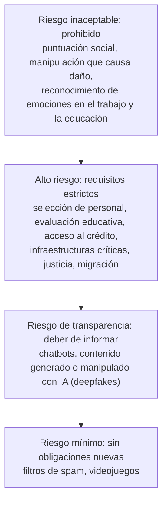

# Capítulo 8. Ética, impacto y futuro de la IA

**Curso:** Introducción a la Inteligencia Artificial (electiva) · Ingeniería de Software – modalidad virtual · UDES
**Semana:** 8 de 8
**Tiempo estimado de lectura:** 110 minutos
**Lecturas base:** Rouhiainen (2018), caps. 5, 9 y 10 · UNESCO (2021) · Russell y Norvig (2004), cap. 26 (sección sobre la ética y los riesgos de la IA)

---

## Objetivos de aprendizaje

Al terminar este capítulo podrás:

1. Identificar los riesgos para la privacidad que plantea la IA y las obligaciones básicas de la protección de datos personales en Colombia.
2. Explicar de dónde vienen los sesgos de un sistema de IA, cómo se miden y por qué la explicabilidad es importante.
3. Describir los principales marcos de gobernanza y regulación de la IA: la Recomendación de la UNESCO, los principios de la OCDE, el Reglamento europeo de IA y la política colombiana.
4. Analizar con datos el impacto de la IA en el mercado laboral, incluida la ingeniería de software.
5. Reconocer los usos de la IA en la desinformación y como arma, y su impacto ambiental.
6. Aplicar principios y prácticas de desarrollo responsable al diseño de un sistema de IA.

## ¿Cómo usar este capítulo?

- Lee una sección a la vez y responde los recuadros **«Para pensar»**. En este capítulo no hay respuestas únicas: lo que importa es que argumentes con datos y principios.
- Las cifras que cita el capítulo proceden de estudios, informes y normas que puedes consultar en la sección [Referencias](#referencias). Sobre temas tan recientes, conviene revisar si hay datos más nuevos.
- La [práctica](../practicas/) combina el análisis de casos, la plataforma Moral Machine y, de forma opcional, una auditoría de sesgo en Python.
- Cuando el capítulo cita un libro, lo hace con el formato *(Autor, año, capítulo)*.

---

## Introducción

Durante siete semanas estudiaste **cómo** funciona la IA: cómo busca, juega, razona, aprende y percibe. Esta última semana pregunta **para qué** y **con qué consecuencias**. No es un tema aparte de la técnica: casi todos los problemas éticos de este capítulo nacen de decisiones técnicas que ya conoces. El sesgo de un modelo nace de sus datos de entrenamiento (sección 6.1.3); la falta de explicaciones, de la forma en que aprenden las redes neuronales (capítulo 7); las alucinaciones de un asistente, de cómo se entrena un modelo de lenguaje (sección 7.6.2).

Por eso, la ética de la IA es también una responsabilidad de quien **diseña y construye** el software. Russell y Norvig (2004, cap. 26) ya advertían que quienes desarrollan IA deben preguntarse por los efectos de su trabajo: el desempleo, la pérdida de privacidad, la responsabilidad cuando un sistema se equivoca. Veinte años después, esas preguntas dejaron de ser hipotéticas. El código de ética de la ACM (2018), la principal asociación profesional de la computación, pide a sus miembros contribuir al bienestar humano, evitar el daño, ser justos y no discriminar, y respetar la privacidad.

---

## 8.1 Privacidad y protección de datos

### 8.1.1 Los datos como combustible

En la semana 6 viste que la IA moderna aprende de grandes cantidades de datos y que las empresas tecnológicas construyen su ventaja sobre un ciclo virtuoso de datos (figura 1.1). Muchos de esos datos son **personales**: lo que buscamos, compramos, escribimos, dónde estamos, cómo es nuestro rostro o nuestra voz. Esto plantea riesgos concretos:

- **Vigilancia.** El reconocimiento facial y el análisis de comportamiento permiten seguir a las personas a gran escala.
- **Inferencias no autorizadas.** Un modelo puede **deducir** datos sensibles que nunca le dimos (una enfermedad, una orientación política) a partir de datos aparentemente inofensivos.
- **Reidentificación.** «Anonimizar» no es tan fácil como borrar el nombre. Narayanan y Shmatikov (2008) mostraron que podían identificar a usuarios del conjunto de datos «anónimo» que Netflix publicó para un concurso, cruzando unas pocas calificaciones de películas con las reseñas públicas de esas personas en otro sitio web.
- **Fugas a través de las herramientas de IA.** Lo que se escribe en un asistente conversacional puede almacenarse y, según las condiciones del servicio, usarse para entrenar modelos. Pegar código o datos confidenciales de una empresa en un chatbot público es un riesgo real de seguridad.

### 8.1.2 El marco legal en Colombia

En Colombia, la **Ley 1581 de 2012** regula el tratamiento de los datos personales, y la **Superintendencia de Industria y Comercio** vigila su cumplimiento. Para quien desarrolla software, sus ideas centrales son:

| Principio de la Ley 1581 | Qué implica al construir un sistema con IA |
|---|---|
| **Finalidad** | Los datos se recogen para un propósito legítimo que se informa al titular. No se pueden reutilizar para entrenar un modelo con otro fin sin una base legal. |
| **Libertad** | El tratamiento requiere el **consentimiento previo, expreso e informado** del titular. |
| **Veracidad o calidad** | Los datos deben ser veraces, completos y actualizados: un modelo entrenado con datos erróneos toma decisiones erróneas sobre personas reales. |
| **Transparencia** | El titular tiene derecho a saber qué datos suyos existen. |
| **Acceso y circulación restringida** | Solo las personas autorizadas acceden a los datos. |
| **Seguridad** y **confidencialidad** | Se deben adoptar medidas técnicas para proteger los datos. |

*Tabla 8.1. Principios del tratamiento de datos personales. Elaboración propia a partir de la Ley 1581 de 2012.*

La ley define además **datos sensibles** (por ejemplo, los relacionados con la salud, el origen étnico, la orientación política o sexual, las creencias religiosas y los datos biométricos) que tienen una protección reforzada, y protege especialmente los datos de niños, niñas y adolescentes. En Europa, el Reglamento General de Protección de Datos va más allá en un punto relevante para la IA: reconoce el derecho de las personas a no ser objeto de decisiones basadas **únicamente** en un tratamiento automatizado que les afecten de forma significativa.

La buena práctica de ingeniería es la **privacidad desde el diseño**: recoger solo los datos necesarios, anonimizarlos o seudonimizarlos cuando se pueda, cifrarlos, limitar quién accede a ellos y borrarlos cuando ya no se necesiten. Es lo que se te pidió en la Actividad Evaluativa 3.

> **Para pensar.** Revisa los permisos de dos aplicaciones de tu celular. ¿Qué datos recogen? ¿Cuáles de ellos necesitan realmente para funcionar?

---

## 8.2 Sesgos, explicabilidad e interpretabilidad

### 8.2.1 ¿De dónde viene el sesgo?

Un sistema de IA tiene un **sesgo** cuando produce resultados sistemáticamente peores o injustos para ciertos grupos de personas. Rara vez es intencional. Las fuentes más comunes son:

- **Sesgo histórico.** Los datos reflejan desigualdades del pasado, y el modelo aprende a repetirlas.
- **Sesgo de representación.** Algunos grupos aparecen poco en los datos de entrenamiento, y el modelo funciona peor con ellos.
- **Sesgo de medición.** Se usa una variable sustituta (*proxy*) que no mide bien lo que se quiere medir.
- **Sesgo de uso.** El sistema se usa en un contexto distinto de aquel para el que se diseñó.

### 8.2.2 Cuatro casos reales

| Caso | Qué ocurrió | Fuente del sesgo |
|---|---|---|
| **Reconocimiento facial** | Buolamwini y Gebru (2018) evaluaron tres sistemas comerciales de clasificación de género a partir de fotos. La tasa de error llegó al 34,7 % en mujeres de piel oscura, frente a un máximo de 0,8 % en hombres de piel clara. | De **representación**: conjuntos de entrenamiento y de evaluación con muy pocas personas de piel oscura. |
| **Riesgo de reincidencia (COMPAS)** | Un análisis de ProPublica sobre un algoritmo usado en tribunales de Estados Unidos encontró que, entre las personas acusadas que **no** volvieron a delinquir, las afroamericanas habían sido clasificadas como de alto riesgo casi el doble de veces que las blancas: 45 % frente a 23 % (Angwin et al., 2016). | **Histórico**: los datos de arrestos reflejan prácticas policiales desiguales. |
| **Selección de personal** | En 2018 se conoció que una gran empresa tecnológica había abandonado una herramienta experimental que puntuaba hojas de vida, porque penalizaba las que contenían la palabra «mujeres», como en «capitana del club de ajedrez de mujeres» (Dastin, 2018). | **Histórico**: aprendió de diez años de contrataciones en un sector dominado por hombres. |
| **Salud** | Un algoritmo usado en Estados Unidos para decidir qué pacientes recibían programas de atención adicional subestimaba las necesidades de los pacientes afroamericanos. Corregirlo aumentaría la proporción de pacientes afroamericanos que reciben ayuda del 17,7 % al 46,5 % (Obermeyer et al., 2019). | De **medición**: usaba el **gasto** médico como sustituto de la **necesidad** médica, y por razones de acceso se gastaba menos en esos pacientes. |

*Tabla 8.2. Casos documentados de sesgo algorítmico. Elaboración propia a partir de las fuentes indicadas.*

El caso de la selección de personal muestra una lección importante: **quitar el atributo sensible no basta**. Aunque el modelo no reciba el género, puede deducirlo de otras variables correlacionadas con él. La parte opcional de la práctica lo reproduce con datos sintéticos: un modelo entrenado con un historial de contratación sesgado selecciona a las mujeres a una tasa del 28 % de la de los hombres; al quitar el género sube al 79,7 %, porque el modelo sigue usando una variable sustituta (las pausas laborales, más frecuentes en las hojas de vida de mujeres); solo al usar únicamente atributos relacionados con el mérito la brecha desaparece.

### 8.2.3 ¿Cómo se mide la equidad?

Hay varias definiciones de **equidad** (*fairness*), y miden cosas distintas:

- **Paridad demográfica:** todos los grupos son seleccionados en la misma proporción. En procesos de selección en Estados Unidos se usa una regla práctica, la **regla de los cuatro quintos**: es señal de posible discriminación que un grupo sea seleccionado a menos del 80 % de la tasa del grupo más favorecido.
- **Igualdad de oportunidades:** entre las personas que **sí** cumplen los requisitos, todos los grupos tienen la misma probabilidad de ser seleccionados (la misma exhaustividad de la sección 6.2.4).
- **Igualdad de errores:** los falsos positivos y los falsos negativos son iguales en todos los grupos.

Estas definiciones a menudo **no se pueden cumplir a la vez**. Chouldechova (2017) demostró que, cuando la proporción real de casos positivos es distinta entre grupos, un clasificador no puede estar bien calibrado y, al mismo tiempo, tener las mismas tasas de falsos positivos y falsos negativos para todos. Elegir qué definición de equidad usar no es una decisión técnica, sino ética y política, que debe tomarse de forma explícita y con las personas afectadas.

### 8.2.4 Explicabilidad e interpretabilidad

Un sistema experto explica su conclusión mostrando la cadena de reglas (semana 5). Un clasificador bayesiano muestra qué palabras pesaron más (semana 6). Una red neuronal profunda con millones de parámetros, en cambio, es una **caja negra**: ni sus creadores pueden decir con precisión por qué tomó una decisión concreta.

La **explicabilidad** importa porque las personas afectadas por una decisión tienen derecho a entenderla y a impugnarla, porque los equipos de desarrollo necesitan detectar errores y sesgos, y porque la confianza se construye con comprensión. Hay dos caminos:

- **Modelos interpretables.** Modelos cuya lógica se puede leer directamente: reglas, árboles de decisión pequeños, modelos lineales, Bayes ingenuo. Rudin (2019) sostiene que, para decisiones de alto impacto (justicia, salud, crédito), deberían preferirse estos modelos, porque su rendimiento suele ser comparable al de las cajas negras.
- **Explicaciones a posteriori.** Técnicas que explican la decisión de un modelo opaco, por ejemplo aproximándolo localmente con un modelo simple alrededor del caso concreto, como LIME (Ribeiro et al., 2016). Son útiles, pero son una aproximación: pueden no reflejar lo que el modelo realmente hace.

Además, la comunidad propuso documentar los modelos y los datos como se documenta cualquier componente de software: las **fichas de modelo** (*model cards*), que informan para qué sirve un modelo, cómo se evaluó y en qué grupos funciona peor (Mitchell et al., 2019), y las **fichas técnicas de conjuntos de datos** (*datasheets*), que describen cómo, por quién y para qué se recogieron los datos (Gebru et al., 2021). El diccionario de datos que hiciste en la Actividad Evaluativa 3 es una versión sencilla de esta idea.

> **Para pensar.** Si un modelo de crédito te niega un préstamo, ¿qué explicación te gustaría recibir? ¿Te bastaría con «el modelo calculó un riesgo alto»?

---

## 8.3 Gobernanza y regulación de la IA

### 8.3.1 De los principios…

En los últimos años, organismos internacionales, gobiernos y empresas publicaron cientos de documentos de principios éticos para la IA. Dos son referencias globales:

- **La Recomendación sobre la ética de la inteligencia artificial de la UNESCO**, adoptada en noviembre de 2021 por los 193 Estados miembros, es el primer instrumento normativo mundial sobre el tema (UNESCO, 2021). Se basa en cuatro valores (el respeto de los derechos humanos y la dignidad humana; vivir en sociedades pacíficas, justas e interconectadas; la diversidad y la inclusión; y la prosperidad del medio ambiente y los ecosistemas) y diez principios:

  | Principios de la Recomendación de la UNESCO |
  |---|
  | Proporcionalidad e inocuidad · Seguridad y protección · Equidad y no discriminación · Sostenibilidad · Derecho a la intimidad y protección de datos · Supervisión y decisión humanas · Transparencia y explicabilidad · Responsabilidad y rendición de cuentas · Sensibilización y educación · Gobernanza y colaboración adaptativas y de múltiples partes interesadas |

  *Tabla 8.3. Principios de la Recomendación de la UNESCO. Elaboración propia a partir de UNESCO (2021).*

- **Los Principios de la OCDE sobre IA**, adoptados en 2019 y actualizados en 2024, que promueven una IA innovadora, digna de confianza y respetuosa de los derechos humanos y los valores democráticos (OCDE, 2024). Colombia fue uno de sus primeros adherentes.

### 8.3.2 …a la ley

Los principios no son obligatorios. El paso siguiente es la **regulación**. El ejemplo más completo es el **Reglamento europeo de inteligencia artificial** (Reglamento [UE] 2024/1689), que entró en vigor el 1 de agosto de 2024 y se aplica de forma escalonada. Su idea central es un **enfoque basado en el riesgo**: cuanto mayor es el riesgo para la salud, la seguridad o los derechos de las personas, más exigencias.

*Figura 8.1. Niveles de riesgo del Reglamento europeo de IA. Elaboración propia a partir del Reglamento (UE) 2024/1689.*

Los sistemas de **alto riesgo** deben contar, entre otros requisitos, con gestión de riesgos, datos de calidad, documentación técnica, registros de funcionamiento, transparencia hacia quienes los usan, **supervisión humana** y niveles adecuados de precisión, solidez y ciberseguridad. Las prohibiciones se aplican desde el 2 de febrero de 2025, y las obligaciones de los modelos de IA de uso general, desde el 2 de agosto de 2025. En julio de 2026, el Reglamento (UE) 2026/1744, conocido como *Digital Omnibus* sobre IA, aplazó la aplicación de los requisitos de alto riesgo: al 2 de diciembre de 2027 para los sistemas de la lista del anexo III (como la selección de personal o la evaluación educativa) y al 2 de agosto de 2028 para la IA integrada en productos regulados. Las obligaciones de transparencia, como informar que se está hablando con un chatbot o marcar el contenido generado con IA, se mantuvieron en el calendario original.

¿Por qué le importa a un ingeniero de software colombiano una norma europea? Porque se aplica a cualquier sistema que se ofrezca o cuyos resultados se usen en la Unión Europea, sin importar dónde se desarrolló, y porque muchas regulaciones de otros países se están inspirando en ella.

### 8.3.3 Colombia

Colombia no tiene todavía, a la fecha de este capítulo, una ley general sobre IA, pero sí una política pública:

- El **CONPES 3975 de 2019** fijó la política nacional para la transformación digital e inteligencia artificial.
- En 2021, el Gobierno publicó un **Marco Ético para la Inteligencia Artificial en Colombia**.
- El **CONPES 4144**, aprobado el 14 de febrero de 2025, es la **Política Nacional de Inteligencia Artificial**. Busca impulsar la investigación, el desarrollo, la adopción y el uso ético y sostenible de la IA, y tiene entre sus ejes la ética y la gobernanza, la infraestructura y los datos, y la formación de talento (Departamento Nacional de Planeación [DNP], 2025).

A esto se suma la protección de datos de la Ley 1581 de 2012 (sección 8.1.2), que ya se aplica a cualquier sistema de IA que trate datos personales.

> **Para pensar.** Clasifica según la figura 8.1 tres sistemas: el filtro de *spam* de la semana 6, un sistema que asigna cupos en una universidad y un chatbot de atención al cliente. ¿Qué obligaciones tendría cada uno?

---

## 8.4 IA y mercado laboral

### 8.4.1 ¿Cuántos empleos?

Las estimaciones sobre el impacto de la IA en el empleo varían mucho según el método:

- Frey y Osborne (2017) estimaron que el 47 % del empleo de Estados Unidos estaba en ocupaciones con **alto riesgo de automatización** en las siguientes décadas. Su estudio analizaba ocupaciones completas, y fue muy citado y también muy discutido, porque una ocupación es un conjunto de **tareas** y la tecnología rara vez las automatiza todas.
- Con la llegada de los modelos de lenguaje, Eloundou et al. (2024) estimaron que alrededor del 80 % de los trabajadores de Estados Unidos tienen al menos el 10 % de sus tareas **expuestas** a estos modelos, y cerca del 19 % tienen expuestas al menos la mitad. «Expuesta» no significa «eliminada»: significa que la tarea podría hacerse mucho más rápido con ayuda de la IA.
- El *Future of Jobs Report 2025* del Foro Económico Mundial, basado en una encuesta a más de mil empresas, proyecta que entre 2025 y 2030 se crearán 170 millones de empleos y desaparecerán 92 millones, un aumento neto de 78 millones, y que cerca del 40 % de las habilidades que exigen los empleos cambiará (World Economic Forum, 2025). La IA es uno de los principales motores de ese cambio, junto con la transición energética, la demografía y la geoeconomía.

### 8.4.2 ¿Qué pasa en el trabajo diario?

Los estudios con datos reales de empresas muestran que, hasta ahora, la IA **transforma** tareas más que eliminar puestos completos:

- En un centro de atención al cliente, un asistente basado en un modelo de lenguaje aumentó la productividad un 14 % en promedio, y un 34 % entre los trabajadores novatos o menos calificados, que aprendieron más rápido las prácticas de los mejores (Brynjolfsson et al., 2025).
- En un experimento controlado, programadores que usaron un asistente de código completaron una tarea un 55,8 % más rápido que quienes no lo usaron (Peng et al., 2023).

Para la ingeniería de software, esto significa que una parte del trabajo de escribir código se acelera, mientras ganan valor las tareas que la IA hace peor: entender el problema, diseñar la arquitectura, **verificar** que el código es correcto y seguro, y asumir la **responsabilidad** por lo que se entrega. Un asistente puede producir código que parece correcto y no lo es, del mismo modo que puede producir referencias que parecen reales y no existen (sección 7.6.2).

### 8.4.3 El trabajo invisible

Detrás de muchos sistemas de IA hay miles de personas que **etiquetan datos**, revisan contenido violento o evalúan respuestas de los modelos, a menudo en países de ingresos bajos y medios, con salarios bajos y condiciones precarias. La IA no es solo algoritmos: también es una cadena de trabajo humano que merece condiciones dignas.

> **Para pensar.** Piensa en el trabajo que quieres hacer cuando te gradúes. ¿Qué tareas de ese trabajo están más expuestas a la IA? ¿Qué habilidades te harán más valioso con ella?

---

## 8.5 IA en la propaganda política y como arma

### 8.5.1 Desinformación y manipulación

La IA facilita producir y dirigir propaganda de tres formas:

- **Microsegmentación.** En 2018 se conoció que la consultora Cambridge Analytica había obtenido datos de decenas de millones de usuarios de Facebook sin su consentimiento y los había usado para elaborar perfiles y dirigir publicidad política personalizada (Cadwalladr y Graham-Harrison, 2018).
- **Amplificación.** Los algoritmos de recomendación de las redes sociales optimizan la interacción, y el contenido falso o indignante suele generar mucha. Vosoughi, Roy y Aral (2018) analizaron unas 126.000 cadenas de noticias en Twitter y encontraron que las falsas se difundían más lejos, más rápido y a más personas que las verdaderas.
- **Generación.** Los modelos generativos producen textos, imágenes, audios y videos falsos muy realistas (*deepfakes*) en segundos y a bajo costo. Además de la desinformación política, se usan para fraudes, como llamadas que clonan la voz de un familiar, y para crear imágenes íntimas falsas de personas reales, una forma de violencia que afecta sobre todo a mujeres.

Por eso el Reglamento europeo exige marcar el contenido generado o manipulado con IA (sección 8.3.2), y por eso es una competencia básica verificar las fuentes antes de compartir un contenido.

### 8.5.2 La IA como arma

Los **sistemas de armas autónomas letales** son armas que, una vez activadas, pueden seleccionar y atacar objetivos sin intervención humana. Plantean preguntas que no tienen respuesta técnica: ¿quién responde si un arma autónoma mata a civiles? ¿Puede una máquina aplicar los principios del derecho internacional humanitario, como distinguir entre combatientes y civiles? En diciembre de 2023, la Asamblea General de las Naciones Unidas aprobó su primera resolución sobre el tema (resolución 78/241), con 152 votos a favor, 4 en contra y 11 abstenciones, en la que expresó su preocupación y pidió al secretario general un informe con las opiniones de los Estados (Naciones Unidas, 2023).

A esto se suman los usos de la IA en **ciberataques** (correos de suplantación más convincentes, búsqueda automatizada de vulnerabilidades) y la vigilancia masiva con reconocimiento facial.

> **Para pensar.** El experimento de la Moral Machine de la práctica trata de decisiones de vida o muerte tomadas por un vehículo autónomo. ¿En qué se parece y en qué se diferencia ese dilema del de un arma autónoma?

---

## 8.6 Sostenibilidad y tendencias emergentes

### 8.6.1 La huella ambiental

Entrenar y usar modelos de IA consume electricidad y agua:

- Strubell, Ganesh y McCallum (2019) llamaron la atención sobre el costo energético de entrenar modelos de lenguaje: en el caso extremo que analizaron, la búsqueda automática de una arquitectura de red, las emisiones estimadas equivalían a las de cinco automóviles durante toda su vida útil.
- Según la Agencia Internacional de Energía, los centros de datos consumieron en 2024 unos 415 TWh, alrededor del 1,5 % de la electricidad mundial, y su consumo podría duplicarse con creces hasta unos 945 TWh en 2030, impulsado sobre todo por la IA (IEA, 2025).
- Los centros de datos también usan agua para refrigerarse. Li et al. (2023) estimaron que el entrenamiento de un solo modelo de lenguaje grande pudo evaporar cientos de miles de litros de agua dulce.

La IA también puede ayudar al ambiente: Rolnick et al. (2022) revisan aplicaciones del aprendizaje automático para la lucha contra el cambio climático, como predecir la producción de energía solar y eólica, optimizar redes eléctricas o vigilar la deforestación con imágenes de satélite. Para quien desarrolla software, la sostenibilidad se traduce en preguntas prácticas: ¿hace falta un modelo grande o basta uno pequeño? ¿Hace falta IA o basta una regla? ¿Cuántas veces se va a ejecutar?

### 8.6.2 Tendencias

Algunas tendencias que marcan el presente de la IA, y que conviene seguir con fuentes como el *AI Index* anual de la Universidad de Stanford:

- **Agentes.** Sistemas basados en modelos de lenguaje que no solo responden, sino que **actúan**: usan herramientas, navegan por la web o escriben y ejecutan código para cumplir un objetivo. Son, literalmente, los agentes de la sección 1.6, y plantean nuevas preguntas de seguridad y responsabilidad.
- **Modelos multimodales.** Un mismo modelo procesa texto, imágenes, audio y video.
- **Modelos pequeños y abiertos.** Modelos que se ejecutan en un teléfono o en un computador personal, con ventajas de privacidad y costo.
- **IA en la ingeniería de software.** Asistentes que escriben, revisan y prueban código, y que cambian la forma de trabajar de los equipos (sección 8.4.2).
- **El debate sobre la IA general y la seguridad.** La discusión de la sección 1.5 sobre la IA general y la superinteligencia dejó de ser solo académica: gobiernos y empresas discuten cómo evaluar y controlar sistemas cada vez más capaces.

---

## 8.7 Principios para un desarrollo responsable

Los principios generales (sección 8.3.1) se vuelven útiles cuando se traducen en **prácticas** a lo largo del ciclo de vida del software. Esta lista resume las del curso y sirve como guía para la Actividad Evaluativa 4:

| Etapa | Preguntas y prácticas |
|---|---|
| **Concepción** | ¿El problema necesita IA? ¿Quiénes se benefician y quiénes podrían salir perjudicados? ¿En qué nivel de riesgo de la figura 8.1 estaría el sistema? Hacer una **evaluación de impacto**. |
| **Datos** | ¿Se obtuvieron con consentimiento y respetando la Ley 1581? ¿Representan a todas las personas que usarán el sistema? Documentarlos con una **ficha de datos**. |
| **Modelo** | ¿Se puede usar un modelo interpretable? ¿Se evaluó el rendimiento **por grupos** y no solo en promedio? Documentarlo con una **ficha de modelo**. |
| **Interfaz** | ¿Sabe el usuario que interactúa con una IA? ¿Ve el nivel de confianza? ¿Puede corregir, impugnar o pedir una persona? (Tabla 7.4). |
| **Despliegue** | ¿Hay **supervisión humana** en las decisiones de alto impacto? ¿Se registran las decisiones para poder auditarlas? ¿Está protegido contra ataques? |
| **Operación** | ¿Se vigila el rendimiento con el tiempo? ¿Hay un canal para reportar errores y un plan para responder a incidentes? |

*Tabla 8.4. Prácticas de desarrollo responsable a lo largo del ciclo de vida. Elaboración propia a partir de UNESCO (2021), OCDE (2024) y las fuentes de este capítulo.*

El futuro de la IA no está escrito: depende de las decisiones que se tomen hoy como sociedad, como empresas y como profesionales. Las técnicas que aprendiste en este curso son poderosas; usarlas bien también es tu responsabilidad.

> **Para pensar.** Aplica la tabla 8.4 al prototipo que estás construyendo para la Actividad Evaluativa 4. ¿En qué etapa encuentras el mayor riesgo?

---

## Resumen

- La IA depende de datos personales y plantea riesgos de **vigilancia, inferencias no autorizadas y reidentificación**. En Colombia, la **Ley 1581 de 2012** exige finalidad, consentimiento, calidad, seguridad y protección especial de los datos sensibles. La **privacidad desde el diseño** es la práctica recomendada.
- Los **sesgos** nacen de los datos (históricos, de representación, de medición) y del uso. Casos como el reconocimiento facial, COMPAS, la selección de personal y la salud lo muestran. **Quitar el atributo sensible no basta**, por las variables sustitutas. Las definiciones de **equidad** pueden ser incompatibles entre sí.
- La **explicabilidad** permite entender, auditar e impugnar decisiones. Se logra con **modelos interpretables** o con **explicaciones a posteriori**, y se apoya en la documentación con **fichas de datos y de modelos**.
- La **UNESCO** y la **OCDE** fijaron principios globales. El **Reglamento europeo de IA** regula según el **nivel de riesgo**; en 2026 se aplazaron sus requisitos de alto riesgo. Colombia tiene una **Política Nacional de IA** (CONPES 4144 de 2025).
- La IA **transforma tareas** más que eliminar empleos completos, con aumentos de productividad documentados y un cambio importante en las habilidades requeridas, también en la ingeniería de software.
- La IA puede usarse para la **desinformación**, los **deepfakes**, el fraude y las **armas autónomas**. Su **huella ambiental** en energía y agua crece con rapidez.
- Un **desarrollo responsable** traduce los principios en prácticas a lo largo de todo el ciclo de vida del software.

---

## Glosario

| Término | Definición |
|---|---|
| **Arma autónoma letal** | Arma que, una vez activada, selecciona y ataca objetivos sin intervención humana. |
| **Caja negra** | Modelo cuyo funcionamiento interno no se puede interpretar directamente. |
| **Consentimiento informado** | Autorización previa y expresa del titular de los datos, dada con conocimiento de su finalidad. |
| **Dato sensible** | Dato personal cuyo uso indebido puede generar discriminación, como los de salud, origen étnico o creencias. |
| ***Deepfake*** | Contenido audiovisual falso generado o manipulado con IA para que parezca real. |
| **Enfoque basado en el riesgo** | Regulación que impone más obligaciones a los sistemas con mayor riesgo para las personas. |
| **Equidad (*fairness*)** | Propiedad de un sistema que no produce resultados injustos para ningún grupo; tiene varias definiciones formales. |
| **Explicabilidad** | Capacidad de un sistema de dar razones comprensibles de sus decisiones. |
| **Ficha de modelo** | Documento que describe el propósito, la evaluación y las limitaciones de un modelo. |
| **Privacidad desde el diseño** | Práctica de incorporar la protección de datos desde el inicio del desarrollo. |
| **Reidentificación** | Identificación de personas en un conjunto de datos supuestamente anónimo. |
| **Sesgo algorítmico** | Tendencia de un sistema a producir resultados sistemáticamente peores o injustos para ciertos grupos. |
| **Supervisión humana** | Intervención de una persona que puede vigilar, corregir o anular las decisiones de un sistema. |
| **Variable sustituta (*proxy*)** | Variable que se usa en lugar de otra; puede introducir sesgos si se correlaciona con un atributo sensible. |

---

## Preguntas de repaso

1. Explica con un ejemplo por qué borrar el nombre de un conjunto de datos no garantiza el anonimato.
2. ¿Qué principios de la Ley 1581 de 2012 debes cumplir si tu aplicación entrena un modelo con las fotos de sus usuarios?
3. Para cada caso de la tabla 8.2, propón una medida que habría reducido el sesgo.
4. Explica por qué quitar el atributo «género» de un modelo de selección de personal puede no eliminar la discriminación.
5. Un clasificador de solicitudes de crédito aprueba al 60 % de un grupo y al 42 % de otro. ¿Cumple la regla de los cuatro quintos? ¿Basta ese dato para saber si es injusto?
6. Compara un modelo interpretable con una explicación a posteriori. ¿Cuál preferirías para decidir libertades condicionales? ¿Y para recomendar canciones?
7. Clasifica según el Reglamento europeo de IA: un sistema que califica exámenes de admisión, un chatbot de una tienda, un sistema de puntuación social de ciudadanos y un corrector ortográfico.
8. ¿Por qué los estudios sobre el impacto de la IA en el empleo llegan a cifras tan distintas? Usa los estudios de la sección 8.4.
9. Describe dos formas en que la IA puede usarse para desinformar y dos formas de protegerse de ellas.
10. Elige un sistema de IA que uses y evalúalo con la tabla 8.4. ¿Qué recomendarías a sus desarrolladores?

---

## Referencias

ACM. (2018). *ACM code of ethics and professional conduct*. https://www.acm.org/code-of-ethics

Angwin, J., Larson, J., Mattu, S., y Kirchner, L. (2016, 23 de mayo). Machine bias. *ProPublica*. https://www.propublica.org/article/machine-bias-risk-assessments-in-criminal-sentencing

Awad, E., Dsouza, S., Kim, R., Schulz, J., Henrich, J., Shariff, A., Bonnefon, J.-F., y Rahwan, I. (2018). The Moral Machine experiment. *Nature, 563*, 59-64. https://doi.org/10.1038/s41586-018-0637-6

Brynjolfsson, E., Li, D., y Raymond, L. (2025). Generative AI at work. *The Quarterly Journal of Economics, 140*(2), 889-942. https://doi.org/10.1093/qje/qjae044

Buolamwini, J., y Gebru, T. (2018). Gender shades: Intersectional accuracy disparities in commercial gender classification. *Proceedings of Machine Learning Research, 81*, 77-91. https://proceedings.mlr.press/v81/buolamwini18a.html

Cadwalladr, C., y Graham-Harrison, E. (2018, 17 de marzo). Revealed: 50 million Facebook profiles harvested for Cambridge Analytica in major data breach. *The Guardian*. https://www.theguardian.com/news/2018/mar/17/cambridge-analytica-facebook-influence-us-election

Chouldechova, A. (2017). Fair prediction with disparate impact: A study of bias in recidivism prediction instruments. *Big Data, 5*(2), 153-163. https://doi.org/10.1089/big.2016.0047

Congreso de Colombia. (2012). *Ley 1581 de 2012, por la cual se dictan disposiciones generales para la protección de datos personales*. http://www.secretariasenado.gov.co/senado/basedoc/ley_1581_2012.html

Dastin, J. (2018, 10 de octubre). Amazon scraps secret AI recruiting tool that showed bias against women. *Reuters*. https://www.reuters.com/article/us-amazon-com-jobs-automation-insight-idUSKCN1MK08G

Departamento Nacional de Planeación [DNP]. (2025). *Documento CONPES 4144: Política Nacional de Inteligencia Artificial*. https://www.dnp.gov.co/publicaciones/Planeacion/Paginas/conpes-4144-hoja-de-ruta-colombia-inteligencia-artificial-retos-actuales-transformacion-futura.aspx

Eloundou, T., Manning, S., Mishkin, P., y Rock, D. (2024). GPTs are GPTs: Labor market impact potential of LLMs. *Science, 384*(6702), 1306-1308. https://doi.org/10.1126/science.adj0998

Frey, C. B., y Osborne, M. A. (2017). The future of employment: How susceptible are jobs to computerisation? *Technological Forecasting and Social Change, 114*, 254-280. https://doi.org/10.1016/j.techfore.2016.08.019

Gebru, T., Morgenstern, J., Vecchione, B., Vaughan, J. W., Wallach, H., Daumé III, H., y Crawford, K. (2021). Datasheets for datasets. *Communications of the ACM, 64*(12), 86-92. https://doi.org/10.1145/3458723

IEA. (2025). *Energy and AI*. International Energy Agency. https://www.iea.org/reports/energy-and-ai

Li, P., Yang, J., Islam, M. A., y Ren, S. (2023). *Making AI less "thirsty": Uncovering and addressing the secret water footprint of AI models* [Preimpresión]. arXiv. https://arxiv.org/abs/2304.03271

Mitchell, M., Wu, S., Zaldivar, A., Barnes, P., Vasserman, L., Hutchinson, B., Spitzer, E., Raji, I. D., y Gebru, T. (2019). Model cards for model reporting. En *Proceedings of the Conference on Fairness, Accountability, and Transparency* (pp. 220-229). ACM. https://doi.org/10.1145/3287560.3287596

Naciones Unidas. (2023). *Resolución 78/241 aprobada por la Asamblea General el 22 de diciembre de 2023: Sistemas de armas autónomas letales*. https://digitallibrary.un.org/record/4033027?ln=es

Narayanan, A., y Shmatikov, V. (2008). Robust de-anonymization of large sparse datasets. En *2008 IEEE Symposium on Security and Privacy* (pp. 111-125). IEEE. https://doi.org/10.1109/SP.2008.33

Obermeyer, Z., Powers, B., Vogeli, C., y Mullainathan, S. (2019). Dissecting racial bias in an algorithm used to manage the health of populations. *Science, 366*(6464), 447-453. https://doi.org/10.1126/science.aax2342

OCDE. (2024). *OECD AI principles*. https://oecd.ai/en/ai-principles

Peng, S., Kalliamvakou, E., Cihon, P., y Demirer, M. (2023). *The impact of AI on developer productivity: Evidence from GitHub Copilot* [Preimpresión]. arXiv. https://arxiv.org/abs/2302.06590

Reglamento (UE) 2024/1689 del Parlamento Europeo y del Consejo, de 13 de junio de 2024, por el que se establecen normas armonizadas en materia de inteligencia artificial. (2024). *Diario Oficial de la Unión Europea*. https://eur-lex.europa.eu/eli/reg/2024/1689/oj

Reglamento (UE) 2026/1744 del Parlamento Europeo y del Consejo (Digital Omnibus sobre IA), publicado el 24 de julio de 2026. (2026). *Diario Oficial de la Unión Europea*. https://eur-lex.europa.eu/eli/reg/2026/1744/oj

Ribeiro, M. T., Singh, S., y Guestrin, C. (2016). "Why should I trust you?": Explaining the predictions of any classifier. En *Proceedings of the 22nd ACM SIGKDD International Conference on Knowledge Discovery and Data Mining* (pp. 1135-1144). ACM. https://doi.org/10.1145/2939672.2939778

Rolnick, D., Donti, P. L., Kaack, L. H., Kochanski, K., Lacoste, A., Sankaran, K., Ross, A. S., Milojevic-Dupont, N., Jaques, N., Waldman-Brown, A., Luccioni, A. S., Maharaj, T., Sherwin, E. D., Mukkavilli, S. K., Kording, K. P., Gomes, C. P., Ng, A. Y., Hassabis, D., Platt, J. C., … Bengio, Y. (2022). Tackling climate change with machine learning. *ACM Computing Surveys, 55*(2), 1-96. https://doi.org/10.1145/3485128

Rouhiainen, L. (2018). *Inteligencia artificial: 101 cosas que debes saber hoy sobre nuestro futuro*. Alienta Editorial.

Rudin, C. (2019). Stop explaining black box machine learning models for high stakes decisions and use interpretable models instead. *Nature Machine Intelligence, 1*(5), 206-215. https://doi.org/10.1038/s42256-019-0048-x

Russell, S. J., y Norvig, P. (2004). *Inteligencia artificial: Un enfoque moderno* (2.ª ed.; J. M. Corchado Rodríguez et al., Trads.). Pearson Educación.

Strubell, E., Ganesh, A., y McCallum, A. (2019). Energy and policy considerations for deep learning in NLP. En *Proceedings of the 57th Annual Meeting of the Association for Computational Linguistics* (pp. 3645-3650). https://doi.org/10.18653/v1/P19-1355

UNESCO. (2021). *Recomendación sobre la ética de la inteligencia artificial*. https://www.unesco.org/es/artificial-intelligence/recommendation-ethics

Vosoughi, S., Roy, D., y Aral, S. (2018). The spread of true and false news online. *Science, 359*(6380), 1146-1151. https://doi.org/10.1126/science.aap9559

World Economic Forum. (2025). *The future of jobs report 2025*. https://www.weforum.org/publications/the-future-of-jobs-report-2025/
